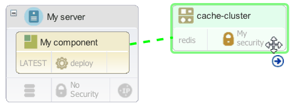

# Modeling Amazon Elasticache cache clusters

Cache clusters like Amazon ElastiCache store data in fast in-memory caches. By including cache clusters in a blueprint, you can connect applications to those clusters so that the applications can use the cached data.

In your components, create properties that refer to the location or other details about the cache. For example, add component environment properties that refer to the location of the cache. Then, you can use those properties in component processes. In this way, you provide information about the cache to the application components.

You can model a new container or an existing container in a blueprint. Amazon ElastiCache is the only type of cache cluster that is supported.

1.   In the blueprint designer, from the **Services** drawer, drag the **New Cache Cluster** to the blueprint to create a cache cluster, or drag an existing cache cluster to the blueprint. 
2.  If this is a new cache cluster, specify the security group for the cluster by dragging the security group from the **Security** drawer of the palette.The security group controls which Virtual Private Cloud \(VPC\) the cache cluster is created in. By default, images can access only cache clusters that are in the same VPC.
3.  If you are creating a cluster, specify the information for the cluster, such as the engine type \(`redis` or `memcache`\) and the security group.The following example shows a cache cluster that is named `my_cache_cluster`:

    ```
    my_cache_cluster:
      type: IBM::ElastiCache::Cluster
      properties:
        name: MyNewCacheCluster
        cache_node_type: cache.m1.small
        engine: redis
        engine_version: 2.8.6
        availability_zone: { get_param: availability_zone }
        vpc_security_group_ids:
              - My security
        subnet_group:
        parameter_group:
    ```

4.   From the **Components** drawer, add one or more components to images in the blueprint. In the blueprint, the component resources have properties that refer to the properties on the HCL® UrbanCode™ Deploy server.
5.  Link the properties in the component to the properties of the cache cluster. 

    1.  Hover the mouse over the component.
    2.  Drag the connector to the cache cluster or replication group, as shown in the following figures.This connector appears only on components with one or more input properties.

        

        

        The Attach to Cache Cluster or Attach to Replication Group window appears.

    3.  Use the window to map the component properties to the values in the cache cluster or replication group.In the case of a cache cluster, map the component properties to the endpoint and port of the cache cluster. For example, if the component has properties that are named `ClusterEndpointPort` and `ClusterEndpointAddress`, the window might look like the following figure:

        

    4.  Click **OK**.
    You can also map the properties by editing the code directly.

    The blueprint code might look like the following example. In this example, the component has properties that are named `ClusterEndpointPort` and `ClusterEndpointAddress`. The component uses these property values to access the cache cluster. To provide the property values, refer to the matching property on the cache cluster resource, as in this example:

    ```
    CacheClusterComp_sw_config:
      type: IBM::UrbanCode::SoftwareConfig::UCD
      properties: 
        name: "CacheClusterComp"
        component_process: deploy
        component_process_timeout: "300"
        ucd_server_url: { get_param: ucd_server_url }
        ucd_username: { get_param: ucd_user }
        ucd_password: { get_param: ucd_password }
        application: { get_attr: [resource_tree, application_name] }
        environment_name: { get_attr: [resource_tree, environment_name] }
        inputs:
          **ClusterEndpointPort: \{ get\_attr: \[my\_cache\_cluster, first\_node\_endpoint\_address\]  \}
          ClusterEndpointAddress : \{ get\_attr: \[my\_cache\_cluster, first\_node\_endpoint\_port\]  \}**
    ```

6.  Create a configuration file and map the types in the blueprint to the matching Amazon types.You must have a configuration file to provision environments from this blueprint, even though there are no OpenStack cache cluster resource types to map to AWS resource types.

When you provision an environment from this blueprint, the component can access the cache cluster.

**Note:** If you provision an environment that contains a new cache cluster and then delete the environment, the cache cluster is also deleted, unless the cache cluster is part of a replication group. Existing cache clusters that the blueprint references are not deleted. New and existing replication groups are not deleted.

You can also model more complicated cache topologies. For example, you can add one master cluster and up to five read-only replica clusters to a replication group. In this way, you can put the replica clusters in different availability zones for fast access in those zones. To model this type of cache, follow these steps:

1.  From the **Services** drawer of the palette, drag a new or existing replication group to the blueprint.
2.  Drag the master cache cluster from the palette to the replication group.
3.  In the replication group, click **No Replicas**.
4.  In the Replication Group window, click **Add** to add replica cache clusters.
5.  Specify the availability zone for each cache cluster.
6.  Click **Save**.

The complete cache cluster looks like the following image. This image shows a replication group and a master cache cluster. Click **Replicas** to see the replica clusters.


**Parent topic:** [Modeling software services](../../com.edt.doc/topics/blueprint_service_ov.md)

