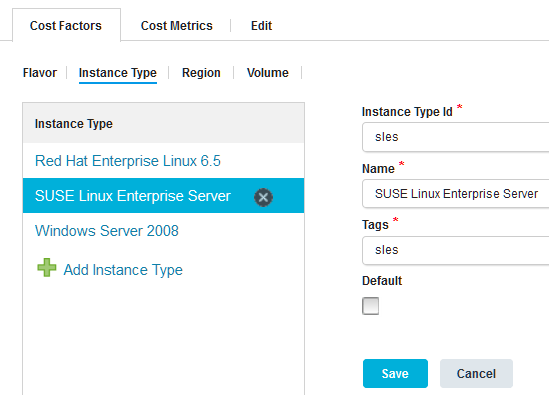

# Specifying costs for cloud resources manually

To estimate the cost of your environments, you can specify information about the prices that your cloud system charges for specific resources.

Connect to a cloud. See [Connecting to clouds through the blueprint designer](security_cloud_connection.md).

As an alternative, you can import some cost information from clouds; see [Importing cost information from clouds](cost_center_import.md).

You must provide the following information about the prices that the cloud system charges:

-   The image flavors that are available on the cloud, including the number of processors, amount of memory, and the storage space on each flavor.
-   The types of instances that are available, such as different operating systems.
-   The regions on which you can provision instances.
-   The types of storage volumes that are available, such as magnetic storage and solid-state storage.

Then, you specify the costs for different combinations of those factors.

1.  Specify information about the cost factors for environments on the cloud system:
2.   In the blueprint designer, as an administrator, click **Settings** \> **Cost Centers**. 
3.  Click **Add Cost Center**. 
4.  Specify a name for the cost center.You can name the cost center after the cloud that it applies to. If multiple clouds use the same cost structure, you can give the cost center a generic name that applies to the multiple clouds.
5.  In the **Source** list, select **Cloud**.
6.  Click **Save**.
7.  Next, specify the factors that the cloud system uses to determine the cost of environments. Later, you map prices to these factors.
8.  Specify the image flavors that are available: 

    1.  Under **Cost Centers**, click the cost center to select it.
    2.  On the **Cost Factors** tab, go to the **Flavor** subtab.
    3.  In the **Flavor** list, click **Add Flavor**.
    4.  Specify the properties of the new flavor:
        -   ****Flavor Id****

            The ID of the flavor. See the cloud system for information about the ID of flavors.

        -   ****Name****

            A label for the flavor.

        -   ****CPU****

            The number of virtual processors.

        -   ****RAM \(GB\)****

            The amount of memory, in gigabytes.

        -   ****Disk Size \(GB\)****

            The amount of storage space, in gigabytes.

        -   ****Disk Count****

            The number of virtual disks.

    5.  Click **Save**.
    6.  Repeat these steps to specify information about the flavors that are available on the cloud.
    The list of flavors looks like the following image. This image shows four flavors: Tiny, Small, Medium, and Large. It shows the details of the Large flavor, which includes six virtual processors and 8 gigabytes of memory.

    

9.  Specify the types of instances that are available. For example, many clouds provide base instances of different operating systems or instances with certain software preinstalled on them.

    1.  Under **Cost Centers**, click the cost center to select it.
    2.  On the **Cost Factors** tab, go to the **Instance Type**subtab.
    3.  In the **Instance Type** list, click **Add Instance Type**.
    4.  Specify the properties for the new instance type: 
        -   ****Instance Type Id****

            The ID of the instance type. See the cloud system for information about the ID of instance types.

        -   ****Name****

            A label for the instance type, such as a description of the operating system or contents of the instance.

        -   ****Tags****

            Search terms for the instance type, which are separated by commas. When the blueprint design server estimates the cost of an environment, it uses these search terms to match a node on a blueprint to the instance type.

        -   ****Default****

            If you select this check box, this instance type is used as the default instance if no other instance types match the nodes in a blueprint.

    5.  Click **Save**.
    The **Instance Type** subtab looks like the following image. This image shows several Windows™ and Linux™ instance types, including Windows Server 2008, Red Hat Enterprise Linux, and SUSE Linux Enterprise Server.

    

10. Specify the regions that are available.Some cloud systems have different prices for environments in different locations. If your cloud system charges the same price for different locations, or if it has only one location, create one region and use it for all environments.
    1.  Under **Cost Centers**, click the cost center to select it.
    2.  On the **Cost Factors** tab, go to the **Region** subtab.
    3.  In the **Region** list, click **Add Region**.
    4.  Specify the properties for the new region:
        -   ****Region Id****

            The ID of the region.

        -   ****Name****

            A label for the region.

        -   ****Country****

            The country that contains the region.

        -   ****Default****

            If you select this check box, this region is used as the default region.

    5.  Click **Save**.
11. Specify the types of volumes that are available, such as magnetic storage and solid-state storage.You specify the cost per gigabyte later.
    1.  Under **Cost Centers**, click the cost center to select it.
    2.  On the **Cost Factors** tab, go to the **Volume** subtab.
    3.  In the **Volume** list, click **Add Volume**.
    4.  Specify the properties for the new volume type: 
        -   ****Volume Id****

            The ID for the volume type. See the cloud system for this information.

        -   ****Name****

            A label for the volume type, such as Magnetic or Solid-state.

        -   ****Default****

            If you select this check box, this volume type is used as the default type.

12. Now that you specified the factors that the cloud considers when it calculates environment cost, you must specify the prices for each of these factors.
13. Specify the costs for each flavor: 

    1.  Under **Cost Centers**, click the cost center to select it, and then go to the **Cost Metrics** tab. 
    2.  Under **Cost Metrics**, click **Instance** to select it.The **Instance** section shows tables of the flavors and the cost for each flavor.
    3.  In the **Region** and **Instance Type** lists, select a region and instance type. 
    4.  In the table of flavors, in the **Cost per Hour** column, specify the cost in US dollars for each flavor in the specified region and instance type.
    5.  Repeat the process for each region and each instance type.
    6.  Click **Save**.
    Now the **Instance** section shows the cost per hour for each flavor, taking into account the region and instance type. The following image shows a table of flavors and their costs for environments on the `Main data center` region and the `Red Hat Enterprise Linux 6.5` instance type.

    

14. Bind the cost center to the appropriate clouds: 
    1.  Click **Clouds**, and then click the cloud.
    2.  Click **Edit**.
    3.  In the **Cost Center** list, select the cost center for the cloud.
    4.  Click **Save**.

When you provision an environment from the blueprint designer, as described in [Provisioning environments from the blueprint designer \(through OpenStack Heat\)](env_provision_edt.md), the blueprint design server estimates the cost per hour of the environment.

**Note:** You cannot estimate the cost for cloud environments that you provisioned by using a composite blueprint.

**Parent topic:** [Estimating the cost for cloud environments](../../com.edt.doc/topics/cost_ov.md)

**Parent topic:** [Estimating the cost for cloud environments](../../com.udeploy.doc/topics/cost_ov.md)

