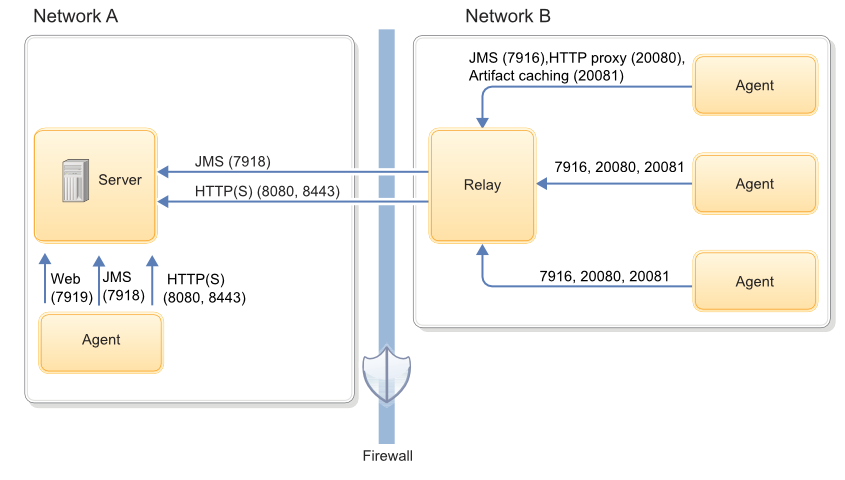
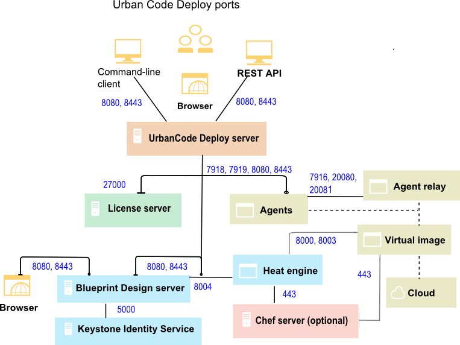

# Firewall and communication configuration

Before you install the server, you must ensure that servers, agents, and other systems can connect to each other through your networks and firewalls.

The following diagram shows the main default ports that are involved in communication between agents, agent relays, and the server.

The following diagram shows the default port numbers that HCL® UrbanCode™ Deploy uses for communication. Most of these ports can change depending on your choices at installation time. The following diagram is only a summary of the defaults.

The server must have network access to the following ports:

-   The server must be able to initiate connections to the license server. The default port for Rational® Common Licensing is 27000. However, in some situations, the server uses different ports to connect to the license server. For more information, or to change the port, see [http://www-01.ibm.com/support/docview.wss?uid=swg21454410](http://www-01.ibm.com/support/docview.wss?uid=swg21454410).
-   The server must be able to accept connections from agents and agent relays. By default, agents and relays connect on port 7918.
-   Users and agents that do not use a relay must be able to initiate connections to the server through HTTP or HTTPS. The default ports are 8080 for HTTP and 8443 for HTTPS.
-   Installing agents remotely on Linux™ or UNIX™ systems requires the server to initiate connections to the SSH port of the agent computer. The default port for SSH is 22.
-   Remote discovery of agents requires the server to initiate connections to port 22 for Linux agents and port 135 for Windows™ agents. See [Discovering agents automatically](../../com.ibm.udeploy.doc/topics/agent_discovery.md).
-   The server might require access to other ports if you connect to external systems, such as an SMTP server for notifications or to cloud systems that use virtual system patterns, like PureApplication® System or IBM® Cloud Orchestrator.

As shown in the diagram, agents can connect to servers directly or through agent relays. You must ensure that the agent communication can get to the server through any firewalls or other limitations.

If your agents connect to the server through an agent relay, you must configure your networks and firewalls to allow the following communication. In this case, you install the agent relay on the same network and the same side of the firewall as the agents.

-   Agents must be able to open network connections on the agent relay JMS port. The default agent relay JMS port is 7916.
-   Agents must be able to open network connections on the agent relay HTTP proxy port. The default agent relay HTTP proxy port is 20080.
-   Agents must be able to open a network connection to the Agent Relay CodeStation proxy port \(HTTP\_proxy + 1, by default 20081\).
-   Installing agents remotely on Windows systems requires the WinRS agent to initiate connections on ports 80 and 5985 on the target computer.
-   If you are using artifact caching as described in [Agent security and communication](../../com.ibm.udeploy.doc/topics/arch_agents.md), agents must be able to open network connections on the agent relay artifact caching port. The agent relay artifact caching port is 20081.
-   Agents run steps from automation plug-ins and source configuration plug-ins. Some of these steps require that agents create network connections to an external system.
-   Agent relays must be able to open network connections on the server JMS port. The default server JMS port is 7918.
-   Agent relays must be able to open network connections on the server HTTP and HTTPs ports. The default HTTP\(S\) ports are 8080 and 8443. It is not possible to reverse the direction of this connection.

For example, if your server is on an internal network and your agents are on an external network such as a public cloud, you install the agent relay on the cloud and have the agents connect to the agent relay. Then, the agent relay connects through the firewall to the internal network.

If your agents connect directly to the server, you must configure your networks and firewalls to allow the following communication:

-   Agents must be able to open network connections on the server JMS port. The default server JMS port is 7918.
-   Agents must be able to open network connections on the server HTTP and HTTPS ports. The default HTTP\(S\) ports are 8080 and 8443.
-   Agents run steps from automation plug-ins and source configuration plug-ins. Some of these steps require that agents create network connections to an external system.

For more information on communication between the server, agents, and agent relays, see [Agent security and communication](../../com.ibm.udeploy.doc/topics/arch_agents.md) and [Agent relays](../../com.ibm.udeploy.doc/topics/arch_agent_relays.md).

