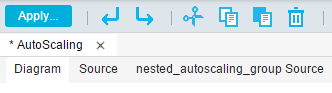
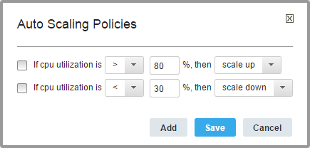
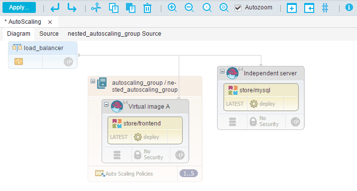

# Modeling autoscaling environments

Autoscaling environments automatically add or remove resources as demand changes.

In the blueprint designer, open the blueprint for the environment that you want to autoscale.

Autoscaling groups have policies that specify when to add or remove resources. For example, a policy can specify that the group should add an instance when the average CPU utilization of the existing instances is above 80%. In most cases, you use autoscaling groups with load balancers, which automatically direct load to the resources in the group.

If there are two or more resources in an autoscaling group, those resources are stored in a nested blueprint.

**Restriction:** Autoscaling groups, and the load balancers that manage them, are supported only for OpenStack clouds. Autoscaling policies are controlled by the Ceilometer infrastructure in OpenStack clouds. Autoscaling policies are triggered by alarms that are generated by Ceilometer. In turn, alarms are triggered by samples \(data points\) that are generated by meters. To learn more about alarms, samples, and meters, see [Measure cloud resources](http://docs.openstack.org/user-guide/content/ceilometer_cli_commands.html) in the OpenStack documentation.

1.   In the blueprint designer, in the **Policies** drawer, add a **New AutoScaling Group** to the blueprint. 
2.  Add resources to the group, such as virtual images. 
3.  When you add a second resource to the group, the Create a New Blueprint window opens.This new nested blueprint represents the contents of the autoscaling group.
4.  Specify a name for the new blueprint and click **Save**. 
5.  Continue to add resources to the autoscaling group and the parent blueprint.You can add as many resources to the autoscaling group as you need. The source code for the autoscaling group appears in a new tab in the blueprint designer, next to the tabs for the diagram and the source code of the parent blueprint, as shown in the following figure.

    

    The nested blueprint behaves like any other blueprint, with one exception: Nested autoscaling blueprints cannot contain the `IBM::UrbanCode::ResourceTree` resource.

    If you set a name for the base\_resource\_group property in the `IBM::UrbanCode::ResourceTree` resource in the main blueprint, that name is consistently used in both the main and nested blueprint.

6.   In the nested blueprint, specify properties just as you would in an ordinary blueprint. For example, if you are deploying components, open the source code of the nested blueprint and specify the component process and application for each component.
7.   Specify the minimum and maximum copies of the autoscaling group by selecting the group, opening the **Properties** pane, and specifying values in the **Max Size** and **Min Size** fields. The maximum and minimum copies of the group are shown at the bottom right of the group, such as `1..5` for a group that can range 1 - 5 copies.

    **Note:** To quickly change the maximum and minimum copies of the group, click the size range. In the AutoScaling Cardinality window, specify new values in the **Max Size** and **Min Size** fields, and then click **Save**.

8.  Set the policies for the autoscaling group by clicking **Auto Scaling Policies**.These policies determine when the group adds or removes virtual images. For example, the following policies specify that the group adds virtual images when the CPU utilization across the existing images is above 80%. If the CPU utilization across the images is less than 30%, the group removes a virtual image.

    

    Click **Save** to save your changes to the policies.

9.  Adjust the data collection interval in Ceilometer as needed to monitor CPU utilization. On the OpenStack system, edit the file /etc/ceilometer/pipeline.yaml and change the interval property that is associated with the `cpu_pipeline` section. Typically, you set the interval property to half the wanted response time.By default, the data collection interval in Ceilometer is 600 seconds. To set the autoscaling policy to respond within 5 minutes \(300 seconds\) of changing processor utilization, change the interval property to 150.
10. In most cases, add a load balancer to the blueprint and connect it to the network and the servers in the autoscaling group. 

When you deploy the autoscaling group, OpenStack Ceilometer monitors the group and adds and removes resources based on the group policies. The load balancer spreads requests throughout the resources and directs traffic to resources with available capacity.

The following blueprint is an example of an autoscaling group with a load balancer. The blueprint includes a virtual image and component that are independent of the group. The autoscaling group contains a virtual image and a component.

**Parent topic:** [Modeling environments for clouds through OpenStack Heat](../../com.ibm.edt.doc/topics/blueprint_edit_clouds.md)

