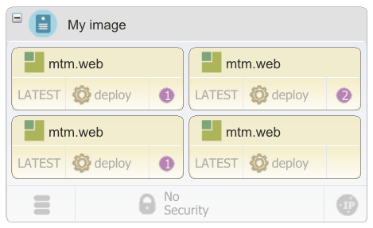

# Deploying components with blueprints

Add components to a blueprint so that when you provision environments from the blueprint, the engine automatically installs the components.

-   On the HCL® UrbanCode™ Deploy server, create an application, and add components to it.
-   Create a blueprint for the target cloud, including adding virtual images:
    -   [Modeling environments for SoftLayer](blueprint_edit_softlayer.md#)
    -   [Modeling environments for Amazon Web Services](blueprint_edit_ec2.md)
    -   [Modeling environments for VMware vCenter](blueprint_edit_vc.md)
    -   [Modeling environments for VMware vRealize Automation](blueprint_edit_vra.md)
    -   [Modeling environments for OpenStack and OpenStack-based clouds](blueprint_edit_os.md)
    -   [Modeling environments for Microsoft Azure](blueprint_edit_azure.md).
    -   [Modeling environments for Google Cloud Platform](blueprint_edit_google_cloud.md)

When you include components in the blueprint, the blueprint appears as an application process on the HCL UrbanCode Deploy server. Then, you can apply the blueprint to an environment by running the application process or by creating an environment. When you provision the environment, you create agents on images that contain HCL UrbanCode Deploy that deploy the components. If you assign the same tag to each component that you deploy to an environment, you can quickly add all the components to the blueprint.

You can also deploy complete applications by using existing application processes. See [Deploying applications with blueprints](blueprint_deploy_app.md#).

1.   In HCL UrbanCode Deploy, create component processes that deploy components. If you add components to the blueprint by using tags, assign each deployment process the same name. These component processes must run independently of application processes. You can adapt existing component processes to run outside of application processes.

    **Note:** These component processes cannot access properties that are outside the components, such as application properties and environment properties.

2.   If the component processes require information about the environment, such as the locations of other systems, create component environment properties to represent that information. When you provision the environment, the blueprint design server provides values for these properties. You can use only component environment properties in this way, and no other types of property.
3.   If you provision an environment that contains multiple components of the same application, create a new tag and add it to each component. If you add this tag to an image in the blueprint designer, then the blueprint designer assigns all components that contain the tag to the image.
4.   Log in to the blueprint designer as a user who has the permissions to create and edit blueprints and to access components. 

    **Note:** The components that you can see in the blueprint editor depend on your permissions. If your blueprint design server account is connected to an account on the HCL UrbanCode Deploy server, you see the components that you have access to on that server. If your blueprint design server account is not connected to an account on the HCL UrbanCode Deploy server, you see the components that are associated with the token or user account that is on the **System Settings** page.

5.   Open the blueprint that you created for the target cloud. 
6.   Add components to the virtual images in the blueprint: 
    1.   From the palette, in the **Component** drawer, drag a component or tag to a virtual image in the blueprint. If you drag a tag to a virtual image, the blueprint designer assigns all components that contain this tag to the image.
    2.   In the Choose Application window, specify the application, as in the following image. The window shows a check box for each application that the component or tag currently belongs to.

        

        Each additional component that you add to the blueprint must be part of the same application. If you add a component that is not part of the application or if a tag contains a component that is not part of the application, the editor prompts you to add the component to the application.

    3.   Accept the default values for the **Application Process** and **Application Snapshot** lists. 
    4.   In the **Base Resource Group** list, select the resource group that contains the resources in the blueprint. If no resource groups are on the server, select **Default** to create a resource group.
    5.   In the **Team** list, select the team to assign to the component or component tag. 
    6.   Click **OK**. 

        The `resource_tree` resource is added to the blueprint. This resource represents additions to the resource tree on the HCL UrbanCode Deploy server. This resource is displayed only in the source view, not in the diagram view. The resource contains information about the connection to the server and what updates the blueprint makes to the server. The following code is an example of the `resource_tree` resource, which shows that you specified an application that is named `JPetStore`:

        ```
        resource_tree:
          type: IBM::UrbanCode::ResourceTree
          properties: 
             urbancode_deploy_url: { get_param: ucd_server_url }
             username: { get_param: ucd_user }
             password: { get_param: ucd_password }
             team_mappings: 
             application: JPetStore
             base_resource_group: JPetStore agents
        ```

        This resource includes properties that specify the location and credentials for the HCL UrbanCode Deploy server. You can change these properties in the source code, or you can select the component in the diagram view and set the properties on the left side of the page.

        Also, two resources are added to the blueprint for each component. The resource of the type [IBM::UrbanCode::SoftwareDeploy::UCD](../../com.ibm.edt.heat.reference.doc/topics/res_ibm_urbancode_softwaredeploy_ucd.md) represents the deployment instance of the component or tag, including the version of the component and a reference to the server on which the component is deployed. The resource of the [IBM::UrbanCode::SoftwareConfig::UCD](../../com.ibm.edt.heat.reference.doc/topics/res_ibm_urbancode_softwareconfig_ucd.md) type represents the configuration properties for the component or tag, such as its application and any properties that it has.

        Also, the editor adds a resource that represents the HCL UrbanCode Deploy agent, which is installed automatically on each virtual image. The resource is named either `ucd_agent_install_win` or `ucd_agent_install_linux`, depending on the operating system that is installed on the virtual image. You can edit the code that is embedded in this resource to change how the agent is installed. To learn more about options that are available when the agent is installed, see [Options for deploying agents](blueprint_agent_options.md#). The blueprint designer automatically detects the operating system based on the image name.

    7.   Specify the version of each component or tag in either the diagram editor or the blueprint source code: 
        -   If you added a component to the image, from the diagram editor, in the lower left of an image, click **LATEST**, which is the most recent component version. From the Choose Component Version dialog box, select the version of the component, and then click **OK**.
        -   If you added a component to the image, from the source code view, in the deployment instance resource, in the `version` property, specify the version of each component. For example, the following code specifies version 1.0 of the `JPetStore-APP` component.

            ```
            JPetStore-APP:
              type: IBM::UrbanCode::SoftwareDeploy::UCD
              properties:
                apply_config: { get_resource: JPetStore-APP_sw_config }
                server: basic_compute_node
                **version: "1.0"**
                agent_timeout: "360"
            ```

            The component version name is in double quotation marks. To use the most recent version of a component, specify `"LATEST"`.

        -   If you added a tag to the image, by default the latest version of each component is deployed. You can also specify the version of each component that is associated with a tag. In the source code view, in the deployment instance resource, in the `version` property of the tag, specify the version of each component. For example, the following code specifies the version for the components on the `JPetStoreComp` tag. The process deploys version 2.1 of the `JPetStore-APP` component, version 2.1.1 of the `JPetStore-DB` component, and the latest version of all other components.

            ```
             JPetStoreComp:
                type: IBM::UrbanCode::SoftwareDeploy::UCD
                properties:
                  apply_config: { get_resource: JPetStoreComp_sw_config }
                  server: ci-toolchain-landscaper-6_1_3
                  **version: "Latest, JPetStore-APP: 2.1, JPetStore-DB: 2.1.1" **
                  agent_timeout: "360"
            ```

            If you specify a component version that does not exist, the component version is deployed.

    8.   For each component or tag, specify the component process to run in either the diagram editor or the blueprint source code: 
        -   From the diagram editor, in the lower center of an image, click the process icon . \(The process icon name is the name of one process that was created for the component.\) From the Choose Component Process dialog box, select the process to run, and then click **OK**.
        -   From the source code view, in the configuration property resource, in the `component_process` property, specify the component process to run. The following example specifies the `Deploy application component` component process of the `JPetStore-APP` component.

            ```
            JPetStore-APP_sw_config:
              type: IBM::UrbanCode::SoftwareConfig::UCD
              properties: 
                name: JPetStore-APP
                **component\_process: Deploy application component**
                ucd_server_url: { get_param: ucd_server_url } 
                ucd_username: { get_param: ucd_user }
                ucd_password: { get_param: ucd_password }
                application: { get_attr: [resource_tree, application_name] }
                environment_name: { get_attr: [resource_tree, environment_name] }
            ```

    9.   If the components contain component environment properties, specify values for those properties in the `input` section of the IBM::UrbanCode::SoftwareConfig::UCD resource. Component environment properties one of two types of properties that you can pass from a blueprint to the HCL UrbanCode Deploy in this way.

        **Note:** If you added a tag to the image, you cannot define component environment properties for the individual components that contain the tag.

        For example, the following code shows component environment properties that are named `ServerName` and `IntegerValue`:

        ```
        ComponentA_config:
          type: IBM::UrbanCode::SoftwareConfig::UCD
          properties: 
            name: ComponentA
            component_process: deploy
            ucd_server_url: { get_param: ucd_server_url } 
            ucd_username: { get_param: ucd_user }
            ucd_password: { get_param: ucd_password }
            application: { get_attr: [resource_tree, application_name] }
            inputs:
              ServerName : { get_param: Referenced_Image_server_name }
              IntegerValue : 25
        ```

        The engine passes these properties to the server at provisioning time. You can use these properties in processes. For example, to refer to the `ServerName` property in a component process, use this code: `${p:environment/ServerName}`.

    10.  If the component maps to a WebSphere® Application Server cell and you use the WebSphere Application Server - Deploy plug-in, add the `subgroup` property to the `properties` section and set the `subgroup` property to the name of the cell. For example, the following code shows a subgroup property that is set to `WebSphereCell`:

        ```
        ComponentA_config:
          type: IBM::UrbanCode::SoftwareConfig::UCD
          properties: 
            subgroup: WebSphereCell
        ```

        After the automatic discovery process runs, the component is nested in the resource tree under the WebSphere Application Server cell resource. To learn more about automatic discovery, see [Importing resources from WebSphere Application Server](../../com.ibm.udeploy.doc/topics/resources_import_was.md#).

7.  If the image that contains your HCL UrbanCode Deploy components is attached to multiple networks, change the agent name. To ensure that you can access the agent, you can modify the blueprint to use this agent name pattern: `application\_name.environment\_name.image\_key`. To customize the provisioned image name and the agent name, you can modify the image's key parameter value in the blueprint properties.
    1.  In the `IBM::UrbanCode::SoftwareDeploy::UCD` resource, add the `agent_naming_scheme` property.The resource resembles the following code:

        ```
          ComponentName:
            type: IBM::UrbanCode::SoftwareDeploy::UCD
            properties:
              apply_config: { get_resource: ComponentName_sw_config }
              server: server_key
              version: LATEST
              agent_timeout: "360"
              **agent\_naming\_scheme:**
        ```

    2.  From the blueprint diagram, select the component.
    3.  In the component properties, for **Agent Naming Scheme**, provide the following value: server-name.
    4.  Select the image and modify the **Key** value.
    5.  If you add multiple components to an image, repeat these steps for each component.
8.   To connect the agents on the virtual images to an agent relay, specify the URL of the agent relay in the ucd\_relay\_url parameter. 

    By default, the blueprint design server installs an agent on each virtual machine in the environment. By default, these agents connect directly to the server. If the server is behind a firewall, inside a VPN, or otherwise inaccessible, you must connect the agents to an agent relay.

    For example, if the URL of the agent relay is `http://relay.example.com`, the parameter looks like the following code:

    ```
      ucd_relay_url:
        type: string
        default: "http://relay.example.com"
    ```

9.   Specify the deployment order of the components. 

    **Note:** 

    -   If you added a tag to the image, you cannot define the deployment order of the individual components that contain the tag. The deployment order is determined by a database query, and the components are usually deployed in alphabetical order of component name.
    -   If your blueprint contains VMware vRealize Automation Enterprise software components, all vRealize Automation components deploy before the HCL UrbanCode Deploy components deploy. You can specify separate deployment orders for each type of component.
    1.   From the **Policies** drawer of the Palette, drag the **Deployment Sequence** resource to the components, starting with the component to deploy first. Because the deployment sequence is modeled as a tree, and not a sequential list, more than one component can have the same deployment sequence number. Subsequent components are not deployed until all previous components are deployed. Components without deployment sequence numbers are deployed asynchronously. Numbers are displayed on the components to indicate the deployment order, as shown in the following figure:

        

    2.   When you drag the **Deployment Sequence** resource to other components, specify the order for the components by selecting the number on the component. In the following figure, the cursor is dragging the **Deployment Sequence** resource over a component. The component shows numbers that indicate the potential deployment order for the component. The number on which you release the **Deployment Sequence** resource specifies its deployment order.

        

    3.   To edit the order of all components, click the deployment order number of one component, use the arrow push buttons to change the order in the Deployment Sequence window, and then click **Save**. The following figure shows the Deployment Sequence window:

        

10.  Save the blueprint. 

The blueprint appears as an application process on the HCL UrbanCode Deploy server. You can use this blueprint through the application process, just like you use any application process on the server. For example, you can apply the blueprint to an existing environment by running the application process. For more information, see [Provisioning cloud environments](env_provision_ov.md).

**Parent topic:** [Modeling environments for clouds through OpenStack Heat](../../com.ibm.edt.doc/topics/blueprint_edit_clouds.md)

