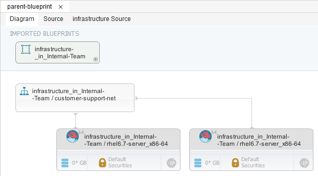
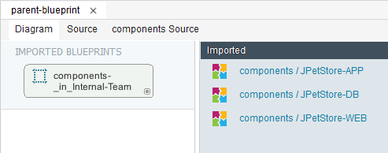

# Creating composite blueprints

You can create a composite blueprint by importing the contents of a saved blueprint into your active blueprint.

Create a blueprint to import into another blueprint. This blueprint can contain infrastructure items, components that are assigned to images, or components that are not assigned to images. See [Editing blueprint diagrams](blueprint_diagram.md#).

**Restriction:** This blueprint cannot contain an imported blueprint.

You can import saved blueprints into your active blueprint. By importing a blueprint, you quickly add the resource tree, components, infrastructure items, or images that the imported blueprint contains to the active blueprint. A link is created between the active composite blueprint and the imported blueprint. You cannot delete individual items from the imported blueprint, and you can make limited changes to imported images. For example, you can add a component to an imported image or connect the imported image to a different network, but you cannot change the image security or IP address.

**Restriction:** If your heat engine is at the Juno level, you cannot provision from a composite blueprint.

1.   In the blueprint designer, create or open a blueprint. 
2.   Click **Import Blueprints** . The Import Blueprint dialog box opens.
3.   From the Import Blueprint dialog box, select the blueprint to import, and then click **Import**. The Imported Blueprint Properties dialog box opens.
4.   From the Imported Blueprint Properties dialog box, specify the behavior of the imported blueprint. 

    1.   Select the method of referring to the imported blueprint. 
        -   Select **path / imported\_blueprint\_name** to refer to the imported blueprint as a relative or absolute file path. This option adds the .yaml file path into the type. In the parent blueprint source code, the imported blueprint is represented with the following code:

            ```
            resources:
              imported\_blueprint\_name:
                type: path/imported\_blueprint\_name.yaml
                properties:
                  imported\_property: { get_param: imported\_property }
            ```

        -   Select **UC::Blueprint::imported\_blueprint\_name** to refer to the imported blueprint as a custom type that is resolved in the resource\_registry section of a configuration file for the parent blueprint. In the parent blueprint source code, the imported blueprint is represented with the following code:

            ```
            resources:
              imported\_blueprint\_name:
                type: UC::Blueprint::imported\_blueprint\_name
                properties:
                  imported\_property: { get_param: imported\_property }
            ```

            **Note:** In version 6.2.1.1 and earlier, only this method of specifying an imported blueprint is available.

        -   Select **$path/imported\_blueprint\_name** to refer to the imported blueprint as a property, which can be defined when you provision the blueprint. In the parent blueprint source code, the imported blueprint is represented with the following code:

            ```
            parameters:
              imported\_blueprint\_name_url:
                type: string
                description: 'Path of imported\_blueprint\_name.yaml'
                default: '.'
            resources:
              imported\_blueprint\_name:
                type: {str_replace: { params: { $imported\_blueprint\_name_url: { get_param: imported\_blueprint\_name_url } }, template: $imported\_blueprint\_nameurl/imported\_blueprint\_name.yaml }}
                properties:
                  imported\_property: { get_param: imported\_property }
            ```

    2.   Determine the properties that the parent blueprint uses. By default, all available properties are selected, but you can customize which properties that the parent blueprint uses.
    3.   Click **OK**. 
    The imported blueprint and the infrastructure items that the blueprint contains are shown in the diagram. The contents of an imported blueprint might resemble the following image:

    

    To hide the infrastructure items that you imported, click the **Toggle Filter** icon in the lower right of the imported blueprint.

    An imported blueprint that contains only components might resemble the following image:

    

    Components that the imported blueprint contains that are not assigned to an image are shown in the **Imported** drawer. You must add these components to images before you provision the blueprint.

5.   Assign all components that are listed in the **Imported** drawer to images in the blueprint. 

Import more blueprints or add other infrastructure items to the blueprint.

**Important:** You cannot have multiple resource trees in a blueprint.

**Parent topic:** [Editing blueprints with the blueprint designer](../../com.ibm.edt.doc/topics/blueprint_create.md)

