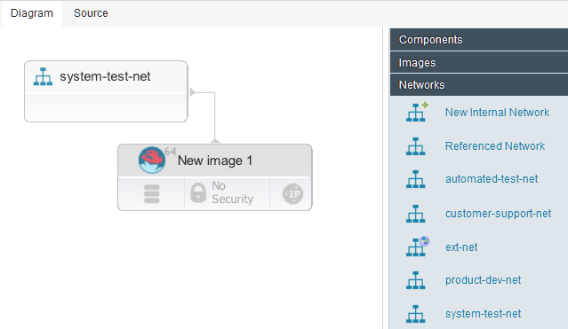
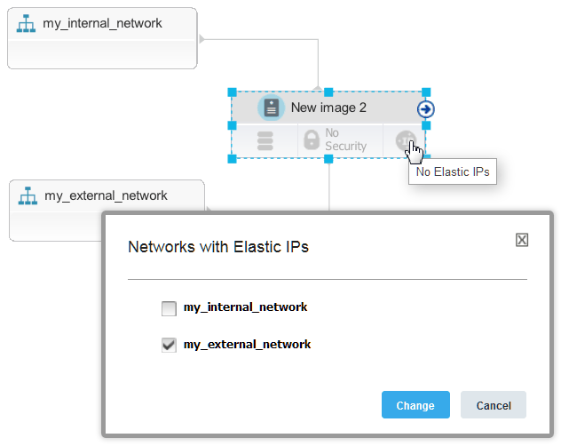

# Attaching resources to existing networks

Existing internal and external networks are included in the blueprint designer palette. You can attach new resources, such as virtual images, to those network resources.

Verify that you are connected to the correct cloud project. The blueprint designer palette shows network resources for the current cloud project.

A common use case is to provision new virtual images on an existing network:

1.  In the blueprint designer, create one or more virtual image resources in a blueprint.
2.  From the **Networks** drawer of the palette, drag a network to the blueprint.
3.  Drag the virtual images to the network, or drag a connector from the images to the network. The images are linked to the network; when you provision an environment from the blueprint, the new virtual images are attached to the network. The following image shows a simple virtual image that is connected to a network.

    

4.  If the network has more than one subnet, from the Choose subnet window, select an available subnet.

    **Note:** If you are using Amazon Web Services, the subnet you select must be configured in the availability zone that you are using.


The images can access the network and the resources that are on the network. For example, many virtual networks have an internal network and an external network. The external network provides public IP addresses to images that require IP addresses. In this case, you often have to connect a virtual image to an internal network and then retrieve a floating IP address from the external network. In this case, follow these general steps. These steps are appropriate for OpenStack-based clouds and for Amazon AWS.

1.  Add virtual images to the blueprint.
2.  Add the internal network to the blueprint.
3.  Connect the virtual images to the internal network.
4.  At the lower right of an image, click **No Elastic IPs** . The lower right of the image changes to show that it has an elastic IP . Also, the source code for the blueprint includes a parameter that represents the external network, as shown in the following blueprint code:

    ```
    public_network_id:
      type: string
      description: Generated for floating IP
      default: 'TODO'
    ```

    At provisioning time, the blueprint designer prompts you for the name of this external network.

5.  To set the default network that represents this external network \(that is, the network that provides elastic IP addresses\), follow these steps:
    1.  Add the external network from the palette to the blueprint. Like the other existing networks, the external network is not displayed as a resource but as a reference in the blueprint code, as in the following example:

        `## REFERENCE {"d5238086-cab5-4b4f-b0b6-1234bac9ef28":{"type": "OS::Neutron::Net", "properties": {"name": "my_external_network", "network_id": "d5238086-cab5-4b4f-b0b6-1234bac9ef28"}}}`

    2.  From the reference, copy the network ID to the parameter that represents the external network. For example, if you use the network in the previous code, the parameter looks like this code:

        ```
        public_network_id:
          type: string
          description: Generated for floating IP
          default: 'd5238086-cab5-4b4f-b0b6-1234bac9ef28'
        ```

        When you provision environments from this blueprint, this network is the default source of floating IP addresses.


SoftLayer® networks are modeled slightly differently. To connect a virtual image to an external network on a SoftLayer cloud, you must connect the image to both the internal and external networks. Then, you click **No Elastic IPs**  and select the network from which the image gets an IP address, as shown in the following figure.



When you provision an environment from the blueprint, the images are connected to the networks.

**Parent topic:** [Modeling networks](../../com.ibm.edt.doc/topics/blueprint_network_ov.md)

