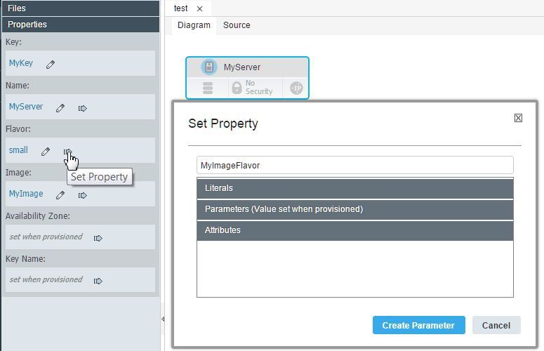
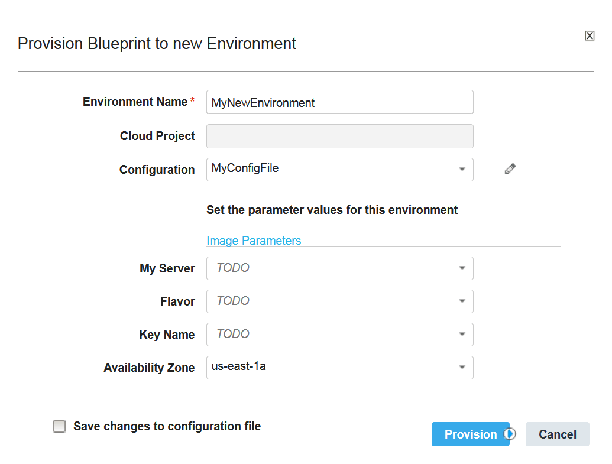

# Externalizing properties in blueprints

Rather than hardcoding values in a blueprint, you can externalize properties to parameters. Then, you can specify values in a configuration file or specify values when you provision an environment.

To provide property values in blueprints, you can put the values in parameters and then externalize the parameters to a configuration file. Externalizing properties in this way is an important part of creating blueprints that can be provisioned on different cloud systems. You can keep the basic information in the blueprint and create configuration files for the specific details for different clouds or different situations.

1.  To externalize a property:
2.   In the blueprint designer, on the **Diagram** tab, click a resource to select it. 
3.  At the left of the editor, in the **Properties** list, next to the property, click **Set Property** .
4.   From the Set Property window, select an existing parameter or type the name of a new parameter, as shown in the following figure. In this example, the `flavor` property is externalized to a new parameter that is named `MyImageFlavor`.

    

5.   In the Set Property window, if you selected an existing parameter, click **Set**. If you typed the name of a new parameter, click **Create Parameter**. The blueprint designer shows the parameter in place of the value. Similarly, the resulting code for the property uses the get\_param function to retrieve the parameter value, as in the following example code:

    ```
      MyServer:
        type: OS::Nova::Server
        properties:
          name: MyServer
          image: "MyImage" 
          flavor: { get_param: MyImageFlavor }
          key_name: { get_param: key_name }
          availability_zone: { get_param: availability_zone }
    ```

    The new parameter appears at the top of the blueprint, in the `parameters` section:

    ```
    MyImageFlavor:
      type: string
      description: Generated
    ```

6.   Create a configuration file or open an existing configuration file. For more information about configuration files, see [Editing configuration files](blueprint_configs.md).
7.   In the configuration file, click **Add** . 
8.   In the Choose Blueprint window, select the blueprint, and then click **OK**. 

The configuration file contains externalized property and parameter values for the blueprint.

When you provision an environment from this blueprint, the blueprint designer prompts you for a value for the parameters, as shown in the following figure. You can also specify a configuration file to use the values that are in that file.



**Parent topic:** [Blueprint properties, attributes, and parameters](../../com.ibm.udeploy.doc/topics/blueprint_props_ov.md)

