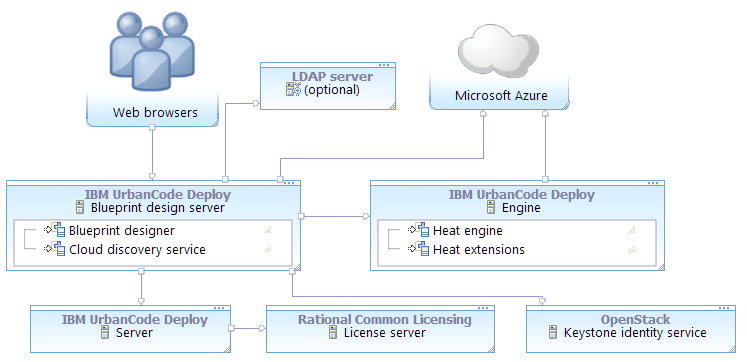

# Connecting the blueprint design server to Azure

To connect the blueprint design server to Microsoft™ Azure, map the Azure account information to a functional ID. Then, assign that functional ID to a team.

-   Obtain a Heat engine and an OpenStack Keystone server. The engine version must match the version of the Keystone server. In most cases for deploying to non-OpenStack clouds, install a Heat engine and Keystone server through HCL® UrbanCode™ Deploy. See [Installing an engine in silent mode](../../com.ibm.udeploy.install.doc/topics/install_engine_silent.md) or [Installing an engine in interactive mode](../../com.ibm.udeploy.install.doc/topics/install_engine_interactive.md).
-   Create a functional user account on the Keystone server. This user account must be a member of the administrative tenant on the Keystone server. If you use the Keystone server that was supplied with the engine, you can use the default administrative tenant credentials. The Keystone server's default administrative tenant user name is `admin` and the default password is `openstack1`. Later, you associate the Azure account information with this functional ID. With this account, users can authenticate to Azure.
-   Install the blueprint design server. See [Installing the blueprint design server](../../com.ibm.udeploy.install.doc/topics/install_server_bds.md).
-   Connect the blueprint design server to the server. See [Connecting the blueprint design server to the server](../../com.ibm.udeploy.doc/topics/ucdp_integrate.md#).
-   Configure an authentication realm for the blueprint design server. You can import users from a variety of sources, including LDAP servers, Keystone identity services, the HCL UrbanCode Deploy server, or from the internal authentication realm. See [Creating authentication realms for the blueprint designer](../../com.ibm.udeploy.admin.doc/topics/security_realms_create.md#).
-   Ensure that the blueprint design server can connect to Azure. You can verify the connection path with the curl or telnet commands. For example, make sure that no firewall, proxy, or security settings prevent communication between the blueprint design server and the cloud. The blueprint design server must be able to access the Azure endpoints for the regions that you plan to use.
-   Install or update the Azure command line client. For best results, use the most recent version of the Azure CLI. See [https://azure.microsoft.com/en-us/documentation/articles/xplat-cli-install](https://azure.microsoft.com/en-us/documentation/articles/xplat-cli-install).
-   Set up an account on Azure, including a subscription.
-   On the Azure web portal, create a resource group. You must place any custom images, virtual networks, and storage accounts that your blueprints use in this resource group.

The following diagram shows a typical topology for this scenario. The blueprint design server and engine connect to Azure. For authentication information, the blueprint design server connects to the Keystone identity service and, optionally, to an LDAP server.


1.   Obtain the connection information for your Azure account. To do this, you must use the Azure command line client and retrieve the following information, as described in the following steps:

    -   Your subscription ID
    -   A tenant ID
    -   A client ID
    -   The client secret key
    1.   Using the Azure CLI, log in to Azure with the following command: 

        ```
        azure login
        ```

        The command gives you a temporary authentication code and a URL.

    2.   In a web browser, go to the URL, enter the authentication code, and follow the instructions on the page. 
    3.   Set the mode to Azure Resource Management by running the following command: 

        ```
        azure config mode arm
        ```

    4.   Retrieve your Azure tenant ID and subscription ID by running the following command: 

        ```
        azure account list --json
        ```

        For example, assume that the output of the command looks like this:

        ```
        [
          {
            "id": "3a3d0c24-4ab8-4950-9e38-0335535985c3",
            "name": "Free Trial",
            "user": {
              "name": "jsmith@example.com",
              "type": "user"
            },
            "tenantId": "6c83cf8d-75c8-4edd-b544-5636dc0d7b73",
            "state": "Enabled",
            "isDefault": true,
            "registeredProviders": [],
            "environmentName": "AzureCloud"
          }
        ]
        ```

        In this case, the tenant ID is `6c83cf8d-75c8-4edd-b544-5636dc0d7b73` and the subscription ID is `3a3d0c24-4ab8-4950-9e38-0335535985c3`.

    5.   Using the following command, create an application and a service principal. This application is not used; it is a placeholder for you to use to obtain the information that you need to connect the blueprint designer to Azure. A service principal is an instance of an application that can access other resources.

        ```
        azure ad sp create 
          --name "applicationName" 
          --password password
        ```

        **Note:** You must enter this command on one line.

        -   For `applicationName`, specify the name of a placeholder application. This application is not used later, so you can enter any value, such as myTemporaryApplication.
        -   For `homePage`, enter any valid URL, such as https://example.com. This value is another placeholder and is not used again.
        -   For `identifierURI`, enter any valid URL, such as https://different-example.com. This value is another placeholder and is not used again.
        -   For `password`, specify a new password.

            **Note:** You will use this password to connect the blueprint designer to Azure, so you must remember it.

        For example:

        ```
        azure ad sp create 
          --name "myTemporaryApplication" 
          --password passw0rd
        ```

    6.   From the output of the azure ad sp create command, write down the application ID value and the service principal ID value. For example, assume that the output of the command looks like this:

        ```
        info:    Executing command ad sp create
        + Creating application myTemporaryApplication
        | Creating service principal for application 36c08414-e467-4cb2-9d31-c6bb2f629d6
        +
        data:    ObjectId:                8ceca473-ad95-4add-9367-5b4451d46902
        data:    DisplayName:             myTemporaryApplication
        data:    Service Principal Names:
        data:                             36c08414-e467-3cb2-91d1-c6bb2f629d64
        data:                             https://example.com
        
        ```

        The application ID is on the line that begins "Creating service principal for application," in this case `36c08414-e467-4cb2-9d31-c6bb2f629d6`. The service principal ID on the line that begins "ObjectId," in this case `8ceca473-ad95-4add-9367-5b4451d46902`.

    7.   Create a role by running the following command. A role is a set of permissions that you can use to access Azure resources.

        ```
        azure role assignment create 
          --objectId servicePrincipalID
          -o Contributor
          -c /subscriptions/subscriptionID
        ```

        -   For `servicePrincipalID` use the service principal ID \(labeled as "ObjectID"\) from the output of the azure ad sp create command. Other Azure CLI commands return object IDs in the output, but you must use the object ID from the output of the azure ad sp create command.
        -   For `subscriptionID`, use your Azure subscription ID.
        This command creates a role of the `Contributor` type, which provides the permissions that are needed to connect the blueprint designer to Azure. For example:

        ```
        azure role assignment create 
          --objectId 8ceca473-ad95-4add-9367-5b4451d46902 
          -o Contributor 
          -c /subscriptions/3a3d0c24-4ab8-4950-9e38-0335535985c3
        ```

    Now you have the following information:

    -   Your subscription ID, from the output of the azure account list command
    -   A tenant ID, from the output of the azure account list command
    -   An application ID, from the output of the azure ad sp create command
    -   The application password, which you created in the azure ad sp create command
2.   Log in to the blueprint designer as a user with the following **System** permissions: 
    -   Configure Security
    -   Manage Users & Groups
3.   Create a connection to the cloud: 
    1.   Click **Settings** \> **Clouds**. 
    2.   Click **Add New Connection**. 
    3.   Specify a name for the cloud connection. 
    4.   In the **Type** list, select **Microsoft Azure**. 
    5.   Click **Save**. 
4.   To create a cloud project, see [Creating cloud projects for the blueprint designer](security_projects.md). 
    1.   Select the cloud connection to Azure and then, on the **Authorization** tab, click **Add Project**. 
    2.   Specify the following information: 

        |Property|Description|
        |--------|-----------|
        |**Name \(Project name from OpenStack\)**|For OpenStack Keystone version 3, specify the OpenStack project name. For Keystone version 2, specify the tenant name. If you installed Keystone with the engine, the default value is admin.|
        |**Functional ID**|Enter the ID of the functional account on the OpenStack system. If you use the Keystone server that is provided with the engine, the default value is `admin`.|
        |**Password**|Enter the password for the functional account. If you use the Keystone server that is provided with the engine, the default value is `openstack1`.|
        |**Azure Subscription ID**|Enter the subscription ID to use. You found this information by running the CLI command azure account list.|
        |**Azure Client ID**|Enter the ID of the application that you created with the azure ad app create command.|
        |**Azure Client Secret**|Enter the password of the application. You specified this password when you ran the azure ad app create command.|
        |**Azure Tenant ID**|Enter the tenant ID to use. You found this information by running the CLI command azure account list.|

    3.   Click **Test Connection** to verify that the connection information is correct. 
    4.   Click **Save**. 
5.   Assign the cloud project to a team: 
    1.   Click **Teams**, and then select a team. 
    2.   Go to the **Cloud Authorization** tab, and click **Add**. 
    3.   Click **Save**. 
6.   Make sure that the team roles include the appropriate permissions for those users, such as creating and editing blueprints. 

Users can log in to the blueprint designer and use the cloud connection. At the top of the page, users can select the Azure cloud connection, cloud project, and region. When they edit blueprints, the palette shows resources that are available to the Azure account, and they can provision blueprints to the selected region. See [Modeling environments for Microsoft Azure](blueprint_edit_azure.md).

**Parent topic:** [Connecting to Microsoft Azure](../../com.ibm.edt.doc/topics/cloud_connect_azure.md)

