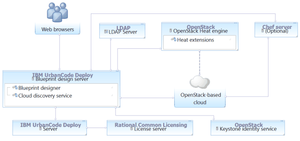

# Connecting to OpenStack-based clouds with LDAP authentication

To connect to an OpenStack cloud and use accounts from an LDAP server for authentication, create a cloud connection and cloud projects manually. Then, add the cloud projects to teams and add LDAP users to those teams.

-   Configure the images for use with the blueprint designer. See [Configuring OpenStack images](cloud_connect_openstack_images.md).
-   Extend the Heat engine that is associated with the OpenStack server. You must use an OpenStack Heat engine that is installed with the OpenStack server, not an engine that you install with HCL® UrbanCode™ Deploy. See [Installing the blueprint design server](../../com.ibm.udeploy.install.doc/topics/install_server_bds.md).
-   Install the blueprint design server. See [Installing the blueprint design server](../../com.ibm.udeploy.install.doc/topics/install_server_bds.md).
-   Connect the blueprint design server to the server. See [Connecting the blueprint design server to the server](../../com.ibm.udeploy.doc/topics/ucdp_integrate.md#).
-   Ensure that the blueprint design server can connect to the cloud. You can verify the connection path with the curl or telnet commands. For example, make sure that no firewall, proxy, or security settings prevent communication between the blueprint design server and the cloud.

The following diagram shows a typical topology for this scenario. The blueprint design server connects to the OpenStack-based cloud and the OpenStack Heat engine. The engine is extended for use with the blueprint design server. The blueprint design server connects to the LDAP server, from which it retrieves user account information. It also accesses the Keystone identity service. The blueprint design server retrieves authentication information from this Keystone identity service.



1.   Log in to the blueprint designer as a user with the following **System** permissions: 
    -   Configure Security
    -   Manage Users & Groups
2.  Create a connection to the cloud: 
    1.   Click **Settings** \> **Clouds**. 
    2.   Click **Add New Connection**. 
    3.  Specify a name for the cloud connection.
    4.   In the **Facing Type** list, select the type of URL for the Heat engine. You can determine the type of Heat URL by examining the Keystone endpoint list. To view the Keystone endpoint list, run the following command:

        ```
        openstack endpoint list
        ```

        -   If you connect through a private URL, select **Internal**.
        -   If you connect through a public URL, select **Public**.
    5.   Specify the functional ID and password. 
    6.   Specify the tenant. 
    7.   Specify the domain. 
    8.   In the Identity URL field, specify the location of your engine, such as `http://engine.example.com:8004`. 
    9.   Select the cost center to use to estimate the cost of environments on this cloud. 
    10. Click **Save**.
3.   Create cloud projects for this connection. See [Creating cloud projects for the blueprint designer](../../com.ibm.udeploy.admin.doc/topics/security_projects.md).
4.  Add the cloud projects to teams.
5.  Create an LDAP authentication realm and import users from that realm.See [Creating LDAP authentication realms for the blueprint designer](../../com.ibm.udeploy.admin.doc/topics/security_realms_ldap.md).
6.  Add the users to the teams and assign those users one or more roles.The users in the team have access to the cloud projects that are associated with that team.
7.   Make sure that the team roles include the appropriate permissions for those users, such as creating and editing blueprints. 
8.   If the cloud uses SSL security, configure SSL security on the blueprint design server. See [Configuring SSL security for OpenStack clouds](cloud_connect_ssl.md). 

Users can log in to the blueprint designer with the accounts on the LDAP server. At the top of the page, users can select the cloud connection, cloud project, and region. When they edit blueprints, the palette shows resources that are available from the cloud that the user account is associated with.

**Note:** When a user logs in to the blueprint designer, the blueprint designer matches the user name to the authentication realms, starting at the top of the list. If the user name is present in more than one authentication realm, the blueprint designer uses the listing in the highest authentication realm.

**Parent topic:** [Connecting to OpenStack and OpenStack-based clouds](../../com.ibm.edt.doc/topics/cloud_connect_openstack.md)

