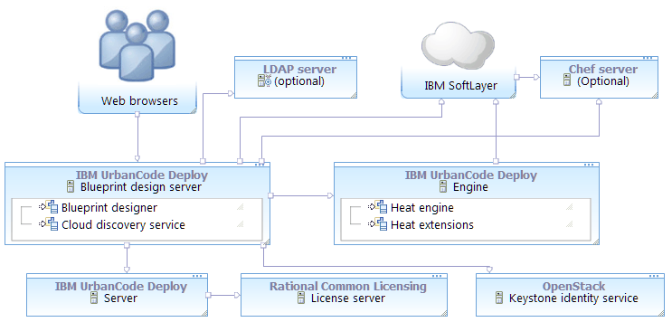

# Connecting to the SoftLayer cloud

To connect to the SoftLayer® cloud, create a functional ID for the SoftLayer account. Then, configure images to work with the SoftLayer cloud and the blueprint design server.

The following diagram shows a typical topology for this scenario. The blueprint design server and engine connect to the SoftLayer cloud. For authentication information, the blueprint design server connects to the Keystone identity service and optionally to an LDAP server.

-   **[Connecting the blueprint design server to the SoftLayer cloud](../../com.ibm.edt.doc/topics/cloud_connect_softlayer_server.md)**  
To connect the blueprint design server to the SoftLayer cloud system, map the SoftLayer account information to a functional ID. Then, assign that functional ID to a team.
-   **[Configuring private SoftLayer images](../../com.ibm.edt.doc/topics/cloud_connect_softlayer_images.md)**  
Before you use SoftLayer private \(custom\) images with the blueprint designer, you can install the cloud-init package on those images. If you want to run Chef roles on the image, you must use the cloud-init package.
-   **[Configuring SoftLayer image flavors](../../com.ibm.edt.doc/topics/cloud_connect_softlayer_flavors.md)**  
Flavors represent the capacity of images, including memory, storage space, and processor capacity. You must configure a set of flavors for the SoftLayer cloud.
-   **[Configuring the timeout value for SoftLayer clouds](../../com.ibm.edt.doc/topics/softlayer_timeout.md)**  
To accommodate variations in responsiveness of the SoftLayer cloud and to allow enough time for it to return resources to the blueprint designer, you can set a SoftLayer timeout value.

**Parent topic:** [Connecting to clouds through the blueprint designer](../../com.ibm.edt.doc/topics/security_cloud_connection.md)

