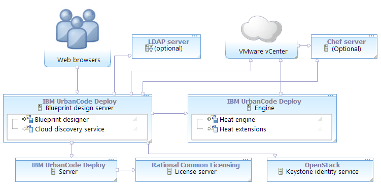

# Connecting to VMware vCenter v5.5 to 6.0

To connect to a VMware vCenter cloud, create a functional ID for the vCenter account. Then, create the flavors for environments.

You can connect the blueprint designer to VMware vCenter clouds that are only version 5.5 to 6.0.The following diagram shows a typical topology for this scenario. The blueprint design server and engine connect to vCenter. For authentication information, the blueprint design server connects to the Keystone identity service and optionally to an LDAP server.

-   **[Connecting the blueprint design server to VMware v Center v5.5 to 6.0](../../com.ibm.edt.doc/topics/cloud_connect_vmware_server.md)**  
To connect the blueprint design server to VMware vCenter, map the VMware vCenter account information to a functional ID. Then, assign that functional ID to a team.
-   **[Configuring VMware vCenter images](../../com.ibm.edt.doc/topics/cloud_connect_vmware_images.md)**  
Before you can use VMware vCenter images with the blueprint designer, you must install VMware Tools and a virtual CD-ROM drive on those images.
-   **[Configuring VMware vCenter images for Chef roles](../../com.ibm.edt.doc/topics/cloud_connect_vmware_images_chef.md)**  
Before you can use VMware vCenter images that run Chef roles with the blueprint designer, you must install cloud-init and a virtual CD-ROM drive on those images.
-   **[Configuring VMware vCenter image flavors](../../com.ibm.edt.doc/topics/cloud_connect_vmware_flavors.md)**  
Flavors represent the capacity of images, including memory, storage space, and processor capacity. You must configure a set of flavors for VMware vCenter.

**Parent topic:** [Connecting to clouds through the blueprint designer](../../com.ibm.edt.doc/topics/security_cloud_connection.md)

