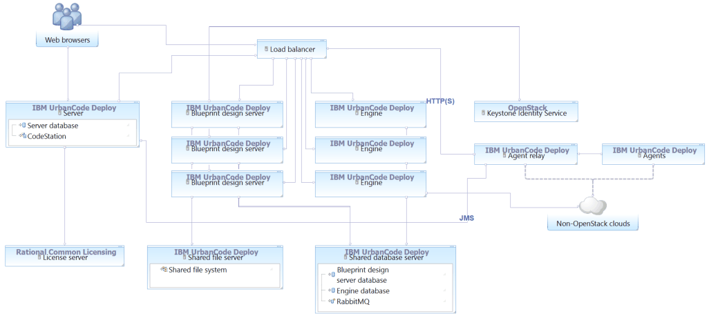
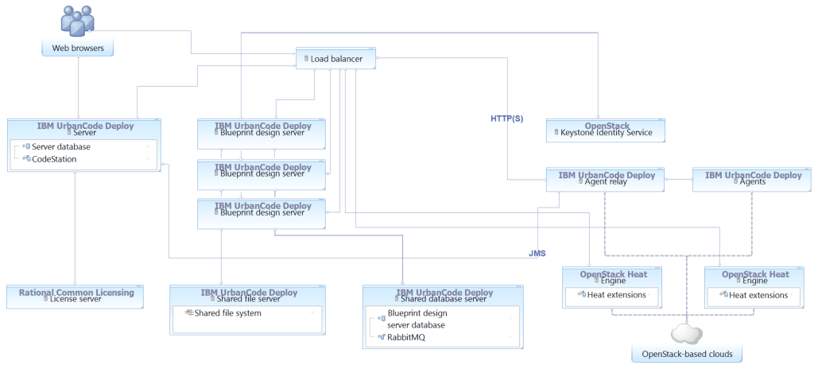

# Setting up clusters of engines

To set up clusters of engines, you store shared files on a system and set multiple engines to use those files.

-   These steps are appropriate for engines that you install with HCL® UrbanCode™ Deploy and use to connect to non-OpenStack clouds. To set up clusters of OpenStack engines that you use to connect to OpenStack clouds, see the OpenStack documentation.
-   Each engine in the cluster must run the same version of HCL UrbanCode Deploy.
-   Install an HCL UrbanCode Deploy server and create a token that the blueprint design servers can use to access it.
-   Set up a system to host the databases and load balancer. These resources can be on the same system or on separate systems. If you have a cluster of servers or blueprint design servers, you can use the same cluster resources or set up separate cluster resources for the engine cluster.
-   If you use HCL UrbanCode Deploy version 6.2.1.1 or later, install the databases on a Red Hat Enterprise Linux™ \(RHEL\) version 7 server. Make sure that the system is connected to a package manager, such as a Yum server.

To set up blueprint design servers and engines in a clustered configuration, you install them on separate systems and connect them to the same database and network storage. You can install as many blueprint design servers and engines as you need. You can also install blueprint design servers and engines as cold-standby servers to serve as disaster recovery units. You can install a blueprint design server and an engine on each cluster node, or you can install blueprint design servers and engines on separate nodes. If you install an engine and a blueprint designer on the same node, ensure that your operating system is compatible with the engine.

You do not need to install the same number of blueprint design servers and engines. Most high-availability setups need more engines than blueprint design servers.

Then, you configure a load balancer to distribute the traffic to the blueprint design servers. Instead of accessing the blueprint design servers and engines directly, users access the load balancer URL. To the users, that URL appears to host a single instance of the blueprint design server or engine.

A complete high-availability system of blueprint designers and engines includes the following systems:

-   One or more blueprint design server nodes
-   One or more engine nodes
-   A database for the engine nodes and the RabbitMQ service
-   A database for the blueprint design server nodes
-   A shared file system for the blueprint design server nodes
-   A load balancer

You can install each of these systems on a separate server, or you can combine some of them to reduce the number of overall nodes. For example, you can use the same database for the engine nodes and the blueprint design server nodes. You can also install one or more of the databases, shared file system, and load balancer on the same server. However, for greatest reliability, install the load balancer, databases, and shared file system on separate servers. For example, the following topology diagram includes three blueprint design server nodes, three engine nodes, and a single server that hosts the databases, RabbitMQ, and shared file system. This type of topology is appropriate for connecting to non-OpenStack clouds such as AWS and Azure.

To connect to OpenStack-based clouds, the topology is different because the Heat engines are installed via the OpenStack server, not via HCL UrbanCode Deploy:

**Note:** These instructions host the RabbitMQ service, the databases for the engine and Keystone service on a single server, and the shared file system on a single server. For a truly high-availability setup and to facilitate disaster recovery, you must ensure that these systems are stable and reliable. For example, you can configure automatic backups and have a cold standby system ready.

You can set up a cluster of blueprint design servers and engines independently of the HCL UrbanCode Deploy server. You do not necessarily have to have a cluster of HCL UrbanCode Deploy servers.

1.   If you use HCL UrbanCode Deploy version 6.2.1.1 or later, run a configuration script to set up and configure the databases and the RabbitMQ service. The script is provided with the installation media for the Heat engine that is provided with HCL UrbanCode Deploy. You must run this script on a RHEL version 7 server. The engines and Keystone services for these versions of HCL UrbanCode Deploy always use MariaDB databases.

    To use the configuration script, run the following command:

    ```
    /extracted\_location/ibm-ucd-patterns-install/engine-install/resources/tools/ha/create-backend-services.sh
    ```

    In this command, extracted\_location is the location that you extracted the engine installation media.

2.   If you use a version of HCL UrbanCode Deploy before 6.2.1.1, set up and configure the database and RabbitMQ service. The engines and Keystone services for these versions of HCL UrbanCode Deploy always use MySQL databases. These commands are for RHEL version 6 servers.
    1.   On the database system, install the engine as described in [Installing the engine](../../com.ibm.udeploy.install.doc/topics/install_engine.md). You do not actually run the engine on this system, but you must install the engine to configure the database for the other cluster engines.

        **Important:** Do not start the engine.

        The installation program installs a MySQL database and RabbitMQ service and populates them with information for the engines.

    2.   Stop the OpenStack Keystone service by running the following command: 

        ```
        service openstack-keystone stop
        ```

    3.   Ensure that the OpenStack Keystone and engine services do not restart if the system reboots by running the following commands: 

        ```
        chkconfig openstack-heat-api off
        ```

        ```
        chkconfig openstack-heat-api-cfn off
        ```

        ```
        chkconfig openstack-heat-api-cloudwatch off
        ```

        ```
        chkconfig openstack-heat-engine off
        ```

        ```
        chkconfig openstack-keystone off
        ```

    4.   Update the database so the other engine nodes can access it. For example, if you are using a MySQL database, log in to MySQL and run the following commands:

        ```
        GRANT ALL PRIVILEGES ON *.* TO 'heat'@'%' IDENTIFIED BY 'heat';
        ```

        ```
        
        GRANT ALL PRIVILEGES ON *.* TO 'keystone'@'%' IDENTIFIED BY 'keystone';
        ```

        ```
        
        GRANT ALL PRIVILEGES ON *.* TO 'root'@'%' IDENTIFIED BY 'passw0rd';
        ```

        These commands change the database user accounts to allow connections from other nodes, not just the node that hosts the database.

    5.   To configure the rabbitmq service for access from the other nodes, open the file /etc/rabbitmq/rabbitmq.config in a text editor. If this file does not exist, create it. 
    6.   Add the following line of code to the file, including the period at the end: 

        ```
        [{rabbit, [{loopback_users, []}]}].
        ```

    7.   Restart the rabbitmq service: 

        ```
        service rabbitmq-server restart
        ```

3.   Set up online and offline backups for the engines. [Backing up engines](../../com.ibm.udeploy.install.doc/topics/backup_engine.md#).
4.   Install a load balancer to send requests to the nodes. For example, the HAProxy load balancer can distribute traffic to a cluster of blueprint design servers and engines: [http://www.haproxy.org/](http://www.haproxy.org/). The following steps describe a basic HAProxy setup:
    1.   Install HAProxy. For example, on Linux systems that use the yum package manager, run the following command:

        ```
        yum install -y haproxy
        ```

    2.   Set up the file /etc/haproxy/haproxy.cfg to distribute load to the nodes. The load balancer must distribute traffic on the following ports to the blueprint design server nodes:

        -   8080
        -   7575
        The load balancer must distribute traffic on the following ports to the engine nodes:

        -   5000
        -   35357
        -   8004
        -   8000
        The following example file distributes load to three blueprint design server nodes that have the host names `designer1.example.com`, `designer2.example.com`, and `designer3.example.com`. It also distributes load to three engine nodes that have the host names `engine1.example.com`, `engine2.example.com`, and `engine3.example.com`.

        ```
        #---------------------------------------------------------------------
        # Example configuration for a possible web application.  See the
        # full configuration options online.
        #
        #   http://haproxy.1wt.eu/download/1.4/doc/configuration.txt
        #
        #---------------------------------------------------------------------
        
        #---------------------------------------------------------------------
        # Global settings
        #---------------------------------------------------------------------
        global
            # to have these messages end up in /var/log/haproxy.log you will
            # need to:
            #
            # 1) configure syslog to accept network log events.  This is done
            #    by adding the '-r' option to the SYSLOGD_OPTIONS in
            #    /etc/sysconfig/syslog
            #
            # 2) configure local2 events to go to the /var/log/haproxy.log
            #   file. A line like the following can be added to
            #   /etc/sysconfig/syslog
            #
            #    local2.*                       /var/log/haproxy.log
            #
            log         127.0.0.1 local2
        
            chroot      /var/lib/haproxy
            pidfile     /var/run/haproxy.pid
            maxconn     4000
            user        haproxy
            group       haproxy
            daemon
        
            # turn on stats unix socket
            stats socket /var/lib/haproxy/stats
        
        #---------------------------------------------------------------------
        # common defaults that all the 'listen' and 'backend' sections will
        # use if not designated in their block
        #---------------------------------------------------------------------
        defaults
            mode                    http
            log                     global
            option                  httplog
            option                  dontlognull
            option http-server-close
            option forwardfor       except 127.0.0.0/8
            option                  redispatch
            retries                 3
            timeout http-request    10s
            timeout queue           1m
            timeout connect         10s
            timeout client          1m
            timeout server          1m
            timeout http-keep-alive 10s
            timeout check           10s
            maxconn                 3000
        
        listen stats *:1936
            mode http
            log global
        
            maxconn 10
            timeout client       100s
            timeout server       100s
            timeout connect      100s
            timeout queue        100s
        
            stats enable
            stats refresh 7s
            stats show-node
            stats uri /haproxy?stats
        
        frontend keystone_api
            bind *:5000
            default_backend keystone_api_back
        
        frontend keystone_admin
            bind *:35357
            default_backend keystone_admin_back
        
        frontend heat_api
            bind *:8004
            default_backend heat_api_back
        
        frontend heat_cfn
            bind *:8000
            default_backend heat_cfn_back
        
        frontend heat_cloudwatch
            bind *:8003
            default_backend heat_cloudwatch_back
        
        frontend ucdp
            bind *:8080
            default_backend ucdp_back
        
        frontend cds
            bind *:7575
            default_backend cds_back
        
        backend keystone_api_back
            balance     roundrobin
            server      enginenode1 engine1.example.com:5000 check
            server      enginenode2 engine2.example.com:5000 check
            server      enginenode3 engine3.example.com:5000 check
            option      httpchk
        
        backend keystone_admin_back
            balance     roundrobin
            server      enginenode1 engine1.example.com:35357 check
            server      enginenode2 engine2.example.com:35357 check
            server      enginenode3 engine3.example.com:35357 check
            option      httpchk
        
        backend heat_api_back
            balance     roundrobin
            server      enginenode1 engine1.example.com:8004 check
            server      enginenode2 engine2.example.com:8004 check
            server      enginenode3 engine3.example.com:8004 check
            option      httpchk
        
        backend heat_cfn_back
            balance     roundrobin
            server      enginenode1 engine1.example.com:8000 check
            server      enginenode2 engine2.example.com:8000 check
            server      enginenode3 engine3.example.com:8000 check
            option      httpchk
        
        backend heat_cloudwatch_back
            balance     roundrobin
            server      enginenode1 engine1.example.com:8003 check
            server      enginenode2 engine2.example.com:8003 check
            server      enginenode3 engine3.example.com:8003 check
            option      httpchk
        
        backend ucdp_back
            balance     roundrobin
            server      designernode1 designer1.example.com:8080 check
            server      designernode2 designer2.example.com:8080 check
            server      designernode3 designer3.example.com:8080 check
            option      httpchk OPTIONS /
            option      forwardfor
            option      http-server-close
            appsession JSESSIONID len 52 timeout 3h
        
        backend cds_back
            balance     roundrobin
            server      designernode1 designer1.example.com:7575 check
            server      designernode2 designer2.example.com:7575 check
            server      designernode3 designer3.example.com:7575 check
            option      httpchk
        
        ```

    3.   Ensure that HAProxy runs at system startup. For example, on Red Hat Enterprise Linux \(RHEL\) version 7, run the following command:

        ```
        systemctl enable haproxy.service
        ```

    4.   Start HAProxy or restart the service if it is already running. For example, on RHEL version 7, run the following command:

        ```
        systemctl start  haproxy.service
        ```

5.   Verify that the load balancer is running and that it is ready to distribute traffic to the nodes. For example, if HAProxy is installed on a system with the host name `ucd-patterns.example.com`, you can go to the following URL to see the status of the nodes: `http://ucd-patterns.example.com:1936/haproxy?stats` 

After you configure the load balancer to distribute connections to the systems, users can connect to a single URL and use the entire cluster. The servers also ensure that the correct number of licenses are used, even if a user accesses multiple servers.

Several server processes behave differently than with individual servers. See [High-availability server processes](../../com.ibm.udeploy.admin.doc/topics/ha_servers.md#).

Add engines to the cluster. See [Adding engines to clusters](ha_add_engine.md).

**Parent topic:** [Setting up high-availability clusters](../../com.ibm.udeploy.doc/topics/server_install_clustered.md)

**Parent topic:** [Configuring](../../com.ibm.udeploy.doc/topics/c_node_configuring.md)

