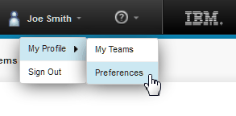

# Setting the language and display options for the server

Each user can specify the language for the server and how dates and times are shown on the server.

1.  At the upper-right corner of the server window, click your user name, and then click **My Profile** \> **Preferences**, as shown in the following figure:

    

2.  On the **Preferences** tab, in the **Locale** field, specify the language for the user interface.
3.  In the **Date Format** field, specify the format for dates in the user interface.
4.  In the **Time Format** field, specify the format for times.
5.  Click **Save**.

**Parent topic:** [Setting user preferences](../../com.ibm.udeploy.admin.doc/topics/prefs_ov.md)

**Parent topic:** [Managing security](../../com.ibm.udeploy.admin.doc/topics/security_ch.md)

