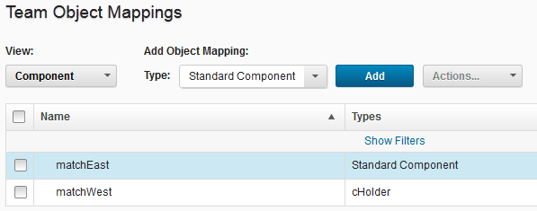
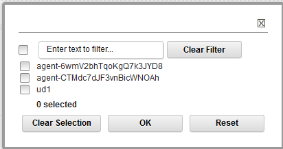

# Mapping teams to objects

In addition to assigning a team to an object \(such as a component or application\), when you create the object, you can use the Teams page on the server to map teams to objects.

To map a team to an object, you must be a member of the team and have the manage teams subpermission for that type of object.

You can assign teams to many of the objects that you create. When you create an object, you can assign teams by using the associated Create item window. You can also assign teams by using the Configuration page for the object. You can also map teams to objects as described here. When you assign a team to an object, such as an environment, only team members with the appropriate permissions can interact with the affected object. By default, new objects are assigned to all the teams that you are a member of. To specify which teams to assign new objects to, see [Setting the teams for your account](prefs_teams.md).

1.   On the server, click **Settings** \> **Teams**. 
2.  From the list of teams, select the team to use.
3.   Under **Team Object Mappings**, in the **View** list, select the type of object. The table shows the objects that are associated with the team.

    

4.   From the **Type** list, select the security type. 
5.  Click **Add**.A list of user-created objects that are not already assigned to the current product area is displayed.

    

6.   Select the appropriate check boxes for the objects to assign to the team, and then click **OK**. 

Teams that are mapped to objects are displayed on the associated object page.

**Parent topic:** [Security teams](../../com.ibm.udeploy.admin.doc/topics/security_teams.md)

