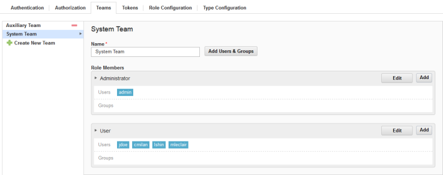

# Assigning users to teams

Assign users to teams so that users can be assigned to roles and work with objects that are associated with the teams.

1.   On the server, click **Settings** \> **Teams**. 
2.   In the Teams pane, select the team to add users to. 

    When a team is selected, all previously defined roles are available. In the following figure, the **System Team** is selected. All roles are displayed, and users are listed below their assigned roles. Users and groups are added to a team by assigning them to a specific role or roles.

    

3.   To add users to roles, do one of the following actions: 
    -   Click **Add** for the target role, and then select the appropriate check boxes from the list of users and groups.
    -   Click **Add Users and Groups**, and then drag users and groups onto target roles.

Assign teams to objects, such as applications, environments, components.

**Parent topic:** [Security teams](../../com.ibm.udeploy.admin.doc/topics/security_teams.md)

