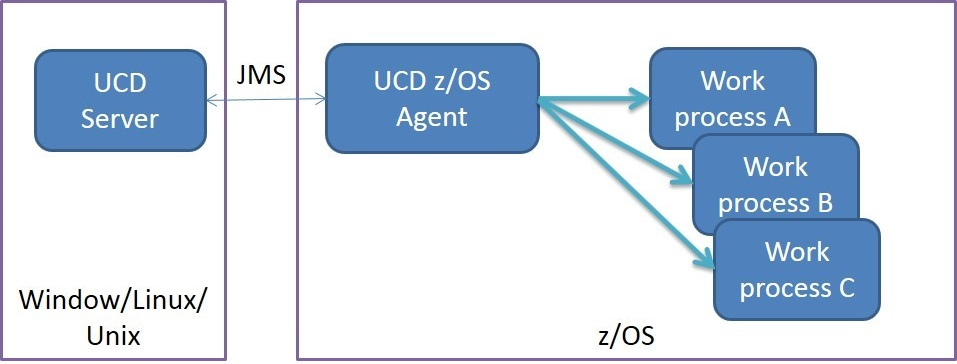
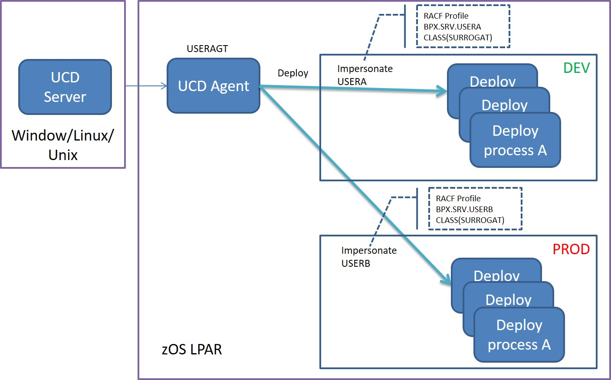

# Security requirements on IBM z/OS computers

Specific security definitions are used to secure HCL® UrbanCode™ Deploy \(UCD\) functions for the IBM® z/OS® environment. To deploy applications to an IBM z/OS environment, the user accounts on the agent computer must have adequate access permissions. You must also identify specific directories and data sets to the authorized program facility.

The topics in this section present the security configurations related to the agent started task, data sets, file systems, user IDs, impersonation and security configurations related to the z/OS Utility plugin.

**Note:** This document does NOT cover the UCD server’s security model and the security configurations related to server agent communication. Refer to [UCD security configuration related to z/OS](security_zos_UCDrelated.md).

## Agent started task and agent user ID

The UrbanCode Deploy IBM z/OS agent is a long running Java process in the IBM z/OS UNIX System Services. The UrbanCode Deploy server distributes work, known as deploy processes, to an agent to execute. For each step in the deploy process, the agent starts a separate work process. The work process inherits the agent user ID’s security environment, unless the process is configured to use impersonation.

  

## Agent impersonation

The su command is used to impersonate users. This figure shows a deployment scenario with two logical environments, DEV and TEST, in the same logical partition \( LPAR\). The deployment process is configured so that the agent impersonates USERA when deploying to DEV and USERB when deploying to TEST.

  

## Limitations

1.  [HardwareCryptography IBMJCECCA](http://www.ibm.com/systems/z/os/zos/tools/java/products/sdk71jcecca.html)isnot supported.
2.  [RACFdigital certificates](https://www.ibm.com/support/knowledgecenter/en/SSLTBW_2.3.0/com.ibm.zos.v2r3.icha700/digcert.htm)arenot supported. UCD uses keystore and keytool provided by Java to generate and manage certifications to be used for the agent/server communication.

-   **[IBM z/OS agent user accounts](../../com.ibm.udeploy.admin.doc/topics/security_zos_agent.md)**  
If you run the agent from a UNIX™ command line, the agent user account is the account that you use to log in to the UNIX shell. If you run the agent as a started task, the agent user account is assigned by the Resource Access Control Facility \(RACF®\) using the started procedures table \(ICHRIN03\) or the STARTED class. To learn more about RACF, see the *z/OS Security Server RACF® System Programmer's Guide, SA23-2287-00*.
-   **[IBM z/OS authorized program facility](../../com.ibm.udeploy.admin.doc/topics/security_zos_apf.md)**  
To deploy applications to an IBM z/OS environment, you must identify specific directories and data sets to the authorized program facility \(APF\).
-   **[IBM z/OS directories and data sets](../../com.ibm.udeploy.admin.doc/topics/security_zos_files.md)**  
To deploy applications to an IBM z/OS environment, the user accounts on the agent computer must have adequate access permissions. You must also identify specific directories and data sets to the authorized program facility.
-   **[IBM z/OS tokens](../../com.ibm.udeploy.admin.doc/topics/security_zos_tokens.md)**  
Tokens are used to authenticate with the HCL UrbanCode Deploy server when z/OS component versions are imported.
-   **[IBM z/OS component versions](../../com.ibm.udeploy.admin.doc/topics/security_zos_versions.md)**  
Component versions forIBM z/OS are imported from the build LPAR by using the buzltool.sh command.
-   **[UCD security configuration related to z/OS](../../com.ibm.udeploy.admin.doc/topics/security_zos_UCDrelated.md)**  
Information for the HCL UrbanCode Deploy \(UCD\) server’s security model and the security configurations related to server agent communication for IBM z/OS are referenced in this topic.

**Parent topic:** [Managing security](../../com.ibm.udeploy.admin.doc/topics/security_ch.md)

