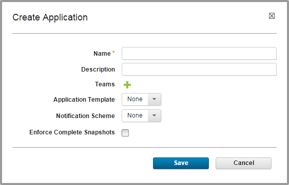
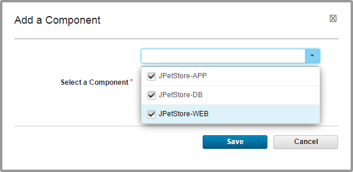

# Creating applications

You can create an application from scratch or import an existing one.

Before you configure an application, ensure that at least one agent is installed in a target environment. For evaluation purposes, the agent can be on the same system as the server. See [Resources](resources_ch.md).

See [Importing applications](app_import.md) for information about importing applications.

1.   Display the Create Application dialog box **Applications** \> **Create Application**, and enter the following information: 

    

    -   Typically the **Name** and **Description** correspond to the application you plan on deploying.

        **Restriction:** If you deploy this application to a cloud that uses virtual system patterns, the application name cannot contain asterisk \(\*\), backslash \(\\\), or forward slash \(/\) characters. See [Modeling environments for clouds that use virtual system patterns](../../com.ibm.edt.doc/topics/blueprint_edit_clouds_vsp.md#).

    -   To grant teams access to the application and set its security type, click the **plus sign** icon by **Teams**, select values from the **Team** and **Type** lists, and click **Add**.
    -   To create an application from a template, from the **Application Template** list, select the application template name. Then, from the **Application Template Version** list, select either the application template version number or to ensure that the application always meets the latest requirements of the template, **Always Use Latest**. See [Creating applications from application templates](app_template_using.md#).
    -   **Notification Scheme**. HCL UrbanCode Deploy includes integrations with LDAP and email servers that enable it to send out notifications that are based on events. For example, the default notification scheme sends out an email when an application deployment fails or succeeds. Notifications also play a role in approving deployments: HCL UrbanCode Deploy can be configured to send out an email to either a single individual or to a group or people \(based on their security role\) notifying them that they must approve a requested deployment. See [Creating Notifications in a Notification Scheme](notify_create.md).
    -   If you want the application to require that every component is versioned, click the **Enforce Complete Snapshots** check box.
2.  Click **Save**.The new application opens.
3.  Add one or more components to the application: 
    1.  Within the application, click the **Components** tab, which is not to be confused with the global **Components** tab. 
    2.  Click **Add Component**. 
    3.  In the Add a Component window, expand the **Select a Component** list and select the check boxes next to one or more components, as shown in the following figure.

        

    4.  Click **Save**.

After you create an application, you:

-   Create an environment \([Creating environments](app_environment_create.md)\)
-   Associate an agent with the environment \([Mapping resources and components to environments](app_environment_mapping.md)\)
-   Create an application process \([Application processes](app_process.md)\)

-   **[Importing applications](../topics/app_import.md)**  
If you exported an application, you can import the application on a different server. When you import an application, you can create an entirely new application or upgrade an existing one.
-   **[Exporting applications](../topics/app_export.md)**  
Exporting applications creates a JSON file \(file extension json\) that contains the properties, components \(and their associated properties and processes\), and processes of the applications.

**Parent topic:** [Applications](../topics/applications_ch.md)

