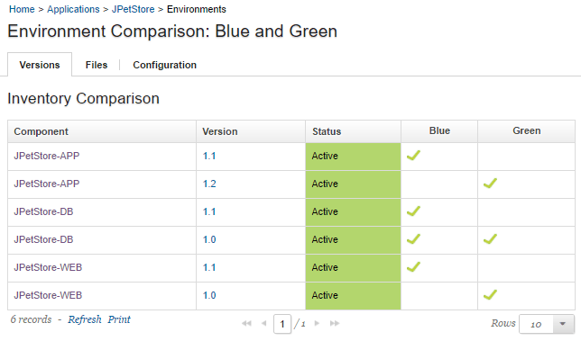
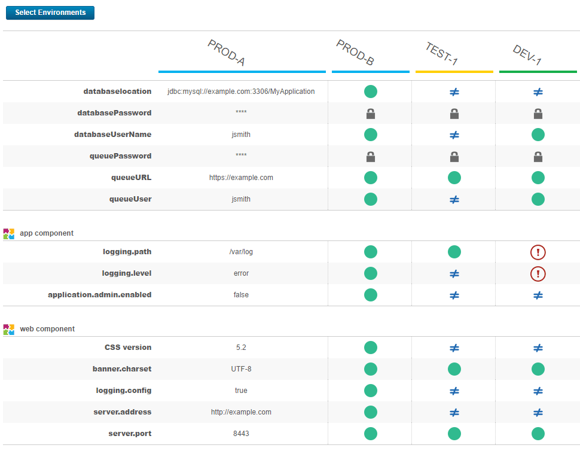

# Comparing environments

You can compare two environments to see differences in their inventories or property values.

**Parent topic:** [Application environments](../topics/app_environment.md)

## Comparing environment inventories

Comparing two environment inventories shows the differences in component versions between two environments. It also shows the differences in files and properties.

1.   From the HCL® UrbanCode™ Deploy dashboard, click **Applications**, and then select an application. 
2.   Click **More** for one of the environments to compare, and then click **Compare**. 
3.   From the **Environment** list, select the other environment to compare, and then click **Save**. The Environment Comparison page opens. The component versions that are contained in each environment are displayed on the **Versions** tab, as shown in the following figure.

    

4.   To see the differences between properties in the two environments, click the **Configuration** tab. 
5.   To see the differences between files in the two environments, click the **Files** tab. 

## Comparing properties

You can run a detailed comparison of properties between environments. You use one environment as a reference point, select one or more other environments, and the server shows the differences in properties on the other environments.

1.   From the HCL UrbanCode Deploy dashboard, click **Applications**, and then select an application. 
2.   Click **Compare Environments**. 
3.   In the Select Environments window, select a reference environment and then select one or more other environments to compare with the reference environment. 

The Environment Comparison page shows the differences in properties between the reference environment and the other environments. The reference environment is shown on the left side of the page and the other environments are shown in the columns to the right.

-   A green dot  indicates that the property has the same value as the reference environment.
-   A not equals sign  indicates that the property has a different value than the reference environment.
-   An empty circle  indicates that the property does not exist on the environment.
-   An exclamation point  indicates that the property is required, but it does not have a value on that environment.
-   A lock  indicates that the property is secure. The server does not compare secure properties.

The Environment Comparison looks like the following figure:

You can also export the results of the comparison to a CSV file by clicking **Download**. The output file escapes values that start with Excel function characters such as `=`, `+`, `-`, and `@` by prepending an apostrophe. Property values that are longer than 4,000 characters are truncated to 4,000 characters in the output.

