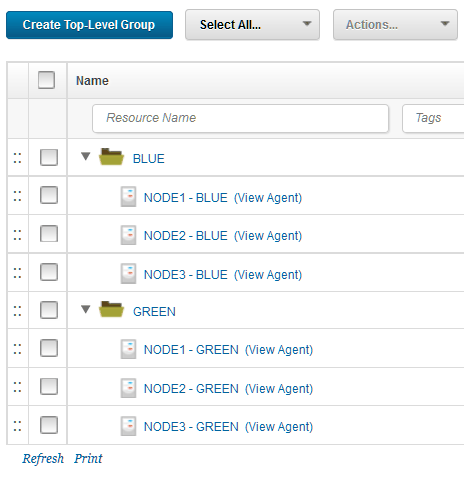
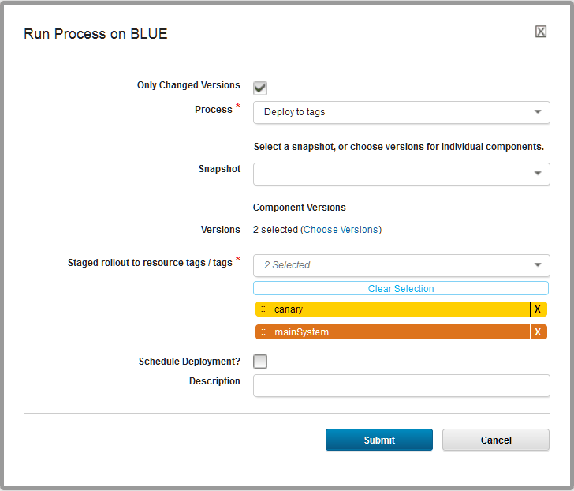

# Modeling blue-green, rolling, and canary deployments

The For Each Agent and For Each Tag steps provide ways to deploy to large environments in stages, allowing you to run flexible blue-green or rolling deployments, with or without updating canary nodes first.

Two application process steps, the [For Each Agent](app_process_every_agent.md) step and the [For Each Tag](app_process_every_tag.md) step, provide flexible ways to deploy to multi-node environments in stages. You can use these steps to select subsets of agents and deploy to those subsets in specific orders. The following scenarios are just a few examples of how you can use these steps to control how deployments happen in multi-node environments.

## Blue-green deployments

For a video demo of blue-green deployments, see [Blue-green deployments with IBM UrbanCode Deploy](https://developer.ibm.com/urbancode/videos/bluegreen-deployments-ibm-urbancode/). For an article that covers a blue-green deployment scenario in detail, see [Setting Up Blue-Green Deployments in IBM UrbanCode Deploy 6.2.4](https://developer.ibm.com/urbancode/docs/setting-blue-green-deployments-ibm-urbancode-deploy-6-2-4/).

Blue-green deployments use two identical environments. While clients are using one active environment, you can update the other environment without interrupting the active environment. Then, when the other environment is ready, you set a load balancer to send client traffic to the updated environment. Updating environments in this way allows for zero-downtime deployments and keeps a second working environment ready at all times in case anything goes wrong with the active environment.

To set up a blue-green deployment, first set up matching environments on the server. These environments can point to the same physical environments as long as they have different agent resources. These different agent resources allow you to distinguish the two environments, as shown in the following figure.

Then, apply resource tags to select subsets of the agent resources. For example, large deployments often update a few test nodes first, called canary nodes. You can apply a resource tag to your canary nodes to run deployments on those agent resources first. For example, the following figure shows the same resource tree with the addition of "canary" tags on the canary node and "mainSystem" tags on the other nodes:

Then, in your application processes, run deployments based on the tags or agents. For example, to run a deployment on the canary agent resources first, and all of the other agent resources second, use a For Each Tag loop. In the loop, use the canary tag first and then a tag that represents the other resources. The following figure shows the For Each Tag step in use, and the next figure shows the properties for that step:

When you request the process, you can set the tags to use for that request, as shown in the following figure:

There are many other ways to organize this type of deployment. For example, instead of using separate environments, you could use a single environment and tag the nodes Blue and Green with resource tags. How you organize your environments and apply resource tags to them depends on the order in which you want to update your nodes.

## Rolling deployments

Rolling deployments update large environments a few nodes at a time. The setup for rolling deployments can be similar to blue-green deployments, but this time with a single logical environment. The environment can have many nodes, as shown in the following figure:

To deploy to these nodes one at a time, use the For Each Agent step. For example, the following application process runs deployments on these nodes within the For Each Agent step. It pauses for a manual task after each deployment to ensure that the deployment ran correctly on that node. You could use any manual or automatic test in place of that manual task. In the properties for the loop, the **Max Concurrent Agents** property is set to 1 to run the deployment to a single agent at a time.

## Canary deployments

Canary deployments are deployments that start by updating a single node or a subset of nodes. That way, you can test the update on a small subset of your system before you update every node. Canary deployments can be part of many other deployment scenarios. For example, the scenario in [Setting Up Blue-Green Deployments in IBM UrbanCode Deploy 6.2.4](https://developer.ibm.com/urbancode/docs/setting-blue-green-deployments-ibm-urbancode-deploy-6-2-4/) includes deployment to a canary node first.

All you need to do to use a canary node in your deployment is to pick one or a few nodes and make sure that you deploy to those nodes first. Then, you must run automated or manual tests to make sure that the canary node or nodes are working well with the new version.

A straightforward way to deploy to canary nodes first is to apply a resource tag to them and to deploy to that resource tag first. For example, the scenario in the article [Deploying applications with canary nodes](https://developer.ibm.com/urbancode/docs/deploying-applications-canary-nodes/) applies the resource tag `canary` to one node and the resource tag `mainSystem` to the other nodes. The article shows several ways to use those tags, but a simple way is to use a For Each Tag loop. This loop contains a simple sub-process that deploys the components and runs automated tests:

In the properties of the loop, you select the tags and then set the order for those tags. In this case, the `canary` tag runs first and the `mainSystem` tag runs second:

**Parent topic:** [Application processes](../topics/app_process.md)

