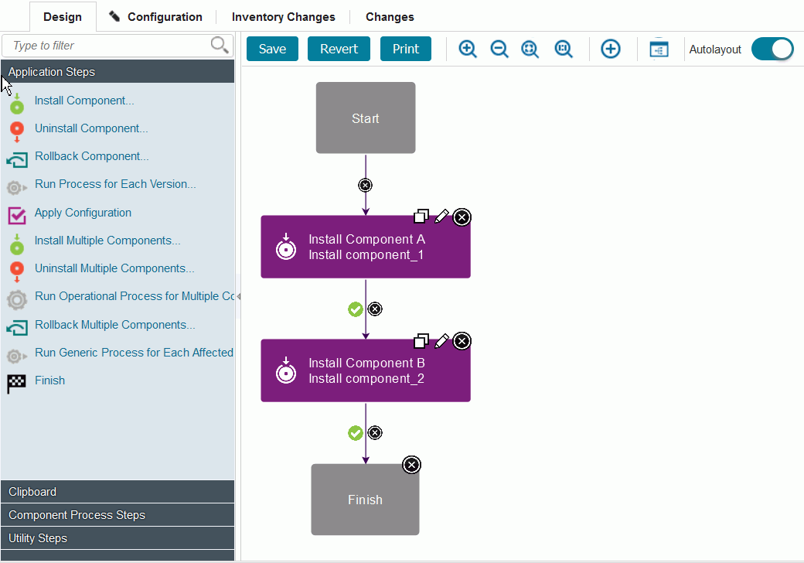

# Deploying components in an application process

You can deploy one or more components in an application process by calling component processes.

-   Create an application and add one or more components to the application.
-   Create an application process.
-   Create a component process of the Deployment type for each component.

    **Important:** If **Deployment** is not selected for **Type**, the deployment process will not succeed.

1.   In an application process, add the Install Component step to the process, and click the edit icon . The Edit Properties window opens. 
2.  In the properties for this step, specify the component to deploy and the component process to run.For more information about this step, see [Install Component](app_processsteps_install.md).
3.   When you drag more steps to the process diagram, position the step so that the link between steps is highlighted, and then drop the step. The step is automatically linked to the earlier and subsequent steps. 
4.   Verify that all processes are connected in the correct order and that the flow is connected to the Start and Finish nodes; then, save the process. 
5.  Run the process on an environment.See [Running application processes](app_process_run.md).

The following example application process deploys two components. The `Install Component A` and `Install Component B` steps call the deployment processes for each component.

**Parent topic:** [Application processes](../topics/app_process.md)

