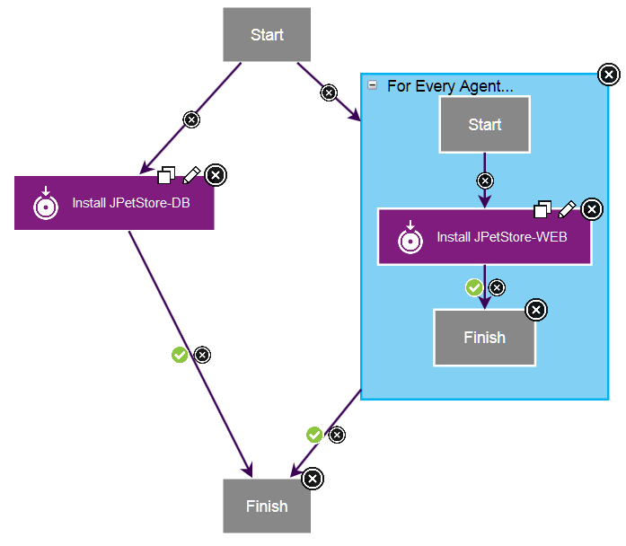
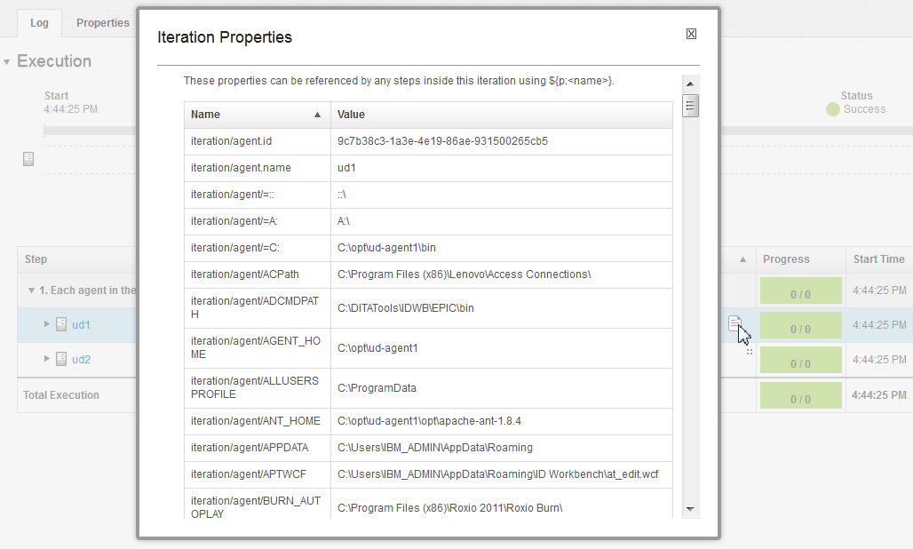

# For Each Agent

This step creates a loop that iterates over the agents in the environment.

**Tip:** 

Applications, components, and generic processes share some process steps. This step applies only to application processes, including application processes that are associated with application templates.

This step provides vertical iterations, or iteration containers, for application processes. If, for example, you have numerous application servers, you can use this step to employ all agents in the environment to simultaneously deploy components to the servers. In this case, using this step means that overall deployment is not impacted even if one application server is slow.

This step runs the process that is defined within the container for each agent in the application environment. The workflow in the container has its own context, and its own start and finish steps, as shown in the following figure. You can use any application process step in the subprocess. An iteration container can connect to any step, even other iteration containers, but you cannot include other iteration containers within an iteration container.

|Field|Description|
|-----|-----------|
|**Name**|A name for the iteration container.|
|**Limit to Resource Tags**|A list of resource tags that limit the container. The subprocess runs only on the agent resources that have one or more of the specified resource tags.|
|**Maximum number of concurrent processes**|The maximum number of agents that run the subprocess at a time. To run the subprocess on every agent at once, specify `-1`. To limit the number of agents to deploy to at once, as in blue/green deployments or rolling deployments, specify an integer. The server attempts to resolve the value to an integer. If the value does not resolve to an integer, then the `-1` value is used by default. You can use a property in this field, as long as the property resolves to an integer.

|

## Iteration properties

The For Each Agent step has properties, called iteration properties, that can be used to reference steps within the iteration context. By using these properties, for example, you can identify the current agent within the context. To reference iteration properties, use the following format: `${p:iteration/<name>}`. For example, the current agent name is in the property `${p:iteration/agent.name}`.

To view the iteration properties for the step, follow these steps:

1.  Open the log for the application process request by clicking **Applications** \> **application\_name** \> **History** \> **View Request**.
2.  Expand the container step and, next to one of the iterations, click **Iteration Properties**.

**Parent topic:** [Process steps: Reference](../topics/app_processSteps.md)

