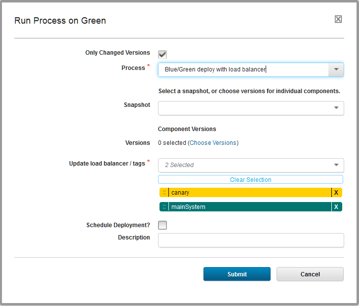
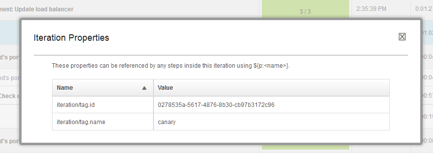

# For Each Tag

This step iterates over resource tags in application processes.

**Tip:** 

Applications, components, and generic processes share some process steps. This step applies only to application processes, including application processes that are associated with application templates.

This step iterates over one or more resource tags. If you have many agent resources mapped to an environment, you can use this step to choose which resources to run steps on. For example, if you are running a rolling deployment, you can use this step to deploy to a few resources first, and then run automated tests on those resources before deploying on the other resources. Also, if you are running a blue/green deployment, you can use this step to limit the deployment to the blue nodes or green nodes. Finally, you can select the order of the tags to iterate over, such as if you want to update specific canary nodes before all other nodes. For a video demo of Blue/Green deployments, see [Blue/Green deployments with IBM UrbanCode Deploy](https://developer.ibm.com/urbancode/videos/bluegreen-deployments-ibm-urbancode/).

Like the For Each Agent step, this step creates an iteration container for subprocesses. You specify one or more resource tags, and the order of those resource tags, and the step runs the subprocess once for each resource tag. The workflow in the container has its own context, and its own start and finish steps, as shown in the following figure. You can use any application process step in the subprocess. An iteration container can connect to any step, even other iteration containers, but you cannot include other iteration containers within an iteration container.

To make it easier to control which resources you deploy to, such as in a staged, rolling, or blue/green deployment scenario, you can set the tags on the fly when you request the process. In the Request Process window, the list of tags for the container is shown. You can add or remove tags here, or change the order of the tags. This way, you can use one process to deploy in different scenarios. For example, if you want to deploy to a canary node first, put that resource tag first, and then follow with the other tags. The following figure shows a process request to a canary node first, and to the rest of the resources next.

|Field|Description|
|-----|-----------|
|**Name**|A name for the iteration container.|
|**Tags**|A list of resource tags to use in the container. The subprocess runs once for each resource tag. You can order the resource tags by dragging and dropping them.|
|**Max Concurrent Tags**|The maximum number of tags for which to run the subprocess at a time. To run the subprocess on all of the tags at the same time, specify `-1`. To run the subprocess on only a few of the tags at a time, as in blue/green deployments or rolling deployments, specify an integer. The server attempts to resolve the value to an integer. If the value does not resolve to an integer, then the `-1` value is used by default. You can use a property in this field, as long as the property resolves to an integer.

|

## Iteration properties

The For Each Tag step has properties, called iteration properties, that can be used to reference steps within the iteration context. By using these properties, for example, you can identify the current agent within the context. To reference iteration properties, use the following format: `${p:iteration/<name>}`. For example, the current tag name is in the property `${p:iteration/tag.name`.

When you run the application process, the log shows each iteration of the container as a separate entry. For example, the following log shows a For Each Tag step that ran over two tags:

To view the iteration properties for the step, follow these steps:

1.  Open the log for the application process request by clicking **Applications** \> **application\_name** \> **History** \> **View Request**.
2.  Expand the container step and, next to one of the iterations, click **Iteration Properties**.

**Parent topic:** [Process steps: Reference](../topics/app_processSteps.md)

