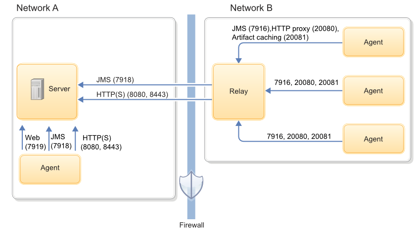

# Agent security and communication

Agents use SSL-secured JMS, WebSocket, HTTP, and HTTPS protocols to communicate with the server.

## Agent overview

Agents do the actual work of deployment, which removes the task from the server. Agents are an important part of scalability in HCL® UrbanCode™ Deploy.

There are two agent types. Web agents use WebSocket connections and HTTP\(S\) for agent-server communication. [Web agents were introduced with version 7.0.0](web_agents.md#). Agents delivered before version 7.0.0 are called JMS agents. JMS agent use JMS and HTTP\(S\) to communicate with the server. You determine agent type when you install the agent.

Although an agent is typically considered as a single process, technically an agent consists of a worker process and a monitor process. The worker process is a multithreaded process that runs the deployment work after it receives commands from the server. Work commands come from plug-in steps, which provide integration with many third-party tools. The monitor is a service that manages the worker process: starting and stopping, handling restarts, upgrades, and security, for example. After an agent is installed, it can be managed from the HCL UrbanCode Deploy web application.

## Agent security

All processes, including packaging, configuration, and deploying, that the HCL UrbanCode Deploy server requests run on hardware that is assigned to agents. For added security, agents do not listen to ports, but open direct connections to the server instead. After an installed agent starts, the agent opens a socket connection to the HCL UrbanCode Deploy server based on the installation information.

For JMS agents, most communication between server and agents uses a Java™ Message Service \(JMS\) based protocol. The communication can be secured with SSL, with optional mutual key-based authentication for each end point. This communication protocol is stateless and resilient to network outages.

Web agents use public-key pinning for strong out-of-box security. Agents and servers identify each other with SSL certificates. The public keys in the certificates are pinned on initial connection. When a public key is pinned, any certificate asserting the same identity must be generated with the same public/private key pair that was used to create the original certificate. Connections from clients or servers that do not correctly identify themselves are closed.

Agents on networks other than the one where the server is located might need to open a firewall to establish connection. After communication is established, the agent will be visible in the HCL UrbanCode Deploy web application where it can be configured. Active agents, regardless of operating system, can be upgraded with the web application.

## Agent communication

JMS agents use the JMS channel as the primary control channel. JMS agents use this channel to retrieve commands from the server. However, some JMS agent activities access the web tier with HTTP and HTTPS. For example, posting logs, transmitting test results, or posting files to CodeStation use HTTP and HTTPS.

Web agents use WebSocket connects for tacking agent status and notifications, and HTTP for everything else.

The following diagram shows the main default ports that are involved in communication between agents, agent relays, and the server.

For more information about firewall configuration and port usage, see [System requirements and performance considerations](../../com.ibm.udeploy.install.doc/topics/sysRequire.md) and [Firewall and communication configuration](../../com.ibm.udeploy.install.doc/topics/agent_firewalls.md).

For JMS agents, the agent monitor service uses JMS for all server communications and for sending commands, such as the run step command, to the worker process. The worker process uses JMS for system communications and HTTP REST services when it completes plug-in steps or retrieves information from the server.

Stateless server-agent communication provides significant benefits to performance, security, availability, and disaster recovery. Because each agent request is self-contained, a transaction consists of an independent message, which can be synchronized to auxiliary storage as it occurs. Either endpoint, server or agent, can be stopped and restarted without repercussion, other than lost time. If communications fail midtransaction, no messages are lost. After they are reconnected, the server and agent automatically determine which messages got through and what work was completed. After an outage, the system synchronizes the endpoints and recovers affected processes. The results of work that an agent completes during the outage are communicated to the server.

**Note:** 

If an agent is reinstalled use the Forget JMS Certificate button by clicking Resources \> Agents \> Agent name \> Configuration \> Agent Security \> Forget JMS Certificate on the server. Next you will need to regenerate the [API key of the agent](https://www.ibm.com/support/knowledgecenter/en/SS4GSP_6.2.7/com.ibm.udeploy.admin.doc/topics/api_key.html).

**Parent topic:** [Agents and agent relay configuration](../topics/configure_agents.md)

