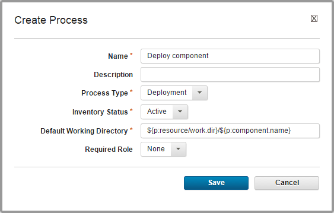

# Creating component processes

A component process is a series of user-defined steps that operate on a component's artifacts. You create a component process in two steps: first, you configure basic information, such as name; second, you use the process editor to assemble the process.

1.   Display the Create Process dialog box by clicking **Components** \> **selected component** \> **Processes** \> **Create Process**. 

    

2.  Complete the following fields:

    |Field|Description|
    |-----|-----------|
    | **Name** |Identifies the process; appears in many UI elements. Required. **Note:** Name character limit is 255.

|
    | **Description** |The optional description can be used to convey more information about the process.|
    | **Process Type** |Defines the process type. Required. Selecting the correct process type is critical for the associated application process to run correctly. **Important:** If you are deploying components you must select the **Deployment** process type. If another type is selected for a component that you plan to deploy with an application process, the application process will fail. For more information, see [Component process types](comp_process_types.md).

|
    |**Inventory Status** |Status that is applied to component versions after being successfully run by this process. `Active` indicates that the component version is deployed to its target resource. The status appears on the Inventory panes for the component itself and environments that ran the process. Required.|
    | **Default Working Directory** |Defines the location that the agent uses to run the process \(for temporary files, and so on\). The default value is $\{p:resource/work.dir\}/$\{p:component.name\}, where $\{p:resource/work.dir\} is the default working directory for the agent and $\{p:component.name\} is the component name. The default value resolves to agent\_directory\\work\\component\_name\_directory and is stored in the componentProcess.defaultWorkDir property. The default properties work for most components; you might need to change it if a component process cannot be run at the agent's location. Required.|
    | **Required Role** |Restricts who can run the process. The available options are derived from the HCL® UrbanCode™ Deploy security system. The default value is `None`, meaning anyone can run the process. For information about security roles, see [Managing security](../../com.ibm.udeploy.admin.doc/topics/security_ch.md).|

3.  Save your work when you are finished.The process is listed on the Processes pane for the associated component.

Edit the process in the process editor. See [Editing processes](comp_workflow_edit.md).

**Parent topic:** [Component processes](../topics/intro_component_processes.md)

