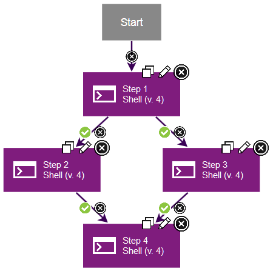
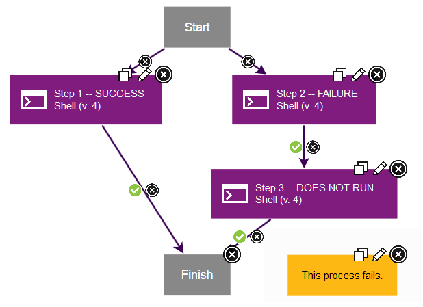
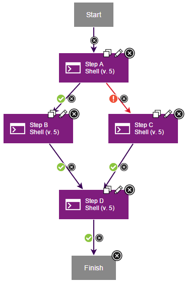
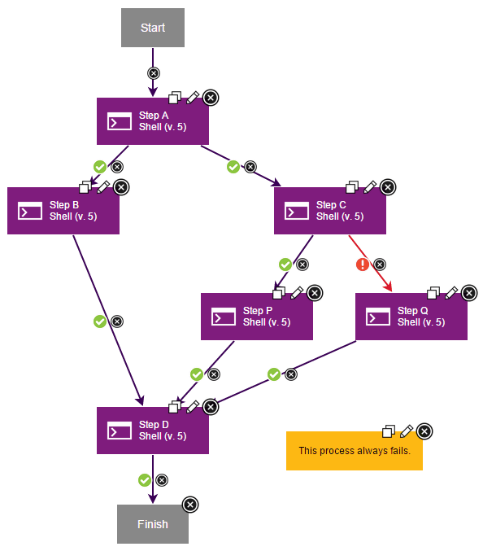
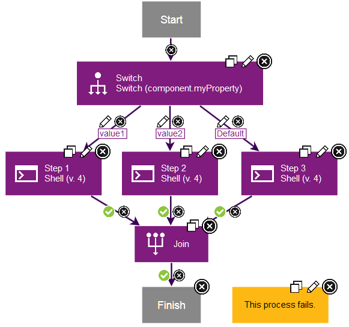

# Branching and joining steps

You can branch processes so that multiple steps run at the same time. You can also merge processes to return to running a single step at a time.

## Default branching and joining

To branch a process and run multiple steps at the same time, add multiple outgoing connections from a step. You can use any combination of `success`, `fail`, and `both` conditional flags, as described in [Conditional processes](comp_process_conditional.md). For example, the following process shows a step that branches into four steps. Two connections have `success` flags. One has a `fail` flag, and one has a `both` flag.

In this case, if the first step finishes, three steps run at the same time: the connections with the `success` flags and the connection with the `both` flag. If the first step fails, two steps run at the same time: the connection with the `fail` flag and the connection with the `both` flag.

If a process has multiple steps that run at the same time, you can use connections to merge the process into a single step. For example, the following process shows two steps that are running at the same time. Both steps have a connection to a third step, and both of those connections have a `success` conditional flag. In this case, if either step 2 or step 3 fails, step 4 does not run. Because all the parallel processes that branch from step 1 have `success` flags, all the processes that merge at step 4 must succeed for step 4 to run.

How you branch and merge steps can change whether the process finishes or fails. For example, the following process has three steps. Step 1 runs on its own parallel path. In another parallel path, step 2 runs first and then links to step 3. Step 1 and step 3 then connect to the Finish step. If step 2 fails, step 3 does not run. Because step 2 failed, the entire branch is invalid, and the process fails.

If you assign a `success` flag to one parallel process and a `failure` flag to another parallel process, only one parallel process can run. Because only one parallel process can run, only one of the processes that merge at the merging step must succeed for that step to run. In the following example, if step A succeeds, step B runs. If step A fails, step C runs. Step D runs if either step B or C succeeds.

Your process can include nested parallel paths, but you must carefully plan how the parallel paths merge. The rules for the `success` and `failure` flags that you assign at the branching step control how the parallel paths must merge. If you mark all the steps at the branching step with `success` flags, then all the steps that are attached to the merging step must succeed.

The following process contains two branching steps but only one merging step. Because both branches from step A have `success` flags, all the steps that merge at step D must succeed for it to run. Step P runs only if step C succeeds and step Q runs only if step C fails. Because both step P and step Q merge at step D, it is impossible for all the steps that join at step D to succeed. This process always fails.

The following process adds a separate merging step to resolve the parallel paths that branch at step C. As in the previous example, either step P or step Q runs. Unlike the previous example, steps P and Q merge at step R, which follows the rules for its branching step and runs if either step P or Q succeeds. Step D still follows the branching rules for step A and runs only if all the processes that it merges succeed. If both step B and step R succeed, step D can run. By resolving each set of parallel paths separately, your process runs as planned.

By carefully planning the location of your branching and merging steps, you can ensure that your processes run correctly.

## Branching and joining with the Switch and Join step

Use a Join step to explicitly indicate that all connections to the Join step must succeed. The Join step fails if any of the connections to it fail or do not run. For example, the following process uses a Switch step to branch the process. The Switch step has three outgoing connections, each for a different possible value of a property. Thus, only one of these outgoing connections runs. The three outgoing connections are merged at a Join step. The Join step always fails because only one of the outgoing connections runs. The two other step chains do not run, and therefore the Join step fails.

In these cases, when you do not intend for each step chain to run, do not use a Join step. Instead, merge the step chains by connecting the chains to a single step, as shown in the following process.

**Parent topic:** [Process step types and logic](../topics/process_steps.md)

