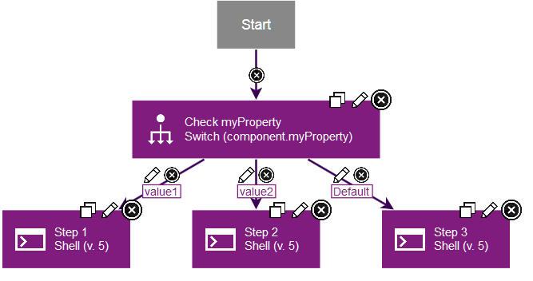
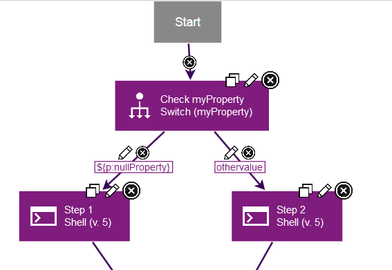

# Switch steps

A switch step is a utility step that you use to branch process, based on the value of a property.

When you add a switch step, you specify a property, either as the property name itself or in the same form as you would use in other steps, such as `${p:propertyName}`. Then, you add two or more outgoing connections from the step, each with a possible value for that property. At run time, the process follows the connection with the matching property value. The process also follows any connections with `fail` or `both` conditional flags.

For example, the following figure shows a switch step for the myProperty component property. Two outgoing connections have different values for that property, including `value1` and `value2`. The third connection has the `default` value, which means that the process follows this connection if no other values are matched.

To set the property to use, add the Switch step to the process and click the edit properties icon . In the step properties, specify the property, either by specifying the property name by itself or in the same form as you would use in other steps, such as `${p:propertyName}`. You cannot use a secure property in this step.

To check whether a property is defined, create a second property, and give that property a null value. Then you can compare other properties to that property to see whether they are defined. For example, the following process contains a property that is named nullProperty; this property is not defined. In the process, the switch step compares a property that is named myProperty to this null property. If the property is not defined, step 1 runs. If the property has the `othervalue` value, step 2 runs.

**Parent topic:** [Process step types and logic](../topics/process_steps.md)

