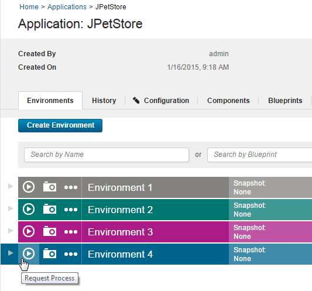
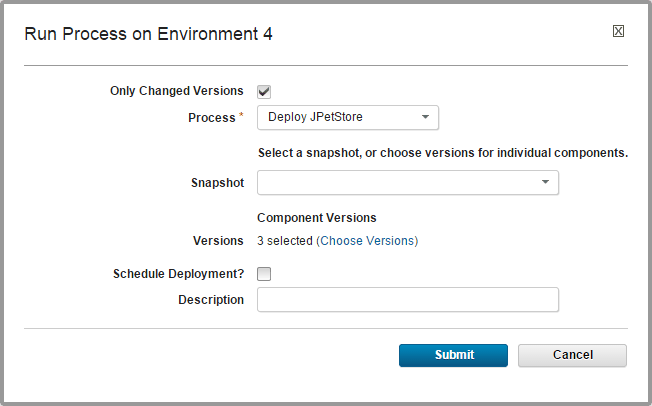

# Deploying applications

To deploy application components, run an application process on an environment.

Create an application, add components to it, and create an application process that deploys the components.

1.  In the HCL® UrbanCode™ Deploy web application, click the **Application** tab. 
2.  Click the name of the application.
3.  For the environment to run the deployment in, click **Request Process** .

    

    The Run Process window is displayed.

4.  With the **Only Changed Versions** check box, specify whether to deploy only versions that have changed or to deploy all versions.This check box is selected by default. If it is selected, no previously deployed versions are deployed again. Clear the **Only Changed Versions** check box to deploy a version regardless of whether it is already deployed. For example, if the inventory is out of date, clear the check box.
5.  Select the process to run from the **Process** list. All processes for the application are listed.
6.  To use a snapshot, select it from the **Snapshot** list. If you select a snapshot, the deployment automatically uses the component versions that are defined for the snapshot.
7.  If you are not using a snapshot, specify the component versions to deploy: 

    1.  Click **Choose Versions**. 
    2.  Specify the versions of each component to deploy. To select a version for each component separately, click **Add** in the Versions to Deploy column. To select versions for all components at once, click **Select For All**, and then select an option from the list. Version options are described in the following table:

        |Version option|Description|
        |--------------|-----------|
        | **Latest Available** |Selects the most recently imported component versions.|
        |**Versions With Name**|Opens the Add Versions With Name window, where you can select component versions that match a name pattern. Additionally, you can select **Passes Gates** so that only component versions that pass application gates are selected. To learn more about gates, see [Environment gates](app_gate.md).|
        |**Current Environment Inventory**|Selects component versions that are already deployed in the environment.|
        | **None \(Clear All\)** |Clears all version selections.|

    3.  To filter the list of components to the components with new versions, select the **Show only changed components** check box.
    4.  After you have selected the component versions to deploy, click **OK**.
    The Run Process window shows the settings for the deployment, including how many component versions are selected for deployment, as shown in the following figure:

    

8.  To run the process later, select the **Schedule Deployment?** check box, which is cleared by default. If you select this check box, fields are displayed that specify the date and time when the process runs. You can also configure the process to run on a recurring basis.
9.  To run the process, click **Submit**. The application process starts immediately unless it is scheduled for a later time.

For an example, see [Deploying a simple web application](../../com.ibm.udeploy.tutorial.doc/topics/webapp_abstract.md).

When a process starts, use the Application Process Request pane to review the deployment status. This pane is also used if the process requires approvals, as shown in the following figure.

The application process request shows each step in the process. Within each process, the steps are not shown in the order that they run in. Instead, steps are shown in the order of appearance in the process editor, from the steps at the top of the canvas to the steps at the bottom of the canvas.

The deployment is considered successful when the application process finishes. An application process might skip component processes and still finish. This means that a technically successful application process might not deploy all of the expected components. To ensure that all components deploy successfully, review the deployment details. Expand a process step and click **View Child Execution** to open the Deployment of Component pane, which can be used to review the deployment details.

In the Deployment of Component pane, you can review the deployment output log, error log, and input and output parameters.

**Parent topic:** [Deploying](../topics/deployment_ov.md)

