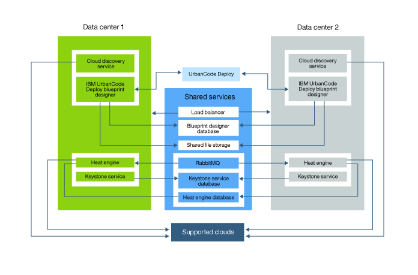

# Configuring disaster recovery for the blueprint design server

You can configure the blueprint design server and engine for disaster recovery by adding cold standby servers to serve as backup servers. You must start the secondary server or servers when the active server fails, and network traffic is routed to the secondary servers.

-   Set up a blueprint design server cluster as described in [Setting up clusters of blueprint design servers](ha_config_bds.md#).
-   Set up an engine cluster that uses the engine that is provided with HCL® UrbanCode™ Deploy version 6.2.1.1 or later as described in [Setting up clusters of engines](ha_config_engine.md#).
-   Both the cluster of blueprint design servers and the cluster of engines must be running.

For the blueprint designer and engine, the topology for disaster recovery is similar to the topology for high availability. However, instead of running all instances of the blueprint designer and engine simultaneously, instances are installed in separate data centers. The servers in only one data center are used at a time, and, if the servers in the first data center fail, you start the secondary servers in the second data center. A load balancer distributes all traffic to the servers in the data center that is active. You connect all servers to the same databases, network storage, and supporting services. The following diagram shows the distribution of components between the data centers.

Since you use a load balancer, instead of accessing the blueprint design servers directly, users access the load balancer URL. To the users, that URL appears to host a single instance of the server with high capacity; the users are not aware of the multiple servers. You must ensure that the servers that host the load balancer, file storage, and databases are stable and reliable or configure the components for high availability.

1.   Install and configure cold standby blueprint design servers in two different data centers. See [Adding blueprint design servers to clusters](ha_add_bds.md#).
2.   Install and configure two cold standby engine servers in the same data centers where you installed the blueprint design servers. See [Adding engines to clusters](ha_add_engine.md#).
3.   Configure online and offline backups for the servers. See [Backing up the server](../../com.ibm.udeploy.install.doc/topics/server_backup.md#).
4.   Verify that the load balancer is sending traffic to the new nodes. For example, if HAProxy is installed on a system with the host name `ucd-patterns.example.com`, you can go to the following URL to see the status of the nodes: `http://ucd-patterns.example.com:1936/haproxy?stats` 
5.   Shut down both the engine and blueprint design server in the second data center. 
6.   If you use DNS, configure the server routing path. 
7.   Configure the load balancer to automatically start the backup Heat engine and blueprint design server. 

