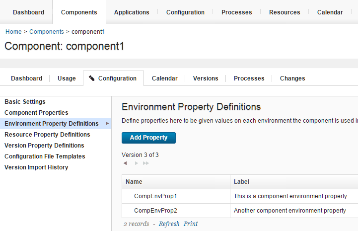

# Passing properties from blueprints to the resource tree

From the blueprint designer, you can set component environment properties and component resource properties in blueprint source code.

Connect the blueprint designer to the server. See [Connecting the blueprint design server to the server](ucdp_integrate.md).

You can pass the following properties from a blueprint to the resource tree:

-   Component resource properties
-   Component environment properties
-   Secure component resource properties
-   Secure environment resource properties
-   Environment properties

Blueprints can create environment properties, but component resource properties and component environment properties must exist on a component before you can pass values to them. If you do not provide values for these properties from the blueprint designer, the properties use the default values that were set in the HCL® UrbanCode™ Deploy.

1.   In the blueprint designer, open a blueprint. 
2.   Add one or more virtual images to the blueprint. 
3.   To pass component environment properties, follow these steps: 
    1.   On the server, on the **Configuration** tab for a component, create one or more component environment properties. For example, the following figure shows a component with two component environment properties:

        

    2.   In the blueprint designer, from the **Components** drawer, add the component to a virtual image. On the `IBM::UrbanCode::SoftwareConfig::UCD` resource, in the `inputs` section, the component environment properties appear as name-value pairs. The properties also appear on the **Properties** tab of the editor. The following example code shows two component environment properties:

        ```
        component1_sw_config:
          type: IBM::UrbanCode::SoftwareConfig::UCD
          properties: 
            name: "component1"
            component_process: "Deploy component1"
            component_process_timeout: "300"
            ucd_server_url: { get_param: ucd_server_url }
            ucd_username: { get_param: ucd_user }
            ucd_password: { get_param: ucd_password }
            application: { get_attr: [resource_tree, application_name] }
            environment_name: { get_attr: [resource_tree, environment_name] }
            inputs:
              **CompEnvProp1 : "Default value for CompEnvProp1"
              CompEnvProp2 : "Default value for CompEnvProp2"**
        ```

    3.   Specify values for the component environment properties in the blueprint. You can specify literal values, or you can use the get\_attr and get\_param functions to retrieve attribute and parameter values.
4.   To pass component resource properties, follow these steps: 
    1.   On the server, on the **Configuration** tab for a component, create one or more component resource properties. 
    2.   In the blueprint editor, from the **Components** drawer, add the component to a virtual image. On the `IBM::UrbanCode::SoftwareDeploy::UCD` resource, in the `inputs` section, the component resource properties appear as name-value pairs. The properties also appear on the **Properties** tab of the editor. The following example code shows a component resource property:

        ```
        component1:
          type: IBM::UrbanCode::SoftwareDeploy::UCD
          properties:
            apply_config: { get_resource: component1_sw_config }
            server: my_server
            version: LATEST
            agent_timeout: "360"
            inputs:
              **CompResourceProp1 : "Default value for CompResourceProp1"**
        ```

    3.   Specify values for the component resource properties in the blueprint. You can specify literal values, or you can use the get\_attr and get\_param functions to retrieve attribute and parameter values.
5.   To pass environment properties, follow these steps: 
    1.   In the blueprint editor, from the **Components** drawer, add at least one component to a virtual image. This step is necessary to create and populate the `resource_tree` resource in the blueprint code.
    2.   On the `resource_tree` resource, in the `properties` section, add environment properties and specify values for them. For example, the following code shows an environment property that is named `tomcat_port`:

        ```
        
        resource_tree:
         properties:
          inputs:
           tomcat_port : "8443"
        ```

6.   To modify the value of a secure component resource or component environment properties, follow these steps: 

    **Restriction:** You cannot modify the value of these secure properties in the blueprint source code.

    1.   On the server, on the **Configuration** tab for a component, create one or more component resource properties. 
    2.   In the blueprint editor, from the **Components** drawer, add the component to a virtual image. On the `IBM::UrbanCode::SoftwareDeploy::UCD` resource, in the `inputs` section, the secure properties appear as name and get\_param function pairs. Because the value of the property is secure, it is not displayed in the blueprint. The properties also appear on the **Properties** tab of the editor. The secure property names are appended with `-SECURE-PROPERTY`, as shown in the following example:

        ```
        component1:
          type: IBM::UrbanCode::SoftwareDeploy::UCD
          properties:
            apply_config: { get_resource: component1_sw_config }
            server: my_server
            version: LATEST
            agent_timeout: "360"
            inputs:
              **SecurePropertyName-SECURE-PROPERTY : \{get\_param: SecurePropertyName\_secure\_property\}**
        ```

        In the `parameters` section of the blueprint, the definition of each secure property is displayed. The secure property names are appended with `_secure_property`, and the description of each secure property and a placeholder string for the password are displayed, as shown in the following example:

        ```
        SecurePropertyName_secure_property
          type: string
          description: 'Secure property definition'
          default: 'DefaultComponentPasswordValue'
          hidden: **true**
        ```

    3.   When you provision the blueprint, specify values for the secure properties. See [Provisioning environments from the blueprint designer \(through OpenStack Heat\)](../../com.ibm.edt.doc/topics/env_provision_edt.md#).
7.   Save the blueprint. 

After you provision the environment, the blueprint designer passes the property values in the blueprint source code to the properties on the server. In processes, you can refer to the properties in the same format as referring to any other property. For example, you can refer to environment properties in this format: `${p:environment/property\_name}`.

**Parent topic:** [Creating, setting, and editing properties](../topics/resources_properties.md)

**Parent topic:** [Blueprint properties, attributes, and parameters](../../com.ibm.udeploy.doc/topics/blueprint_props_ov.md)

