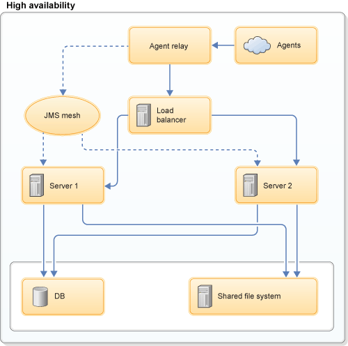
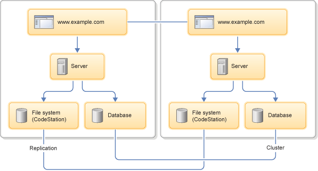

# High availability overview

To configure clustered high availability for HCL® UrbanCode™ Deploy, you must use a load balancer. You can configure a cold standby server by using a load balancer or configuring the servers' DNS.

The architecture of all high-availability scenarios can resemble the following figure:

The load balancer communicates with all HCL UrbanCode Deploy servers. All servers access the same database, shared file system, and agents.

The principle and basic design is the same whether you cluster HCL UrbanCode Deploy servers, blueprint design servers, or engines. Two common high-availability scenarios are clustered and cold-standby \(disaster recovery\), and you can apply both scenarios to configurations that use only the HCL UrbanCode Deploy server or both the server and the blueprint designer.

## Cold Standby

The cold standby option is simple to implement and reduces downtime. In this setup, the load balancer manages two servers, or two servers are connected through DNS settings. Both the primary and secondary servers are connected to a database and a remote file system. The secondary server is not running. If the active node fails, you must start the secondary server so network traffic can be routed to it. This event is called failover. During failover, the secondary server reestablishes connections with all agents, runs recovery, and proceeds with any queued processes. HCL UrbanCode Deploy has no automatic process for failover, but it can be managed by using your load balancer or DNS.

You can convert a cold-standby system to a clustered system by putting shared files on network storage and connecting the servers with cluster connections. See [Setting up high-availability clusters](server_install_clustered.md).

**Note:** The cold standby server or servers must not be running until they are started by the failover process. Even if no traffic is routed to the cold standby server, it runs internal processes that can corrupt the database. For this reason, servers must be either part of the cluster or shut down.

## Clustered

The high availability \(HA\) feature increases server reliability by distributing processing across a cluster of servers. Each server is an independent node that cooperates in common processing. The goal is to create a fault-tolerant system that requires little or no manual intervention. All servers are running, and the load balancer routes processes to all servers, based on their availability.

The HCL UrbanCode Deploy servers create a JMS mesh by using ActiveMQ. All servers recognize each other, and all services are active on each server.

The architecture of clustered servers can resemble the following figure. It includes two data centers that each have a database, a file share, and a server. The file shares and databases are synchronized through synchronous replication.

For all of the HCL UrbanCode Deploy servers in the high-availability cluster to have access to consistent data, the clustered databases and file systems must utilize synchronous replication. HCL UrbanCode Deploy does not synchronize data across database and file system nodes, so you must establish and maintain the synchronization.

For installation instructions, see [Setting up high-availability clusters](server_install_clustered.md).

**Note:** Do not configure a load balancer to distribute requests for the agent communication JMS port. To ensure agent and agent relay availability, configure them for failover.

-   **[High-availability server processes](../../com.ibm.udeploy.admin.doc/topics/ha_servers.md)**  
While high-availability servers complete the same processes as standalone servers, they run slightly differently and access files in run slightly different locations than individual servers do.
-   **[High-availability agent communication](../../com.ibm.udeploy.admin.doc/topics/ha_agents.md)**  
Agents communicate with the server over JMS and HTTP or HTTPS. These modes of communication are handled differently in a high availability scenario.

**Parent topic:** [High availability and failover](../topics/ha_config_ov.md)

