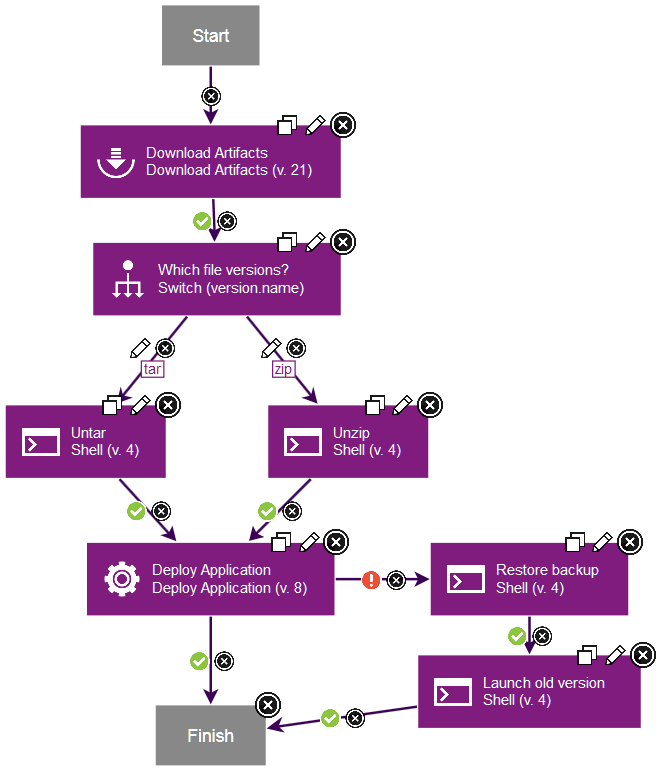

# Component processes

A component process is a series of user-defined steps that operate on a component's artifacts. Each component has at least one process that is defined for it and can have several.

A component process can be as simple as a single step or contain numerous steps and relationships. The switch step, for instance, creates conditional processes. For example, you might take artifacts from a source like an IBM® Anthill Pro project and map the artifacts that get deployed to an HTTP server into one component. Then, you might map the artifacts that get deployed to a Java™ Platform, Enterprise Edition container to another component. You might map the artifacts that get deployed to a database to yet another component. Or, to take another example, a single-component deployment might consist of two processes: the first moves component files to a target server on Friday night \(a lengthy operation\), while the second deploys the files Saturday morning.

**Important:** When you begiu to create a component process, you must assign a type by making a selection from **Process Type** menu. The type that you select can determine whether the application process that you create later functions as intended. For example, if the object of the component process you are creating is to deploy the current component and you select **Operational \(with version\)** in **Process Type**, the process will fail. See [Component process types](comp_process_types.md#).

Component processes are created with the process editor. The process editor is visual drag-and-drop editor where you can drag process steps onto the design space and configure them as you go. As more steps are placed, you visually define their relationships with one another. Process steps are selected from a menu of standard steps that replace typical deployment scripts and manual processes. HCL® UrbanCode™ Deploy provides steps for several utility processes, such as inventory management, and workflow control. Other process steps are provided by plug-ins. Plug-ins provide integration with common deployment tools and application servers, such as WebSphere®, Microsoft™ IIS, and many others. Without any additions, HCL UrbanCode Deploy provides plug-ins for many common processes, such as downloading and uploading artifacts, and retrieving environment information. A component process can have steps from more than one plug-in.

Like other processes, component processes begin with the Start step and must end with the Finish step.

A component process is defined for a specific component. A component can have more than one process that is defined for it, but each component requires at least one process.

For example, deploying an EAR file to an IBM WebSphere Application Server typically consists of the following operations:

1.  Transfer the EAR file to the target server.
2.  Stop the target server instance.
3.  Run wsAdmin with deployment properties.
4.  Start the target server instance.
5.  Verify that the deployment succeeded by accessing a specified URL.

The WebSphere Application Server - Deploy plug-in provides a configurable process step for each operation.

A frequently used component process can be saved as a template and applied later to new components.

Component processes are run by HCL UrbanCode Deploy agents on hosts. One instance of a component process is started for each resource that is mapped to a component in the target environment. See [Resources](resources_ch.md).

-   **[Component process types](../topics/comp_process_types.md)**  
Different types of component processes deploy, configure, or uninstall component versions.
-   **[Creating component processes](../topics/comp_process_configure.md)**  
A component process is a series of user-defined steps that operate on a component's artifacts. You create a component process in two steps: first, you configure basic information, such as name; second, you use the process editor to assemble the process.
-   **[Running component processes](../topics/comp_process_run.md)**  
Component processes are typically run from within application processes. However, you can also run component processes directly to test the processes or to correct an error in an urgent situation.
-   **[Creating configuration files in component processes](../topics/comp_tasks_config_create.md)**  
Configuration templates are templates for files that are created during a component process. Typically, the data is for configurations for web servers, but the files can be used for any application that you deploy.

**Parent topic:** [Processes](../topics/comp_workflow.md)

