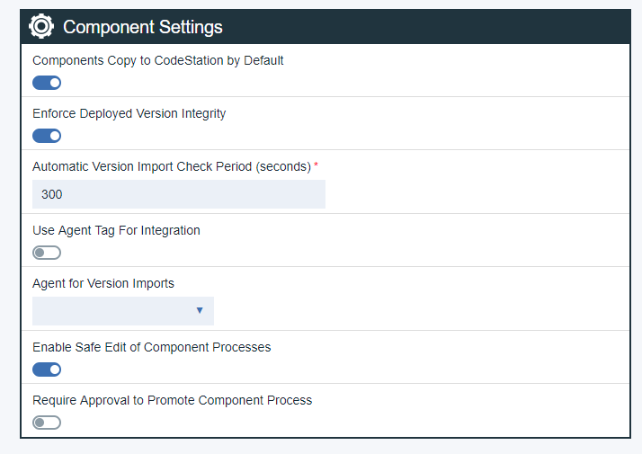

# Working on processes in safe edit mode

Safe editing enables you to test component processes before making them available in normal environments. Make updates to your component process, test those updates safely, and then promote to a new version when you are ready.

Enable Safe Edit mode by completing the following steps:

1.  Open installed.properties file in a text editor and add experimental.safeEdit.enabled=true. Navigate to the file by clicking **\(ucd\)\>server\>conf\>server\>installed.properties**.
2.  **Save** file and restart the server.
3.  Click **Settings \> System Settings**. Two new parameters are displayed below Component Settings. Select **Enable Safe Edit of Component Processes**, optionally select**Require Approval to Promote Component Process** and then click **Save** at the bottom of the System Settings page.

    **Note:** After server restarts, a background upgrade begins. You are unable to set new settings until the upgrade is complete. A progress bar is displayed next to Component Settings.

4.  Click **Settings \> System Settings**. Two new parameters are displayed below Component Settings. Select **Enable Safe Edit of Component Processes**, optionally select**Require Approval to Promote Component Process** and then click **Save** at the bottom of the System Settings page.
5.  If **Require Approval to Promote Component Process** is enabled, after a draft is promoted you see Promotion Pending where the Promote push button was. The **Promotion Pending** button is inactive while an approval is pending. Approval requests go to anyone with manage processes permission on component. Under **Work Items**, there is a new Component Process promotion table with **Approve** and **Reject** actions. These actions link to latest promoted version and draft processes for which promotion was requested.

 

You can edit component processes and component template processes without affecting deployments to protected environments.

1.  Under **Environments**, when you are editing the **Allow Process Drafts to be deployed** option, a new setting becomes available. After you select **Allow Drafts to be Deployed**, a new field, **Component using Process Drafts**, is displayed. Choose components for draft processes to run on.
2.  On the Components tab, click the component name.
3.   To **Edit** draft process, on the Processes tab, hover the cursor over the process to edit, and click the  the pencil icon. 
4.  Design your draft process, and then click **Save**.
5.  Test the process in the environment you set up in step one.
6.  When process works as expected, go back to the process designer, and click **Promote**. This action makes the process available for use or creates a promotion approval.
7.  Click **Lock** to lock draft.The name of the person who locked the draft is displayed under **Locked By** on the Processes page. Only the person who holds the lock can edit the process. Under **Actions** a **Force Unlock** option is available.

Environments that are set to allow draft processes can use draft process for deployments. Other environments must use the promoted processes.

**Note:** Snapshots can only lock to versions of component processes. They cannot lock to drafts. If a snapshot is deployed to an environment that allows drafts then one of these conditions apply:

-   If the snapshot is using the latest version of a process, the draft will be used.
-   If the snapshot is using a specific version of a process, then that specific version will be used.

**Parent topic:** [Processes](../topics/comp_workflow.md)

