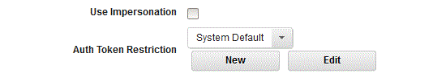

# Manage process step authentication

Use token restrictions to manage process step authentication.

The HCL® UrbanCode™ Deploy server generates an authentication token whenever it runs a plug-in process step. The token authenticates the user that is running the step and has the same permissions as that user. You can limit the actions available to tokens by applying token restrictions to them. A token restriction is a set of one or more REST API commands. When a token-restricted plug-in step runs, it uses the commands that are defined by the token restriction regardless of the user's permissions.

You apply token restrictions to plug-in steps in processes. You can apply a different token restriction to every plug-in step in a process. If you do not apply a restriction to a step, the default token restriction is used. The default token enables all the supported methods for all REST resources. You can modify the default token restriction but you cannot delete it.

You can apply token restrictions to component, application, and generic processes. To apply a token restriction to a process step, on the step configuration window, select the restriction from the **Auth Token Restriction** list.

You can edit the selected token restriction and also create a new token restriction from the plug-in step configuration window. For more information, see, [Restricting authentication tokens](../../com.ibm.udeploy.admin.doc/topics/security_token_restrict.md)

**Parent topic:** [Processes](../topics/comp_workflow.md)

