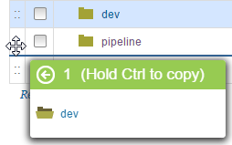

# Moving and copying resources

The tree structure of the Resources page enables resources to be moved by dragging and dropping them into place.

Each row on the Resource Tree page represents a resource. By nesting resources, organizational groupings can be moved and created. Resources that are grouped under other resources are referred to as subresources.

1.   Open the Resource Tree page. In addition to the Resource Tree page, resources can be displayed in several ways, such as by adding resources to an environment.
2.   Click and hold the mouse in the first column of the resource that you want to reposition. This column has four small dots that are arranged in a square.  
3.  Drag the resource to a new location.While you are dragging the resource, a window appears to show the resource, as shown in the following figure:

    

4.   To copy the resource, hold the Ctrl key while you drag it. 
5.   Position the pointer over the row where you want to move the selected resource. If the resource can be placed in the target location, the resource window header is green, otherwise it is red.
6.  Release the mouse button.The resource and any subresources that are associated with it are placed beneath the target row.

**Parent topic:** [Modifying the resource tree](../topics/resource_tree_modify.md)

