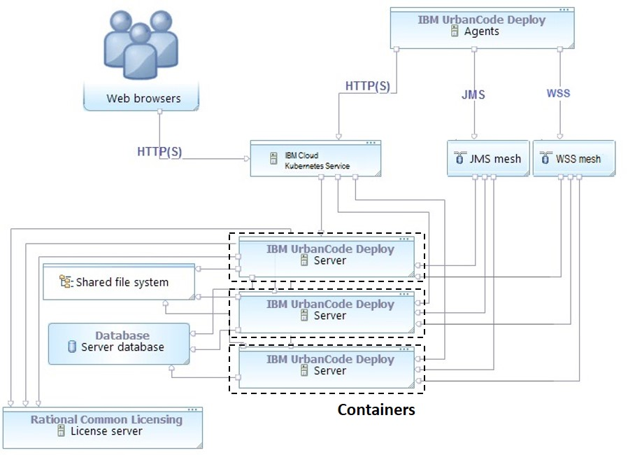

# Installing the server in a Kubernetes cluster

The HCL® UrbanCode™ Deploy server can be installed in a cloud-based environment, as a containerized server cluster, managed by Kubernetes. UrbanCode Deploy works with Kubernetes to simplify application deployment and manage versions in the containers.

The core installation of UrbanCode Deploy includes a server, database, and agents. In a typical containerized topology, the UrbanCode Deploy server is installed as a single server in a container or can be scaled to a server cluster managed by Kubernetes. The database is installed in a container or an on-premises location. Agents can be installed on cloud environments, virtual machines \(VMs\), containers, or physical systems.

  

The server cluster is configured in either of two cloud-based environments and their compatible versions.

-   IBM® Cloud™ Private \(ICP\)

    IBM Cloud Private is an application platform for managing on-premises, containerized applications. It includes the container orchestrator Kubernetes, a private image registry, a management console, and monitoring frameworks.

-   IBM® Cloud™ Kubernetes® Service \(IKS\)

    IBM Cloud Kubernetes Service provides dedicated core and memory allocations, as well as features like image templates. In this environment, you perform configuration and management tasks using both the IBM Cloud infrastructure customer portal and the API. Virtual servers are deployed to the same VLANs as physical servers, allowing you to spread workloads across UrbanCode Deploy servers, while maintaining interoperability. UrbanCode Deploy server scalability in IKS is supported by a Kubernetes orchestrator.

-   **[Installing the server in IBM Cloud Private](../../com.ibm.udeploy.install.doc/topics/docker_install_icp.md)**  
You can install a containerized version of the HCL UrbanCode Deploy server in an IBM Cloud Private \(ICP\) cluster. The UrbanCode Deploy server is installed using a Helm chart. After the server is installed, you can manage it with the ICP Management console.
-   **[Installing the server in IBM Cloud Kubernetes Service](../../com.ibm.udeploy.install.doc/topics/docker_install_iks.md)**  
You can install a containerized version of the HCL UrbanCode Deploy server in an IBM Cloud Kubernetes Service. The UrbanCode Deploy server is installed using a Helm chart. After the server is installed, you can manage it with the ICP Management console.
-   **[Upgrading the containerized server](../../com.ibm.udeploy.install.doc/topics/docker_upgrade.md)**  
You can upgrade your containerized version of the HCL UrbanCode Deploy server 6.2.7 to the 7.0.0 version in an IBM® Cloud private and IBM® Cloud Kubernetes Service cluster.
-   **[Scaling the server in a Kubernetes cluster](../../com.ibm.udeploy.install.doc/topics/docker_scale.md)**  
Scaling the HCL UrbanCode Deploy server may become necessary when the demand for system resources changes. For example, when server requests increase in a high-availability cluster in a container, you can add another UrbanCode Deploy server instance to the server cluster.
-   **[Helm chart configuration parameters](../../com.ibm.udeploy.install.doc/topics/docker_helmparametersdita.md)**  

**Parent topic:** [Installing HCL UrbanCode Deploy](../../com.ibm.udeploy.install.doc/topics/install_ch.md)

**Related information**  

[https://developer.ibm.com/urbancode/docs/getting-started-ibm-urbancode-deploy-containers/](https://developer.ibm.com/urbancode/docs/getting-started-ibm-urbancode-deploy-containers/)

[https://www.ibm.com/support/knowledgecenter/SSBS6K\_3.1.0/kc\_welcome\_containers.html](https://www.ibm.com/support/knowledgecenter/SSBS6K_3.1.0/kc_welcome_containers.html)

[https://console.bluemix.net/docs/containers/container\_index.html\#container\_index](https://console.bluemix.net/docs/containers/container_index.html#container_index)

