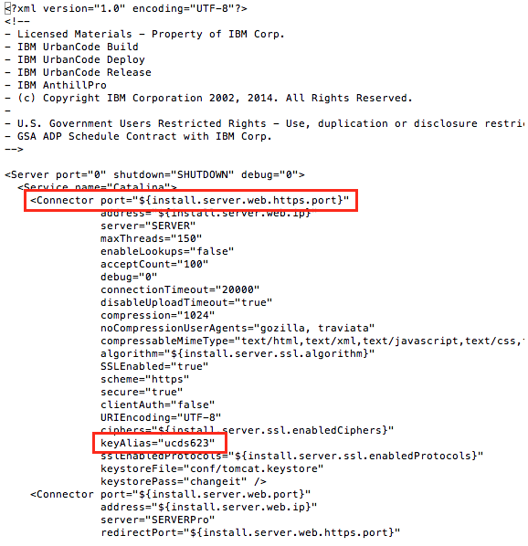

# Enabling server identity verification

Starting with version 6.2.1.1 of the product, you can enable extra security to configure the agents to verify the identity of the server for communication that uses the HTTPS protocol.

Upgrade HCL® UrbanCode™ Deploy to version 6.2.1.1 or later. If you use agent relays, update to version 6.2.3 or later. Upgrade the following plug-ins to the latest versions that are available:

-   All source configuration plug-ins
-   WinRS Agent Install plug-in
-   z/OS® Utility plug-in
-   MobileFirst Platform Foundation \(formerly Worklight\) plug-in
-   WebSphere® Application Server - Deployment plug-in

Versions of these plug-ins that were released before March 2016 do not support server identity verification.

Ensure that the keytool utility, which is provided with the Java™ developer kit and is not part of HCL UrbanCode Deploy, is available in the system path.

When you install the HCL UrbanCode Deploy server, a private key and self-signed certificate with the alias server are stored in the server\_installation\_directory/opt/tomcat/conf/tomcat.keystore file. This certificate is presented to agents, agent relays, and users that connect to the server via HTTPS. Because the certificate that is associated with the private key has a generic distinguished name \(DN\), you must replace the key so that the agent or agent relay can correctly verify the host name of the server. After you configure the server to present a certificate with a valid host name, you then configure the agents to accept that trusted certificate and to require verification of the host name of the server.

1.   Stop the HCL UrbanCode Deploy server. 
2.   Open a command-line window, and go to the server\_installation\_directory/opt/tomcat/conf directory. 
3.   Generate a private key that is associated with the correct host name to use for HTTP communication. Run a command similar to the following command: 

    ```
    keytool -genkeypair -alias serverNewCN -keysize 2048 -sigalg SHA256withRSA -keyalg RSA -keystore tomcat.keystore
    ```

    The existing key is stored in the tomcat.keystore file with the server alias.

4.   Open the server.xml file in a text editor. In the HTTPS connector section of the file, add a property to specify the alias in the keystore that contains the certificate to use. 

    ```
    keyAlias="serverNewCN"
    ```

    Enter the property in the location that this example shows:

    

5.   Create a certificate signing request that uses the new private key, and then use an internal or external certificate authority to sign it. 
6.   Export the server certificate. Run a command similar to the following command: 

    ```
    keytool -exportcert -alias server -keystore tomcat.keystore -file server.cert
    ```

7.   Start the HCL UrbanCode Deploy server. 
8.   If you used a certificate authority that is not already trusted by the agents, copy the server certificate to the agent computer, and then import the certificate into the keystore of the JRE that is used to run the agent process. By default, the path to the keystore is $JAVA\_HOME/lib/security/cacerts. If you use agent relays, repeat this step for all agent relays.
9.   If you use agent relays, complete the following steps to configure the agents to verify the identity of the agent relays. 

    **Note:** Agent relays use separate keystores for HTTPS and JMS connections. Server identity verification uses the HTTPS, or codestation, keystores for the agent relays.

    1.   Open a command-line window on the agent relay computer, and go to the /agent\_relay\_install/conf/ directory. By default, the agent-relay-install location is `/opt/ibm/agentrelay` on Linux™ and `C:\Program Files\IBM\agentrelay` on Windows™. 
    2.   Generate a private key that is associated with the HTTPS connection for the agent relay. Run a command similar to the following command: 

        ```
        keytool -genkeypair -alias agentrelay -keysize 2048 -sigalg  SHA256withRSA
            -storepass changeit -keypass changeit -keyalg RSA -keystore codestation.keystore
        ```

        For the `-alias` argument, specify the certificate alias of the codestation keystore for the agent relay. The certificate is in the agentrelay.properties file for the agent relay, in the property codestation.cert.alias. The default value is `agentrelay`.

    3.   Export the agent relay certificate. Run a command similar to the following command: 

        ```
        keytool -exportcert -alias agentrelay -keystore codestation.keystore -file agentrelay.cert
        ```

    4.   Copy the agent relay certificate to the agent computer, and then import the certificate into the keystore of the JRE that is used to run the agent process. By default, the path to the keystore is $JAVA\_HOME/lib/security/cacerts.
10.  Add verify.server.identity=true to the agent\_installation\_directory/conf/agent/installed.properties file on each agent. If you use agent relays to cache artifacts, repeat this step for all agent relays.
11.  Upgrade each agent or agent relay to version 6.2.1.1 or later. If an agent is already upgraded, restart the agent. Agents can communicate with the server during this process, so you can upgrade agents one at a time.

**Parent topic:** [SSL configuration](../../com.ibm.udeploy.doc/topics/SSLinstall.md)

