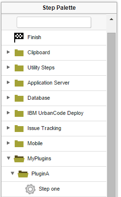

# The plugin.xml file for automation plug-ins

An automation plug-in is defined with the plugin.xml file.

The structure of this file consists of a `header` element and one or more `step-type` elements. The `header` element identifies the plug-in. Each `step-type` element defines a step. Steps are available to users in the process editor and are used to construct component processes.

After the document type declaration, the `plugin` root element identifies the XML schema type, PluginXMLSchema\_v1.xsd, which all plug-ins use. The following code sample presents the basic structure of the plugin.xml file for automation plug-ins:

```
<?xml version="1.0" encoding="UTF-8"?>
<plugin xmlns="http://www.urbancode.com/PluginXMLSchema_v1" 
        xmlns:xsi="http://www.w3.org/2001/XMLSchema-instance">
  <header>
    <identifier id="plugin_id" version="version_number" name="Plug-in Name"/>
    <description/>
    <tag>Plugin type/Plugin subtype/Plugin name</tag>
  </header>
  <step-type name="Step_Name">
    <description/>
    <properties>
      <property name="property_name" required="true">
         <property-ui type="textBox" label="Driver Jar" 
             description="The full path to the jdbc driver jar to use." 
             default-value="${p:resource/sqlJdbc/jdbcJar}"/>
      </property>
    </properties>
    <post-processing>
      <![CDATA[
        if (properties.get("exitCode") != 0) {
            properties.put("Status", "Failure");
        }
        else {
            properties.put("Status", "Success");
        }
     ]]>
    </post-processing>

    <command program="${path_to_tool">
      <arg value="parameters_passed_to_tool"/>
      <arg path="${p:jdbcJar}"/>
      <arg file="command_to_run"/>
      <arg file="${PLUGIN_INPUT_PROPS}"/>
      <arg file="${PLUGIN_OUTPUT_PROPS}"/>
    </command>
  </step-type>
</plugin>
```

The `<tag>` tag specifies the location of the steps in the process editor palette. For example, the following code specifies that the steps are in the `MyPlugins/PluginA` folder.

```
<tag>MyPlugins/PluginA</tag>
```

When the plug-in is installed, the steps appear in the specified folder in the palette, as shown in the following figure.



In HCL® UrbanCode™ Deploy version 6.1 and later, you can further organize specific steps into sub-folders. For example, assume that the plugin.xml file puts steps in the `MyPlugins/PluginA` folder, as in the previous example. The following code puts a step in the `MyPlugins/PluginA/Subgroup1` sub-folder:

```
<step-type name="Step one">
  <server:sub-tag>Subgroup1</server:sub-tag>

```

To organize steps into sub-folders in this way, you must add the namespace `xmlns:server="http://www.urbancode.com/PluginServerXMLSchema_v1"` to the `<plugin>` tag that is at the root of the plugin.xml file, as in the following example:

```
<plugin xmlns="http://www.urbancode.com/PluginXMLSchema_v1"
  xmlns:server="http://www.urbancode.com/PluginServerXMLSchema_v1"
  xmlns:xsi="http://www.w3.org/2001/XMLSchema-instance">
```

**Restriction:** Plug-ins that use sub-folders in this way work only in HCL UrbanCode Deploy version 6.1.0 and later.

For information about the structure of plugin.xml for source plug-ins, see [Creating source plug-ins](ref_create_pluginsrc.md#).

-   **[The header element](../../com.ibm.udeploy.reference.doc/topics/ref_create_header.md)**  
The mandatory `header` element identifies the plug-in and contains three mandatory child elements and one optional child element:
-   **[The plugin-javaopts.conf file](../../com.ibm.udeploy.reference.doc/topics/ref_create_javaopts.md)**  
The plugin-javaopts.conf file can be used to set the JAVA\_OPTS environment variable for automation plug-ins that use Groovy.

**Parent topic:** [Creating plug-ins](../../com.ibm.udeploy.reference.doc/topics/reference_plugins_create.md)

