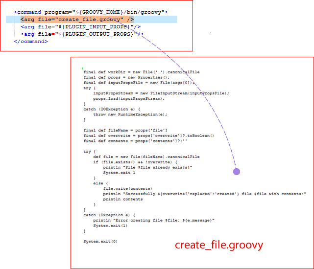

# Step commands

The step's `command` element specifies the scripting tool that runs the step and identifies the file that contains the actual script.

The agent that runs the step downloads the plug-in and expects to find the script among the downloaded files. The agent must also have access to the scripting tool. Any other arguments that are required by the script or tool can also be specified with the `arg file` attribute. The `arg file` attributes should be defined in the order compatible with the scripting tool.

The Create File command script is written in Groovy. Groovy is scripting language similar to Java™. The following illustration shows a command that runs an external Groovy file that is named create\_file.groovy.



This command instructs the Groovy interpreter to run create\_file.groovy \(more about Groovy and the particulars of this file in the following section\).

This line \(which is part of every command\):

```
<arg file="${PLUGIN_INPUT_PROPS}"/>

```

sends a file that contains the properties that are required by the step to the agent. The properties in the file are those properties that are furnished at runtime and others that are defined earlier that are required by the step. See [Example plug-in](reference_plugins_example.md). The `${PLUGIN_INPUT_PROPS}` variable resolves to the location of this properties file.

And this line \(which is also part of every command\):

```
<arg file="${PLUGIN_OUTPUT_PROPS}"/>

```

refers to the file returned by the agent after finishing the step. The properties in this file are available to later steps in the process. The `${PLUGIN_OUTPUT_PROPS}` variable resolves to the location of this properties file.

-   **[create\_file.groovy](../../com.ibm.udeploy.reference.doc/topics/ref_example_groovy.md)**  
The create\_file.groovy file contains the Groovy script that runs the step's command.

**Parent topic:** [Example plug-in](../../com.ibm.udeploy.reference.doc/topics/reference_plugins_example.md)

