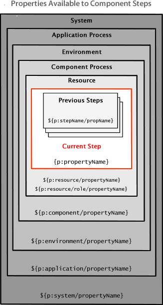

# Step properties

In the context of our discussion, properties are values that are used by the step's command. Step properties are defined with the property element.

As you can see in [Example plug-in](reference_plugins_example.md), the Create File step has three properties:

-   `file` contains the name of the file the command creates; it is represented as a text box in the process designer
-   `contents` contains the content of the file; it is represented by a text-area box, which can contain a large amount of data
-   `overwrite` is used to specify whether the file can overwrite an existing file; it is represented by a check box in the process designer

These properties are displayed in the dialog box that appears when the step is added to a component process. The other properties in the dialog are displayed for every step \(post-processing is discussed below\). Property values can be entered into the dialog box by the process designer at design-time, or left to be furnished at runtime by the user that runs the application.

You can configure most properties with the property-ui child element \(the `selectBox` type requires the `value` child element as well\). See [Creating plug-ins](reference_plugins_create.md) for information about the options available for presentation in the UI. Default values can be defined when you create the step.

In addition to a step's own properties, a command has access to properties set earlier by other steps within the process, to properties set by the application that started the component process, to properties on the target environment and resource.

The following illustration shows the properties that are available to an individual step. Step property values become unavailable after the component process ends.

Runtime defined properties are combined with the properties that were defined earlier and together sent to the agent. Earlier properties \(those properties that were defined outside the current process\) are retrieved from the database. How properties are processed and consumed is discussed further in the next section.

**Parent topic:** [Example plug-in](../../com.ibm.udeploy.reference.doc/topics/reference_plugins_example.md)

