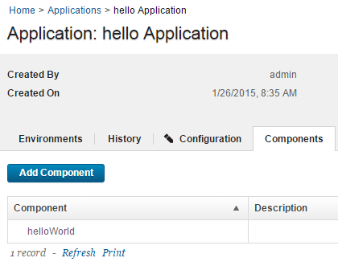

# Lesson 3: Create an application

Applications manage components, typically by deploying them into environments.

To create an application, you identify the components that it manages; define at least one environment into which the components are deployed; and create a process to do the work. An environment maps components to agents and handles inventory, among other things. An application process is similar to but not identical to a component process. Application processes are primarily intended to direct underlying component processes and orchestrate multi-component deployments. In this lesson, you create an application and assign the helloWorld component to it.

1.   Click the **Applications** tab, and then click **Create Application**. 
2.  Name the new application something like hello Application.
3.   Accept the default values for the other fields, and click **Create**. For the tutorial, the default value for the **Notification Scheme** is fine. HCL® UrbanCode™ Deploy integrates with LDAP and email servers, which enables the product to send event-based notifications. For example, the `default notification scheme` sends an email \(if an email server is configured, see [Server settings](../../com.ibm.udeploy.admin.doc/topics/settings_system.md)\) when a deployment finishes. Notifications can also play a role in deployment approvals. See [Managing security](../../com.ibm.udeploy.admin.doc/topics/security_ch.md) for information about security roles.
4.  Add the helloWorld component to the application: 
    1.   From the Application: hello Application page, click the **Components** tab. This is the **Components** tab that is associated with the application, not the **Components** tab at the top of the page. 
    2.   Click **Add Component**. 
    3.   In the Add a Component window, select the **helloWorld** component, and then click **Save**. An application can deploy only components that are added to it.

The application includes the helloWorld component, as shown in the following figure. Applications can have any number of components, and components can be included in any number of applications.

In this lesson, you created an application and assigned the helloWorld component to it. On the **Components** tab, you have the component that is managed by the application listed.

For more information about creating applications, see [Creating applications](../../com.ibm.udeploy.doc/topics/app_create.md).

**Parent topic:** [Create a simple helloWorld deployment](../../com.ibm.udeploy.tutorial.doc/topics/quickstart_abstract.md)

