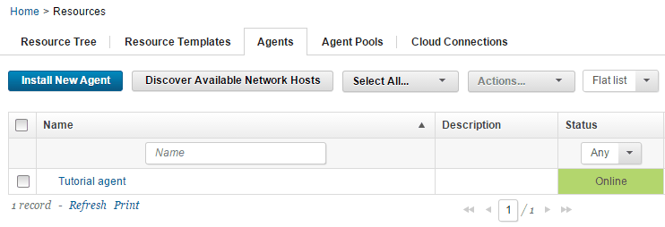
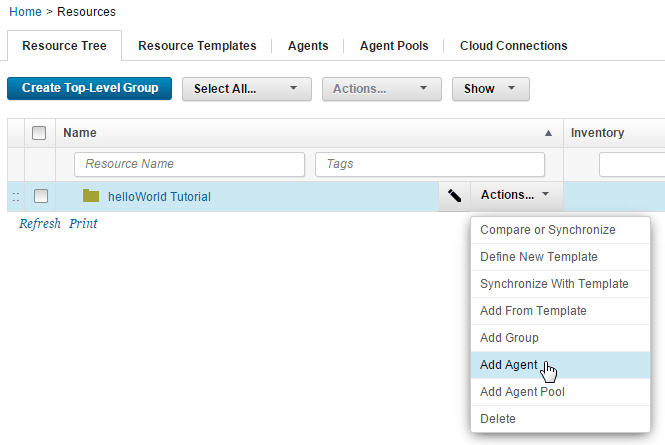
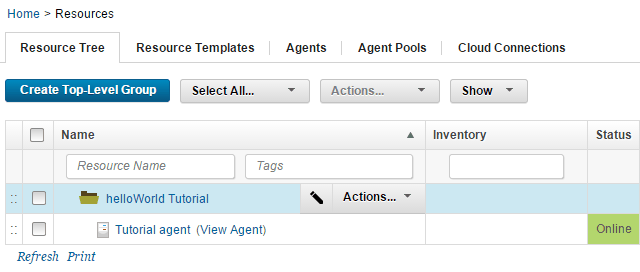

# Configure the helloWorld tutorial system

To deploy the tutorial component, or any component, you must have an agent. An agent is a lightweight process that runs on a target computer and does the actual work of deploying components.

Before you begin the tutorial, make sure that you completed the [Prerequisites](quickstart_intro.md#prereqs).

To complete the tutorial, you must have an agent that is running on a target computer system. This target computer can be a virtual image, or a physical computer, including the one where the server is installed. You must have access to this computer and be able to install the agent on it. In addition, you must create several directories on the file system where the server is located. These directories contain the artifacts that you deploy.

To prepare the tutorial system:

1.  Provision a computer for use as the target computer. This computer must meet the system requirements in [System requirements and performance considerations](../../com.ibm.udeploy.install.doc/topics/sysRequire.md).
2.   Install an agent on the target computer. You can install the agent from the HCL UrbanCode Deploy web interface as described in [Installing agents remotely](../../com.ibm.udeploy.doc/topics/agent_installremote.md). You can install the agent from the command line as described in [Installing agents from the command line](../../com.ibm.udeploy.install.doc/topics/agentInstall.md).
3.   Designate the agent for importing versions. By default, one system-wide agent is designated to import component versions. If you skip this step or if another agent is already designated, you can still use the new agent when you import your component version. To designate the agent, see [Server settings](../../com.ibm.udeploy.admin.doc/topics/settings_system.md).
4.  On the HCL UrbanCode Deploy server, verify that the agent is installed by clicking **Resources** \> **Agents**. Your agent must be included in the list of agents with a status of Online, as shown in the following figure: 

    

5.  Add the agent as a resource: 

    1.   To the left of the **Agents** tab, click the **Resource Tree** tab. 
    2.  Click **Create Top-Level Group**, give the new group a name such as helloWorld Tutorial and click **Save**.This group is a container for resources, such as agents and components.
    3.  On the same line as the resource group, click **Actions** \> **Add Agent**, as shown in the following figure: 

        

    4.   In the Create Resource window, select the agent in the **Agent** list, and click **Save**. 
    The agent is displayed as a child of the resource group.

    

6.  On the computer where you installed the agent, add files that represent deployable artifacts to the file system. 
    1.  Create a directory and give it a name such as helloWorld on the file system where the agent is located.
    2.   In the helloWorld directory, create a subdirectory that is named 1.0. The source configuration the tutorial uses treats each subdirectory in the target directory as a different component version.
    3.  In the 1.0 directory, place several files with any name and extension.The files represent the artifacts that the agent deploys by using the processes that you create. For the exercise, the number of files and their type is irrelevant, but, for best performance, limit their number and size.

        **Note:** If z/OS® is used on your target computer, convert text-type files that are used for artifacts to IBM®-1047 encoding.

The server and agent are configured for the tutorial, and the files that represent artifacts are ready to use. If you installed the agent on a remote system, you must know the credentials and locations that you specified.

**Parent topic:** [Create a simple helloWorld deployment](../../com.ibm.udeploy.tutorial.doc/topics/quickstart_abstract.md)

