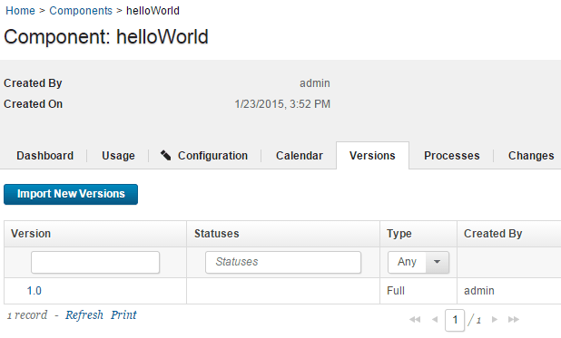
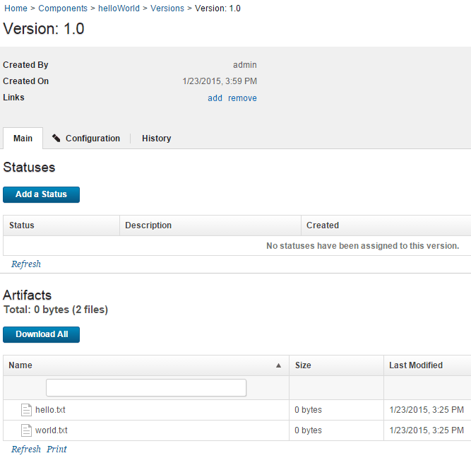

# Lesson 1: Create the helloWorld component

Components contain artifacts and processes. Artifacts include runnable files, images, databases, configuration instructions, and anything else that is associated with a software project. Processes define the activities that components can perform.

Before you begin this lesson, make sure that you complete the steps that are described in [Configure the helloWorld tutorial system](quickstart_configure.md).

In many cases, artifacts are added to a component by connecting the HCL® UrbanCode™ Deploy server to a computer system that hosts the artifacts. The server can import artifacts from build systems, source-code management systems, and file systems. Imported artifacts are stored in CodeStation, the artifact repository. The artifacts for the helloWorld component come from the file system where the HCL UrbanCode Deploy agent is located. For more information about creating components, see [Creating components](../../com.ibm.udeploy.doc/topics/comp_create.md).

1.  To create the helloWorld component: 
    1.   Click the **Components** tab and then click **Create Component**. In the window that opens, you define the component and specify the location of the artifacts for it.
    2.  In the **Name** field, type helloWorld. 
    3.   In the **Source Configuration Type** list, select **File System \(Versioned\)**. This parameter defines the type of artifacts the component uses. All artifacts in a component share the source type. The File System \(Versioned\) type looks for the artifacts on the file system.

        **Note:** The None type can be used for configuration-type or operational-type deployments. For more information about deployment types, see [Creating component processes](../../com.ibm.udeploy.doc/topics/comp_process_configure.md).

    4.  In the **Base Path** field, specify the location of the helloWorld folder that you created earlier, such as /home/user1/artifacts/shared/helloWorld. The File System \(Versioned\) source type considers directories in the specified folder as representations of component versions. For this reason, make sure that you specify the helloWorld directory and not the helloWorld/1.0 directory.
    5.  Accept the default values for the other fields on the page.The **Preserve Execute Permissions** and **Import Versions Automatically** check boxes are cleared and the **Copy to CodeStation** check box is selected. The **Default Version Type** is set to **Full**.
    6.  Click **Save**.
2.  Create a component property.A property is user-defined parameter that can be set at design time or run time. Properties can be defined for components, processes, applications, environments, and other product elements. Here you set the property on the component, but in situations where multiple components share the property, you might set the property value on the environment instead of setting it on every component.
    1.  On the "Component: helloWorld" page, click the **Configuration** tab and then click **Component Properties**.
    2.  Click **Add Property**.
    3.  In the Edit Property window, name the property something like helloHome. 
    4.  In the **Value** field, type the name of the directory that you created to hold the component artifacts, for example c:\\helloWorld.The component process uses this property later to identify the target location for the component artifacts.
    5.  Click **Save**.
3.  Import the component version: 

    1.  Click the **Versions** tab. 
    2.  Click **Import New Versions**. The server creates a version of the component that is based on the folder in the helloWorld folder, and imports the files in the helloWorld/1.0 directory. In this case, the server creates a single version of the component that is based on the helloWorld/1.0 folder. If other folders were in the helloWorld directory, they too would be imported and versions would be created from them.
    3.  Verify that the list of versions includes version 1.0 of the component, as in the following figure: 

        

    4.  Click the version name, **1.0**. 
    5.  Verify that the list of artifacts includes the files in the helloWorld/1.0 directory, as in the following figure: 

        

    The helloWorld component is ready to use.

In this lesson, you created a component that is based on files in the file system, and imported the initial version into CodeStation, the artifact repository. On the helloWorld Component page, you have the initial version, 1.0, listed.

Component processes describe different ways to use a component, such as how to deploy it, install it, update it, or do other tasks with it. In the next lesson, you create a process that defines how to deploy the component. For more information about creating components, see [Creating components](../../com.ibm.udeploy.doc/topics/comp_create.md).

**Parent topic:** [Create a simple helloWorld deployment](../../com.ibm.udeploy.tutorial.doc/topics/quickstart_abstract.md)

