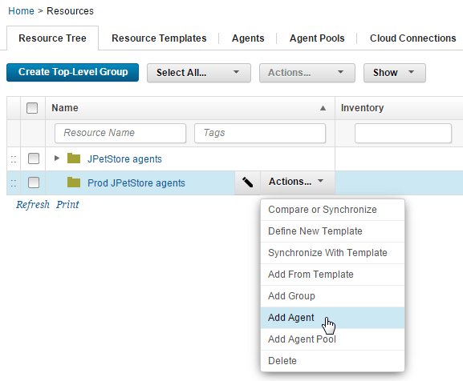
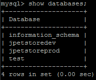
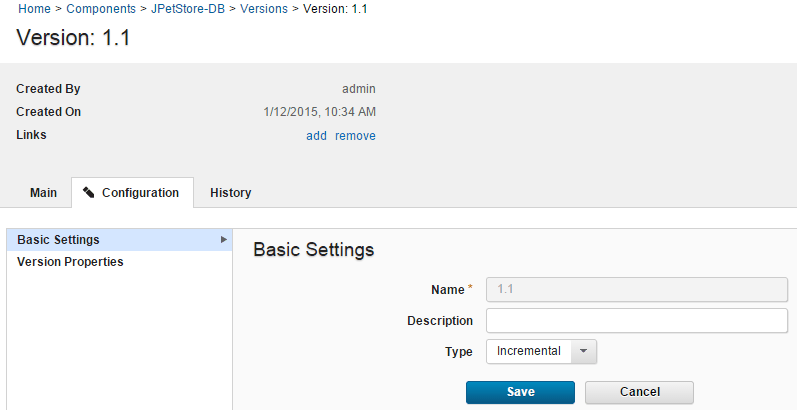
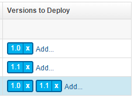

# Configuring the server and target system

Modify the HCL® UrbanCode™ Deploy server that you used in the previous tutorial. Create another agent resource and incorporate a new environment property to allow for easy reuse.

Before you begin the tutorial, make sure that you completed the [Prerequisites](snapshot_intro.md#prereqs).

To work through this tutorial, you must use the target system that you configured in the [Deploying a simple web application](webapp_abstract.md#) tutorial.

This system hosts the following items that are associated with your HCL UrbanCode Deploy JPetStore application:

-   An HCL UrbanCode Deploy agent
-   A MySQL database
-   An instance of Apache Tomcat

You must have MySQL and Apache Tomcat installed on the system. Follow these steps to set up an agent resource, create a new MySQL database, and redeploy your application to your environment:

1.   Create another resource and add the existing agent to it. To reuse the agent with another environment on the same HCL UrbanCode Deploy server, you must associate the agent with another resource.

    1.   On the HCL UrbanCode Deploy server, click the **Resources** tab. Be sure to click the **Resources** tab at the top of the page.
    2.   From the **Resource Tree** tab that is displayed, click **Create Top-Level Group**. 
    3.   In the Create Resource window, provide the new group with a name such as Prod JPetStore agents and click **Save**. 
    4.   On the same row as the new resource group, click **Actions** \> **Add Agent**, as shown in the following figure: 

        

    5.   In the Create Resource window, select the agent in the **Agent** field and click **Save**. 
    The agent is listed as a child of both resource groups. By associating the agent with both resource groups, you can use the same agent with your existing environment and the one that you create in a later lesson.

2.   Create an empty database for the application to use in another environment: 
    1.   Log in to the MySQL command line as the MySQL root user. For example, if you installed MySQL as the root user, run this command from the command line:

        ```
        mysql -u root
        ```

        The command line shows a prompt that looks like this prompt:

        ```
        mysql>
        ```

    2.   Create the database with the following command: 

        ```
        create database jpetstoreprod;
        ```

        If the command runs correctly, you see this message: `Query OK, 1 row affected`.

    3.   Give the existing database user access rights to the database. The database user that has access to the `jpetstoredev` database must have access to the new database too. If you used the default user name in the [Deploying a simple web application](webapp_abstract.md) tutorial, create another database by using the following command:

        ```
        grant all privileges on jpetstoreprod.* to 'jpetstore'@'localhost';
        ```

        **Note:** If you used the default settings when you configured the original database, the password for user `jpetstore` is `jppwd`.

        If the command runs correctly, you see this message: `Query OK, 0 rows affected`.

    4.   Type quit to exit the MySQL command line. 
3.   Verify that the user can access the database: 
    1.   From the command line, log in to MySQL as the existing user: 

        ```
        mysql -u jpetstore -pjppwd
        ```

    2.   Run the following command to list the databases on the system: 

        ```
        show databases;
        ```

    3.   Verify that both the `jpetstoreprod` and `jpetstoredev` databases appear in the list, as shown in the following figure: 

        

    4.   Type quit to exit the MySQL command line. 
4.   Before you deploy your application, confirm that all environment properties contain the correct values: 

    1.   From the **Applications** tab of your HCL UrbanCode Deploy server, click the JPetStore application. 
    2.   Open the environment by clicking the environment name. 
    3.   Open the environment properties by clicking **Configuration** and then clicking **Environment Properties**. Be sure to click the **Configuration** tab for your application, not the **Configuration** tab at the top of the page.
    The environment properties are displayed as shown in the following table:

    |Property|Description|Example Value|
    |--------|-----------|-------------|
    |`tomcat.home`|The Tomcat home folder on the target computer|/opt/apache-tomcat-6.0.39 on Linux™ or C:\\apache-tomcat-6.0.39 on Windows™|
    |`tomcat.contextroot`|The Tomcat webapp folder on the target computer, which is an identifier in the application URL|For both Tomcat version 6 and Tomcat version 7, specify `JPetStoreDev`|
    |`db.url`|The URL to the MySQL database, relative to the target system|If you installed MySQL on the same system as the agent and used the database name `jpetstore`, the URL looks like the following example: `jdbc:mysql://localhost:3306/jpetstore`|
    |`tomcat.manager.url`|The location of the Tomcat manager application|For Tomcat version 6, specify `http://localhost:8081/manager` ; for Tomcat version 7, specify `http://localhost:8081/manager/text`|
    |`tomcat.start`|The location of the startup script for Tomcat|/opt/apache-tomcat-6.0.39/bin/startup.sh on Linux or C:\\apache-tomcat-6.0.39\\bin\\startup.bat on Windows|

5.   To ensure that the JPetStore-DB component is deployed correctly, confirm that component version 1.1 is an incremental version. An incremental component version contains only the changes that are associated with that version. For the component to be complete, you must deploy the previous versions of the component as well.
    1.   From the **Components** tab, click the JPetStore-DB component. 
    2.   Click the **Versions** tab to display the available component versions, and then click 1.1 to display its attributes. 
    3.   Click the **Configuration** tab. Make sure to click the **Configuration** tab that is within the component, not the **Configuration** tab at the top of the page. 
    4.   On the **Basic Settings** panel, confirm that Incremental is selected from the **Type** list, as shown in the following figure: 

        

    5.   If JPetStore-DB version `1.1` is not set to **Incremental**, from the **Type** list, select **Incremental**, and then click **Save**. 
6.   To confirm that you configured your environment and component correctly, redeploy the application to your environment: 
    1.   Click the **Applications** tab, and then click the JPetStore application. 
    2.   In the same row as your environment, click the **Request Process** icon. The Run Process window opens.
    3.   Clear the **Only Changed Versions** check box. 
    4.   In the **Process** list, select Deploy JPetStore. 
    5.   Click **Choose Versions**. The Component Versions window opens.
    6.   In the **Select For All** list, click **Latest Available**. 
    7.   In the same row as `JPetStore-DB`, click **Add**. 
    8.   From the displayed list, select 1.0. Your list of **Versions to Deploy** resembles the following figure:

        

    9.   To record your version selections, click **OK**. 
    10.  To deploy your application, click **Submit**. HCL UrbanCode Deploy runs the application process, and your application is de ployed.

The agent and the target system are configured for your work with the sample application. You need the password that you used and locations that you specified in this lesson later.

**Parent topic:** [Creating and deploying snapshots](../../com.ibm.udeploy.tutorial.doc/topics/snapshot_abstract.md)

