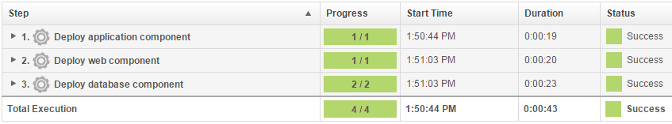

# Lesson 3: Deploying the snapshots

To promote the snapshot to an environment, apply the snapshot when you run the application process.

In this lesson, you apply a snapshot to your new environment to quickly promote the components to a new environment. When you request the application process, you select the snapshot to deploy a selected set of components to an environment.

1.   Open the application page by clicking **Applications** and then clicking JPetStore. 
2.   In the same row as your new environment, click the **Request Process**  icon, as shown in the following figure. 

    

3.   In the Run Process window, in the **Process** list, select the Deploy JPetStore process. 
4.   In the **Snapshot** list, select the Version 1.1 snapshot. 
5.   Click **Submit**. 

The web page shows you the progress of the application process request, and you can watch as the processes run. If the process finishes, the request shows that each component process is finished, as in the following figure:



You can view the running application at the following URL by substituting the host name of your target system for hostname. This is the host name of the agent that you configured in [Configuring the agent and target system](webapp_configure_agent.md). In the URL, specify the tomcat.contextroot value that you entered for this environment after the port number.

```
http://hostname:8081/JPetStoreProd
```

The application shows a simple online shopping site in the form of a pet store. The following figure shows the home page:


If you browse to the Dogs category, you see that the Bichon section is present. As you saw in the previous tutorial, this entry indicates that the JPetStore-DB component deployed both the 1.0 and 1.1 versions.


This application process installed all components in the application by running their component processes. You defined the versions of the component processes in the snapshot.

You used a snapshot to quickly apply a compatible set of component processes to an application environment and viewed the deployed web page.

**Parent topic:** [Creating and deploying snapshots](../../com.ibm.udeploy.tutorial.doc/topics/snapshot_abstract.md)

