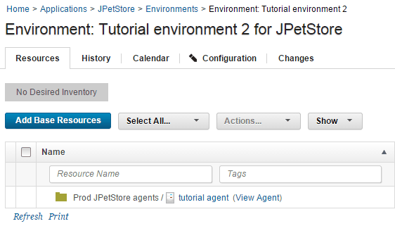

# Lesson 2: Creating an environment

Environments are deployment targets for the application components that you specify. You create another environment in the application's delivery pipeline to facilitate multiple active applications. You apply an agent resource and specify which components the agent resource deploys.

Before you start this lesson, ensure that the agent is running. Click **Resources** \> **Agents** and make sure that your agent is listed as `Online`, as in the following figure:

In this lesson, you create an environment to deploy the snapshots that you created. You also add your agent to the environment. By adding a second environment, you can mimic a simple delivery pipeline that has two environments.

1.  Define an environment for the application: 
    1.   Click the **Applications** tab, and then click JPetStore. 
    2.  From the **Environments** tab for the application, click **Create Environment**. 
    3.  Specify the name to be Tutorial environment 2.
    4.  Accept the default values in the other fields in this window, and click **Save**.
2.  Specify the properties for the environment.When you created the component processes, you included parameters that specify the location of artifacts on the target computer system, such as the location of the application server. Because these properties can vary on different target systems, you specify these properties as environment properties.
    1.  Open the environment by clicking the environment name. 
    2.  Open the environment properties by clicking **Configuration** and then clicking **Environment Properties**. 
    3.  Add the following properties one at a time by clicking **Add Property** and specifying the name and value of the property as shown in the following table: 

        |Property|Description|Example Values|
        |--------|-----------|--------------|
        |`tomcat.home`|The Tomcat home folder on the target computer|/opt/apache-tomcat-6.0.39 on Linux™ or C:\\apache-tomcat-6.0.39 on Windows™|
        |`tomcat.contextroot`|The Tomcat webapp folder on the target computer, which is an identifier in the application URL|For both Tomcat version 6 and Tomcat version 7, specify `JPetStoreProd`|
        |`db.url`|The URL to the MySQL database, relative to the target system|If you installed MySQL on the same system as the agent and used the database name `jpetstoreprod`, the URL looks like the following example: `jdbc:mysql://localhost:3306/jpetstoreprod`|
        |`tomcat.manager.url`|The location of the Tomcat manager application|For Tomcat version 6, specify `http://localhost:8081/manager` ; for Tomcat version 7, specify `http://localhost:8081/manager/text`|
        |`tomcat.start`|The location of the start script for Tomcat|/opt/apache-tomcat-6.0.39/bin/startup.sh on Linux or C:\\apache-tomcat-6.0.39\\bin\\startup.bat on Windows|

3.  Add the agent to the environment.You added the agent as a resource to another resource group. Next, you add that resource to the environment, as described in the following steps:

    1.  Click the **Resources** tab for the environment.Make sure that you are on the **Resources** tab for the environment and not the **Resources** tab at the top of the page.
    2.  Click **Add Base Resources**. The Add Resource to Environment window shows all the resources that are available on the server.
    3.  Select the check box next to your agent in the Prod JPetStore agents resource, and then click **OK**. 

        **Note:** Since one agent deploys the components for in both application environments, ensure that the agent you select is in the agent resource that you created for your new environment. You must not select the agent in the agent resource that is associated with the application's other environment.

    The resource is shown on the **Resources** tab for the environment, as shown in the following figure:

    

4.  Map the components to this agent resource. If you had many agents on a system with multiple nodes, you would specify which components run on each agent resource. In this case, you have only one agent resource, so all the components run on this agent.

    1.  On the same row as the Prod JPetStore agents resource, click **Actions** \> **Add Component**.The **Actions** button is not displayed until you hover the mouse over the resource.
    2.   Select the application component and then click **Save**. 
    3.  Repeat the process to add the other components to the resource. 

        **Note:** Be sure to add each component to the agent resource and not to another component. The components must be at the same hierarchy level, and not child items of each other.

    The components are mapped to the target system, as shown in the following figure:

    

The **Environments** tab includes the new environment, as shown in the following image:

With the environment prepared and the agent running, you can run the application process on the environment to deploy the components that you specified in the snapshot.

In this lesson, you added an environment to the application

In the previous tutorial, you proved that the components in the first environment are compatible and complete. You can use the snapshot that you created to quickly promote all the components to the new environment. Your delivery pipeline might include deploying an application to testing and quality assurance servers before you deploy it to a production server. By using a snapshot, you can ensure that you quickly and correctly select all the right component versions as you move an application through the delivery pipeline.

For more information about creating environments, see [Creating environments](../../com.ibm.udeploy.doc/topics/app_environment_create.md).

**Parent topic:** [Creating and deploying snapshots](../../com.ibm.udeploy.tutorial.doc/topics/snapshot_abstract.md)

