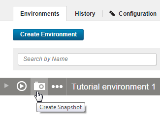
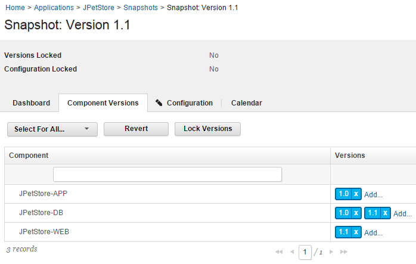
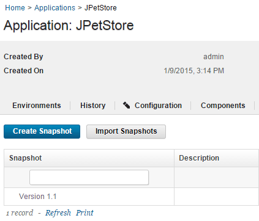

# Lesson 1: Adding snapshots

Creating a snapshot involves saving a collection of component versions that are part of an application.

These steps describe how to create a snapshot that uses components of the sample application. In the [Deploying a simple web application](webapp_abstract.md) tutorial, you deployed the JPetStore application twice to the same environment. In the second deployment, you used two components that contain new information. In this lesson, you create a snapshot that uses the same components as the deployed environment. You create a snapshot from a functioning development environment in preparation for deployment to the next phase of your continuous delivery pipeline. In a later lesson, you deploy this snapshot to a new environment. By deploying with snapshots in HCL UrbanCode Deploy, you can quickly bring a new environment to a specific state.

**Before you begin:** Make sure that your HCL UrbanCode Deploy server has the prerequisites that are listed in [Prerequisites](snapshot_intro.md#prereqs) and that you completed the steps in [Configuring the server and target system](snapshot_configure_agent.md).

1.   Click the **Applications** tab, and then click JPetStore. 
2.   In the same row as your environment, click the **Create Snapshot** icon, as shown in the following figure: 

    

3.   In the Create Snapshot window, specify the name to be Version 1.1.
4.   Accept the default values in the other field, and then click **Save**. 
5.   Click the **Component Versions** tab. The snapshot is shown as in the following image:

    

    The JPetStore-DB component uses incremental versions and must contain both the 1.0 and 1.1 versions to deploy. If the JPetStore-DB component does not contain both versions, you must update the component version. See [Configuring the server and target system](snapshot_configure_agent.md#increment).

In this lesson, you added a snapshot to the application. The snapshot is based on the components in the application that are currently deployed to an environment.

On the application's Snapshots page, you have a snapshot, as shown in the following figure:

In the next lesson, you create an environment to for the next step in the JPetStore application's delivery pipeline.

After you create a snapshot that describes a collection of components, you can deploy the snapshots to an environment. In the next lesson, you create another environment.

For more information about creating snapshots, see [Creating snapshots](../../com.ibm.udeploy.doc/topics/app_snapshot_create.md).

**Parent topic:** [Creating and deploying snapshots](../../com.ibm.udeploy.tutorial.doc/topics/snapshot_abstract.md)

