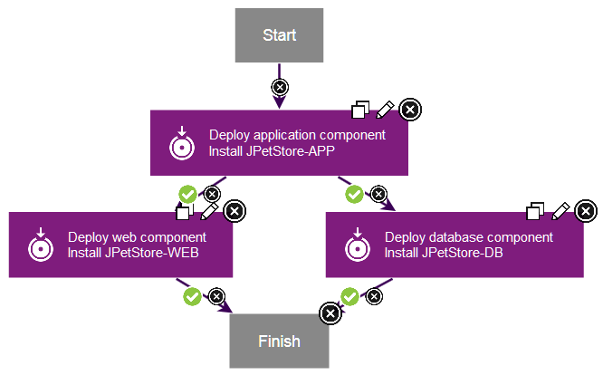

# Lesson 4: Creating an application process

Application processes tie together component processes.

In this lesson, you create an application process to install the components by calling each component process.

1.   Click the **Applications** tab, and then click the **JPetStore** application. 
2.   Click **Processes**, and then click **Create Process**. Be sure to click the **Processes** tab within the application and not the **Processes** tab at the top of the page, which leads to generic processes.
3.  In the Create an Application Process window, name the new application process Deploy JPetStore. 
4.   Accept the default values for the other fields, and click **Save**. 
5.  Click the new process to open it in the process editor. The process editor for application processes is similar to the process editor for component processes. However, for application processes, the steps are limited to calling component processes and a few utility steps.
6.  Add a step to deploy the application component: 
    1.  From the list of steps, add an **Install Component** step to the process editor.This step calls component processes that have a process type of `Deployment`.
    2.  In the Edit Properties window, name the step Deploy application component. 
    3.  In the **Component** list, select the `JPetStore-APP` component.
    4.  In the **Component Process** list, select the `Deploy Application Component` component process.
    5.   Click **OK**. 
7.  Similarly, add a step that is named Deploy web component to deploy the web component.
8.  Similarly, add a step that is named Deploy database component to deploy the database component.
9.   Verify that the `Start` step is connected to the `Deploy application component` step. 
10. Instead of connecting the remaining steps in a straight line, follow these steps to connect the steps so that they run at the same time.Use the figure at the end of this step as a reference point.
    1.  Connect the `Deploy application component` step to the `Deploy web component` step.
    2.  Connect the `Deploy application component` step to the `Deploy database component` step. Now these two steps will run at the same time, after the application step.
    3.  Connect both the `Deploy web component` step and the `Deploy database component` step to the `Finish` step. 
11. Save the process.

The complete application process deploys the application component first and then deploys the web component and database components at the same time. The application process looks like the following figure:

**Parent topic:** [Deploying a simple web application](../../com.ibm.udeploy.tutorial.doc/topics/webapp_abstract.md)

