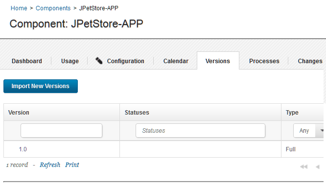

# Lesson 1: Adding components

Components are groups of deployable artifacts that make up an application. Components include runnable files, images, databases, and configuration instructions.

-   Make sure that your HCL® UrbanCode™ Deploy server has the prerequisites that are listed in [Prerequisites](webapp_intro.md#prereqs).
-   Make sure that you have set up the agent for the sample application as described in [Configuring the agent and target system](webapp_configure_agent.md).

These steps describe how to create the components of the sample application.

The JPetStore sample application includes three components:

-   The application component includes the logic of the application. This component consists of a single web archive file that is named JPetStore.war.
-   The web component includes the static web content for the application, including images for the web interface.
-   The database component includes the database for the application and scripts that upgrade the database schema to new versions.

In most cases, you add components by connecting the HCL UrbanCode Deploy server to the system that hosts the artifacts. The server can import artifacts from many build systems and source-code management systems. The server can create new versions of the components automatically as the artifacts change or as new builds run. However, for simplicity, in this lesson you copy the files for the components to the server and access them from there. For more information about creating components from artifacts on build systems and source-code management systems, see [Creating components](../../com.ibm.udeploy.doc/topics/comp_create.md).

1.  Download the artifacts.zip file by clicking the following link:[artifacts.zip](http://download.boulder.ibm.com/ibmdl/pub/software/rationalsdp/documentation/product_doc/UrbanCode/uDeploy/version_6-1/artifacts.zip).

    You can also find this file in the Files section of the Learning Circle:[HCL UrbanCode Deploy and IBM® UrbanCode Release Learning Circle](https://www.ibm.com/developerworks/community/groups/service/html/communityview?communityUuid=860ff390-6cab-4f95-ab37-66d2ca7521b4)

2.  Copy the artifacts.zip file to the HCL UrbanCode Deploy agent computer and extract it.This file contains separate folders for each of the components; these folders are named app, web, and db. Each of these folders contains one or more folders with names such as 1.0 or 1.1; these folders represent different versions of the artifacts.

    For the tutorial, these folders must be on the same system that hosts the HCL UrbanCode Deploy agent. Note the locations of these folders, because you will need the locations later.

3.  Log in to the HCL UrbanCode Deploy server. 
4.  Create the application component: 
    1.   Click the **Components** tab, and then click **Create Component**. In this window, you specify where the artifacts for the component are.
    2.  In the **Name** field, type JPetStore-APP. 
    3.  In the **Source Configuration Type** list, select **File System \(Versioned\)**.
    4.  In the **Base Path** field, specify the location of the app folder on the server, such as /home/user1/artifacts/shared/app. 
    5.   Under **Default Version Type**, click **Import new component versions using a single agent**, and then select your agent in the **Agent for Version Imports** list 
    6.  Accept the default values for the other fields on the page.
    7.  Click **Save**.
5.   Import the versions of the component: 

    1.   Click the **Versions** tab. 
    2.   Click **Import New Versions**. The import process is listed in the Currently Running Version Imports section. Then the process is finished, the server creates versions of the component based on the folders in the app folder. In this case, the server creates a single version of the component that is based on the app/1.0 folder. Importing versions of small components like this one typically takes a few seconds. You might need to refresh the page or click the **Refresh** link at the bottom of the table to see the new version.
    3.   Verify that version 1.0 of the component is included in the list of versions, as in the following figure: 

        

        If the version import failed, make sure that the files are available on the agent system and that the location of these files is correct on the component **Configuration** tab.

    The component is available to be used in one or more applications.

6.  Create the database component: 

    1.   Click the **Components** tab, and then click **Create Component** again. 
    2.  Specify the name to be JPetStore-DB. 
    3.  In the **Source Configuration Type** list, select **File System \(Versioned\)**.
    4.  In the **Base Path** field, specify the location of the db folder on the server, such as /home/user1/artifacts/shared/db. 
    5.  Under **Default Version Type**, click **Import new component versions using a single agent** and then select your agent in the **Agent for Version Imports** list 
    6.  Accept the default values for the other fields on the page.
    7.  Click **Save**.
    8.  Click **Versions** and then click **Import New Versions**.
    Now the server shows two versions of the database component.

7.  Create the web component: 

    1.  Click the **Components** tab and then click **Create Component** again. 
    2.  Specify the name to be JPetStore-WEB. 
    3.  In the **Source Configuration Type** list, select **File System \(Versioned\)**.
    4.  In the **Base Path** field, specify the location of the web folder on the server, such as /home/user1/artifacts/shared/web. 
    5.  Under **Default Version Type**, click **Import new component versions using a single agent** and then select your agent in the **Agent for Version Imports** list 
    6.  Accept the default values for the other fields on the page.
    7.  Click **Save**.
    8.  Click **Versions** and then click **Import New Versions**.
    Now the server shows two versions of the web component.

8.  So that you can try updating the components later, delete the newest versions of the database and web components: 
    1.  Click **Components** and then click the `JPetStore-DB` component.
    2.  Click **Versions**.
    3.  In the list of versions, in the same row as the version that is named `1.1`, click **Delete** and then click **OK**.You will import this version again later.
    4.  Similarly, delete version `1.1` of the `JPetStore-Web` component. 

In this lesson, you added components that are based on files in the file system. In a production scenario, you would connect the component to a source-code management system such as Subversion or a build system such as Jenkins.

On the Components page, you now have three components, each with one version, as shown in the following figure:

In a later lesson, you add these components to an application.

In addition to files and other artifacts, components also contain component processes, which describe how to deploy, install, uninstall, update, or run other tasks on a component. In the next lesson, you create processes that describe how to install the components.

For more information about creating components, see [Creating components](../../com.ibm.udeploy.doc/topics/comp_create.md).

**Parent topic:** [Deploying a simple web application](../../com.ibm.udeploy.tutorial.doc/topics/webapp_abstract.md)

