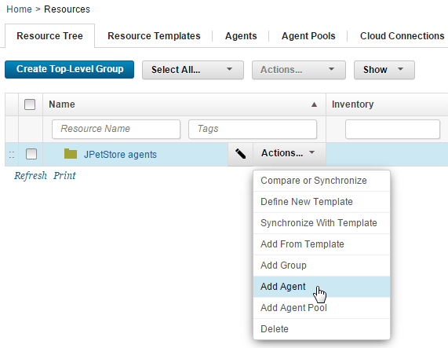
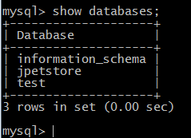

# Configuring the agent and target system

To deploy applications with HCL® UrbanCode™ Deploy, you need one or more agents. The server uses the agents to deploy the application components on target systems.

Before you begin the tutorial, make sure that you completed the [Prerequisites](webapp_intro.md#prereqs).

To work through this tutorial, you need an agent that is running on a target computer system. This target computer can be a cloud resource, a virtual image, or a physical computer. You must have access to this computer and be able to install MySQL/MariaDB, Apache Tomcat, and the HCL UrbanCode Deploy agent on it. Follow these steps to set up an agent and a target system for your work with the tutorial:

1.   Prepare a computer for use as the target system. This computer must meet the system requirements that are listed in [System requirements and performance considerations](../../com.ibm.udeploy.install.doc/topics/sysRequire.md). Most of the examples in this tutorial show information for a simple Linux™ operating system such as Red Hat Enterprise Linux version 7.
2.  Install an agent on the target system.See [Installing agents](../../com.ibm.udeploy.install.doc/topics/agent_install_ov.md).
3.  On the HCL UrbanCode Deploy server, verify that the agent is installed by clicking **Resources** \> **Agents**. Your agent must appear in the list of agents with a status of **Online**, as shown in the following figure:

    

4.  Add the agent as a resource: 

    1.   To the left of the **Agents** tab, click the **Resource Tree** tab. 
    2.  Click **Create Top-Level Group**, give the new group a name such as JPetStore agents and click **Save**.This group is a container for resources, such as agents.
    3.  On the same row as the new resource group, click **Actions** \> **Add Agent**, as shown in the following figure:

        

    4.   In the Create Resource window, select the agent in the **Agent** field and click **Save**. 
    The agent is now listed as a child of the resource group. You must add agents to resource groups in this way so that applications can access the agents through the resource group.

5.   Install and start the MySQL/MariaDB server on the target system. The application uses a MySQL/MariaDB database. If you are using a Linux operating system, you can use the package manager to install and start MySQL/MariaDB. For example, on Red Hat Enterprise Linux version 7, run the following commands:

    ```
    yum install mariadb mariadb-server
    ```

    ```
    systemctl enable mariadb
    ```

    ```
    systemctl start mariadb
    ```

    On Windows, you can use a graphical installer or download a binary package for the database server. Then, start the server by going to the bin folder and running the mysqld command.

6.  Create an empty database for the application to use: 
    1.   Open a command-line window and log in to the database as the root user. For example, run this command from the command line:

        ```
        mysql -u root
        ```

        The command line now shows a prompt that looks like this prompt:

        ```
        MariaDB>
        ```

    2.  Create the database with the following command: 

        ```
        create database jpetstore;
        ```

        If the command runs properly, you see the message `Query OK, 1 row affected`.

    3.  Create the database user with the following command: 

        ```
        create user 'jpetstore'@'localhost' identified by 'jppwd';
        ```

        If the command runs properly, you see the message `Query OK, 0 rows affected`.

    4.  Give the user access rights to the database with the following command:

        ```
        grant all privileges on jpetstore.* to 'jpetstore'@'localhost';
        ```

        If the command runs properly, you see the message `Query OK, 0 rows affected`.

    5.  Type quit to exit the MySQL command line.
7.  Verify that the user can access the database: 
    1.   From the command-line window, log in to the database as the new user: 

        ```
        mysql -u jpetstore -pjppwd
        ```

    2.  Run the following command to list the databases on the system:

        ```
        show databases;
        ```

    3.  Verify that the `jpetstore` database appears in the list, as shown in the following figure:

        

    4.   Type quit to exit the database command line. 
8.   Install Apache Tomcat on the target system. You can use Tomcat version 6 through version 8. A simple way to install Tomcat on a Linux operating system is to download and install the binary distribution of Tomcat, as in the following steps:
    1.   Download the binary distribution of Tomcat, such as apache-tomcat-6.0.39.tar.gz . 
    2.   Extract this file to a folder on the target computer, such as /opt/apache-tomcat-6.0.39 . For example, on a Linux operating system you might run the following command:

        ```
        tar -xf apache-tomcat-6.0.39.tar.gz ; mv apache-tomcat-6.0.39/ /opt
        ```

9.  Add an administrative user to the Tomcat server in the conf/tomcat-users.xml file. This user account is necessary to deploy applications to Tomcat. For example, for Tomcat version 6, open the file conf/tomcat-users.xml and uncomment the `role` and `user` tags at the bottom of the file. Then, add the following lines of code to those tags:

    ```
    <role rolename="manager"/>
    <user username="tomcatmanager" password="tomcatmanager" roles="manager"/>
    ```

    The end of the file looks like the following example:

    ```
    <role rolename="tomcat"/>
      <role rolename="role1"/>
      <user username="tomcat" password="tomcat" roles="tomcat"/>
      <user username="both" password="tomcat" roles="tomcat,role1"/>
      <user username="role1" password="tomcat" roles="role1"/>
    
      <role rolename="manager"/>
      <user username="tomcatmanager" password="tomcatmanager" roles="manager"/>
    
    </tomcat-users>
    ```

    For Tomcat version 7 or 8, open the file conf/tomcat-users.xml and uncomment the `role` and `user` tags at the bottom of the file. Remove the text `<must-be-changed>` and replace it with passwords for the default user accounts. If you do not remove this text, the configuration file is unreadable and your sample application will not be able to access Tomcat. Then, add the following lines of code to those tags:

    ```
    <role rolename="manager-script"/>
    <role rolename="manager-gui"/>
    <user username="tomcatmanager" password="tomcatmanager" roles="manager-script,manager-gui"/>
    ```

    The end of the file might look like the following example:

    ```
    <role rolename="tomcat"/>
      <role rolename="role1"/>
      <user username="tomcat" password="tomcat" roles="tomcat"/>
      <user username="both" password="tomcat" roles="tomcat,role1"/>
      <user username="role1" password="tomcat" roles="role1"/>
    
      <role rolename="manager-script"/>
      <role rolename="manager-gui"/>
      <user username="tomcatmanager" password="tomcatmanager" roles="manager-script,manager-gui"/>
    
    </tomcat-users>
    ```

10. In the conf/server.xml file, modify the default HTTP ports to avoid conflicts. 
    1.   Replace all instances of port number `8080` with port number `8081`. To update the port numbers from the command line, run this command:

        ```
        sed -i 's/8080/8081/g' /opt/tomcat\_directory/conf/server.xml
        ```

    2.   Replace all instances of port number `8443` with port number `8445`. To update the port numbers from the command line, run this command:

        ```
        sed -i 's/8443/8445/g' /opt/tomcat\_directory/conf/server.xml
        ```


Now the agent and the target system are configured for your work with the sample application. You need the passwords and locations that you specified later.

**Parent topic:** [Deploying a simple web application](../../com.ibm.udeploy.tutorial.doc/topics/webapp_abstract.md)

